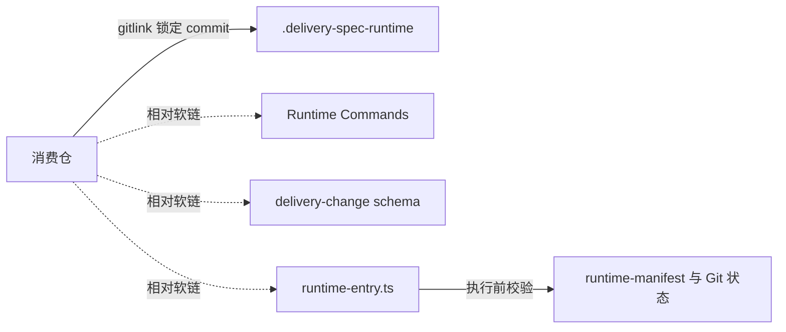

# delivery-spec-runtime

公共 OpenSpec delivery 生命周期运行时。它把 `delivery-change` schema、九个 OMP Commands、治理工具和机器合同放在一个可锁定版本的 Git submodule 中，使多个消费仓共享同一套交付方法，而不复制 Runtime 源码。

## 适用范围

本仓负责：

- Runtime 自身的 Commands、schema、工具、合同和测试；
- Runtime 自身的 OpenSpec Change、长期 specs 和交付证据；
- OpenSpec 上游版本的隔离评估和受控提升。

本仓不保存消费仓或业务项目的真实 Change、长期 spec、环境、凭据和交付证据，也不替消费仓决定何时更新 Runtime gitlink。

## 工作原理



父仓 gitlink 是唯一版本锁。`runtime-manifest.json` 声明 Node/OpenSpec 精确版本和三条受管相对软链；Runtime 入口在执行生命周期命令前验证 gitlink、submodule、manifest、工具版本、软链和 bootstrap 状态。任一条件不满足都 fail closed。

完整设计见 [架构与安全边界](docs/architecture.md)。

## 五分钟接入

要求：Git、满足 manifest 的 Node 版本，以及 manifest 锁定的 OpenSpec CLI 版本。

```bash
git submodule add https://github.com/Eridanus117/delivery-spec-runtime.git .delivery-spec-runtime
node --experimental-strip-types \
  .delivery-spec-runtime/openspec/tools/runtime-link.ts apply --asset-root .
git add .gitmodules .delivery-spec-runtime \
  .omp/commands \
  openspec/schemas/delivery-change \
  openspec/tools/runtime-entry.ts
```

首次提交后验证绑定：

```bash
node --experimental-strip-types \
  .delivery-spec-runtime/openspec/tools/runtime-entry.ts \
  runtime-check --change-root .
```

预期结果：命令退出码为 0，父仓 gitlink、Runtime submodule 和三条受管软链全部满足合同。克隆、升级和故障恢复见 [消费仓使用指南](docs/consumer-guide.md)。

## 核心不变量

- 父仓 gitlink 是 Runtime 的唯一版本锁，不建立第二份 lock。
- 实时消费仓禁止执行 `openspec update` 或 `runtime-update`。
- `.omp/commands/opsx-*.md` 是渲染物，只修改 `.omp/command-sources/`。
- OpenSpec 版本必须是 `runtime-manifest.json` 中的精确 SemVer。
- 候选 Runtime 和 CLI 只在临时 fixture、临时消费仓副本中执行。
- 真实消费仓在候选评估中只允许前后摘要和 Git 状态核验。
- Runtime 变更使用功能分支和 PR，不直接推送默认分支。

## 按任务阅读

| 我要做什么 | 文档 |
|---|---|
| 理解 gitlink、软链、入口校验和 fail-closed 边界 | [架构与安全边界](docs/architecture.md) |
| 接入、克隆、更新或修复消费仓 Runtime | [消费仓使用指南](docs/consumer-guide.md) |
| 修改 Commands、schema、contracts 或运行验证 | [Runtime 维护指南](docs/maintainer-guide.md) |
| 评估并提升 OpenSpec 版本 | [受控 OpenSpec 升级](docs/openspec-upgrade.md) |
| 创建、审查、验收、归档 Runtime Change | [Runtime 自治理](docs/governance.md) |

## 信息权威边界

| 内容 | 权威位置 | 用途 |
|---|---|---|
| 仓库入口 | `README.md` | 定位、最短接入和任务导航 |
| 当前使用与维护方法 | `docs/` | 面向读者的操作说明 |
| 长期行为要求 | `openspec/specs/` | 规范性 Requirements 和 Scenarios |
| 当前工作 | `openspec/changes/<change>/` | active Change 的计划与证据 |
| 历史交付证据 | `openspec/changes/archive/` | 审计记录，不是当前操作手册 |
| 程序校验真源 | manifest、schema、contracts、tools | 机器实际执行的合同 |
| Agent 会话规则 | `AGENTS.md` | 只约束 Agent，不是产品或使用文档 |

文档解释机器合同，但不复制机器合同；需要精确字段和失败条件时，以对应 manifest、schema、contract 和工具校验为准。

## 开发验证

```bash
node --experimental-strip-types \
  openspec/tools/render-commands.ts check --runtime-root .
node --experimental-strip-types --test test/*.test.ts
openspec validate --all --strict
```

预期结果：Commands 无漂移、Runtime 合同测试全部通过、所有 active Change 和长期 specs 严格校验通过。具体维护步骤见 [Runtime 维护指南](docs/maintainer-guide.md)。
