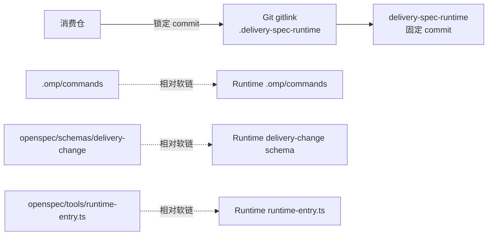
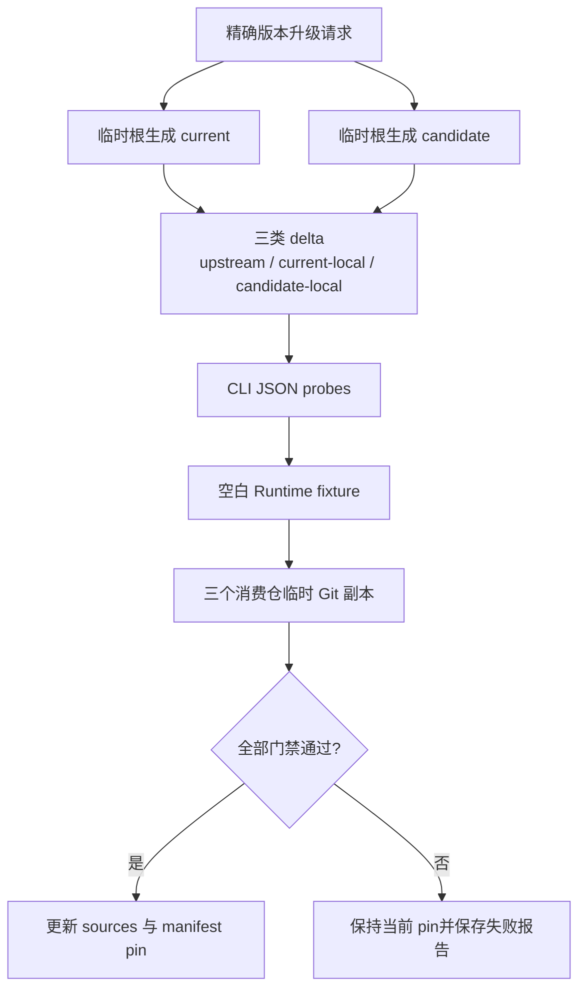

# delivery-spec-runtime

公共 OpenSpec delivery 生命周期运行时。它把 `delivery-change` 九层 schema、九个 OMP Commands、运行时完整性检查和升级合同放在一个可版本锁定的 Git submodule 中，让工作、私人和公开项目仓共享同一套方法，但不复制运行时源码。

## 它解决什么问题

消费仓需要稳定的 OpenSpec 工作流，同时又必须满足三项约束：

- 每个仓能用 Git commit 精确锁定 Runtime 版本；
- Runtime 的 Commands、schema 和入口只有一份实现；
- OpenSpec 上游升级不能沿软链覆盖 Runtime 定制，也不能拿真实消费仓做候选试验。

本仓只保存 **Runtime 自身**的 OpenSpec Change、长期 capability specs、实现和验收证据。它不保存消费仓或业务项目的真实 Change、长期 spec、环境、凭据和交付证据。

## 架构



父仓 gitlink 是唯一版本锁。`runtime-manifest.json` 声明三条受管相对软链；`runtime-entry.ts` 在执行生命周期命令前核对：

1. 父仓 `.gitmodules` 唯一登记 `.delivery-spec-runtime`；
2. submodule 当前 commit 等于父仓 `HEAD` 的 gitlink；
3. submodule 和父仓记录的 gitlink状态均 clean；
4. manifest、Node/OpenSpec 版本和三条相对软链满足合同；
5. bootstrap 不处于未完成事务。

任一条件不满足都 fail closed，不提供复制投影、第二份 lock 或兼容旁路。

## 仓库布局

| 路径 | 职责 |
|---|---|
| `runtime-manifest.json` | Node/OpenSpec 精确版本与三条软链合同 |
| `openspec/schemas/delivery-change/` | 九层交付 schema 与模板 |
| `.omp/command-sources/` | Commands manifest、公共 Runtime preamble、九个命令 body 的唯一真源 |
| `.omp/commands/` | 确定性渲染并提交的九个 `/opsx-*` Commands |
| `openspec/tools/runtime-entry.ts` | 消费仓统一 fail-closed 入口 |
| `openspec/tools/runtime-link.ts` | 建立和修复 manifest 托管的相对软链 |
| `openspec/tools/render-commands.ts` | 从结构化真源 write/check Commands |
| `openspec/tools/openspec-upgrade.ts` | 隔离生成、差异、CLI probes 和消费仓候选 smoke |
| `openspec/contracts/` | 批准、任务、升级请求/报告和 CLI probe 机器合同 |
| `openspec/changes/`、`openspec/specs/` | 只治理 Runtime 自身演进 |
| `test/` | Node 合同测试和临时 Git/submodule fixture |

## 消费仓接入

要求：Git、满足 manifest 的 Node 版本，以及 manifest 锁定的 OpenSpec CLI 版本。

```bash
git submodule add https://github.com/Eridanus117/delivery-spec-runtime.git .delivery-spec-runtime
node --experimental-strip-types \
  .delivery-spec-runtime/openspec/tools/runtime-link.ts apply --asset-root .
git add .gitmodules .delivery-spec-runtime \
  .omp/commands \
  openspec/schemas/delivery-change \
  openspec/tools/runtime-entry.ts
```

首次提交后验证绑定：

```bash
node --experimental-strip-types \
  .delivery-spec-runtime/openspec/tools/runtime-entry.ts \
  runtime-check --change-root .
```

克隆消费仓时必须递归初始化 submodule：

```bash
git clone --recurse-submodules <consumer-repository>
```

已有 clone 缺少 Runtime 时执行：

```bash
git submodule update --init --recursive
```

消费仓通过正常 Git 变更更新 `.delivery-spec-runtime` gitlink，并与应用代码一样审阅、验证和提交。不要复制 Runtime 文件到父仓，也不要恢复 `runtime-lock.json`。

## Runtime 不变量

- 实时消费仓禁止执行 `openspec update`。
- `runtime-entry.ts runtime-update` 在启动 OpenSpec CLI 前稳定拒绝。
- `.omp/commands` 是指向 Runtime 的目录软链；官方生成器不能以消费仓为 cwd。
- `.omp/commands/opsx-*.md` 是渲染物，维护者只修改 `.omp/command-sources/`。
- OpenSpec 版本是 `runtime-manifest.json` 的精确 SemVer，不接受 tag 或 range。
- 消费仓 smoke 必须在临时 Git 副本注入候选 Runtime/CLI；真实仓只允许前后摘要和状态核验。
- 所有 Runtime 代码变更通过功能分支和 PR 交付，不直接推默认分支。

## 维护 Commands

修改公共入口或命令 body 后，先渲染，再检查确定性结果：

```bash
node --experimental-strip-types \
  openspec/tools/render-commands.ts write --runtime-root .
node --experimental-strip-types \
  openspec/tools/render-commands.ts check --runtime-root .
```

`check` 对 missing、extra、modified 任一漂移非零退出。OMP 支持 Mermaid；`opsx-explore` 对真实结构、流程、状态和依赖优先使用 `mermaid` fenced block。只有目标表面不能渲染 Mermaid 时才降级为简洁 ASCII，不使用 Unicode 线框字符。

## 受控 OpenSpec 升级

升级分两步：官方 current/candidate 在隔离根生成；Runtime 维护者依据报告更新 command sources 和 manifest。任何时候都不在实时消费仓运行官方 update。



请求文件使用精确字段；`evidenceRoot` 必须位于当前 Runtime Change 的 `08-验收/runs/` 下：

```json
{
  "schemaVersion": 1,
  "currentVersion": "1.10.0",
  "candidateVersion": "1.11.0",
  "runtimeRoot": "/absolute/path/to/delivery-spec-runtime",
  "evidenceRoot": "/absolute/path/to/delivery-spec-runtime/openspec/changes/<change>/08-验收/runs/<run-id>/upgrade-evaluation",
  "consumers": [
    { "name": "agent-system", "path": "/absolute/path/to/agent-system" },
    { "name": "webcoding-spec", "path": "/absolute/path/to/webcoding-spec" },
    { "name": "work-spec", "path": "/absolute/path/to/work-spec" }
  ]
}
```

执行：

```bash
node --experimental-strip-types \
  openspec/tools/openspec-upgrade.ts evaluate --request <request.json>
```

评估器固定以 executable + argv 调用两个精确版本，在 OS 临时目录完成：

- 九个官方 OMP Commands 的 current/candidate 生成；
- upstream、current-local、candidate-local 三类逐文件 delta 和 SHA-256；
- 声明式 CLI JSON required-fields probes；
- 空白 Runtime/gitlink/软链 fixture；
- 消费仓临时 clone 中的候选 Runtime 与候选 CLI smoke；
- 真实 Runtime 和消费仓前后 Git 状态、受管链接及摘要核验；
- 临时根清理和脱敏 `upgrade-report.json`。

报告只保存版本、路径类别、摘要、结构签名和退出状态，不保存消费仓 artifact 正文、环境值或凭据。任一生成、probe、fixture、smoke、清理或零写入门禁失败时结果为 `FAIL`，manifest pin 保持不变。

## Runtime 自治理

Runtime 的需求、方案、测试、任务、验收和发布证据位于本仓 `openspec/changes/`；长期生效能力位于 `openspec/specs/`。默认 schema 为 `delivery-change`。

```bash
openspec new change <ascii-kebab-slug>
openspec validate <change> --strict
```

05 必须先形成独立方案提案，呈现候选和 Trade-off；维护者明确批准方案决策后才能生成实施计划。
实现任务以 `task-state.json` 为真源。完成实现后，`implementation-review.json` 绑定 baseline→reviewed
的全部实现路径；08 验收通过 `acceptance-state.json` 绑定当前 Review、任务状态和验收正文；
Spec Sync、strict validation、cleanup 和 `prStarted=false` 再汇入 `archive-readiness.json`。


最终 PR 只能在功能分支归档 Change 并完成 final validation 后创建。PR 反馈若改变实现或规格，
必须受控 reopen 并重新执行 Review→Acceptance→Sync→Archive。消费仓 gitlink 更新由各仓独立
Change 管理，不阻塞 Runtime Archive。

## 开发验证

```bash
node --experimental-strip-types \
  openspec/tools/render-commands.ts check --runtime-root .
node --experimental-strip-types --test test/*.test.ts
openspec validate --all --strict
```

涉及实际 OpenSpec 版本提升时，还必须保存真实升级 run、空白 fixture、三消费仓隔离 smoke、public candidate 和清理证据。上游 release note 与生成文件只是待审输入，不自动成为 Runtime 权威。
