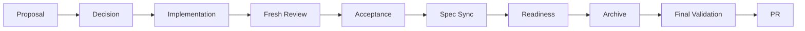

# Runtime 自治理

本文面向修改 `delivery-spec-runtime` 自身的 Change 维护者。它说明阶段顺序和责任边界；机器状态以 `delivery-control.ts`、`delivery-lifecycle.ts` 及对应 JSON contracts 为准。

## 真源分层

| 内容 | 权威位置 | 规则 |
|---|---|---|
| 当前操作方法 | `README.md`、`docs/` | 帮助读者执行任务，不复制机器合同 |
| 长期行为要求 | `openspec/specs/` | 规范性 MUST/SHOULD 和 Scenario |
| active Change | `openspec/changes/<change>/` | 当前需求、决策、任务和证据 |
| 历史 Change | `openspec/changes/archive/` | 审计证据，不作为当前 runbook |
| Artifact 批准 | `artifact-approvals.json` | 内容摘要和批准状态真源 |
| 实现任务 | `task-state.json` | 任务状态真源；07 Markdown 仅是投影 |
| Review/Acceptance/Readiness | `implementation-review.json`、`acceptance-state.json`、`archive-readiness.json` | 生命周期门禁真源 |
| Runtime 执行合同 | manifest、schema、contracts、tools | 程序校验权威 |
| Agent 规则 | `AGENTS.md` | 只约束 Agent 会话 |

## 生命周期



顺序不可交换。最终 PR 只能在功能分支完成归档和 final validation 后创建。

## 建立 Change

```bash
openspec new change <ascii-kebab-slug>
openspec status --change <change> --json
```

`delivery-change` 还必须初始化 `change-info.json`、`artifact-approvals.json` 和任务状态。每个 Artifact 写入前先读取对应 `openspec instructions`，写入后用摘要批准。

## Proposal 与 Decision

05 中依次形成：

1. `方案提案.md`：至少两个真实候选、约束、成本、风险、可逆性和 Trade-off；
2. `方案决策.md`：维护者明确选择、依据、拒绝方案、接受后果和重开条件；
3. `改造方案.md`：只把已批准候选转成实施切片、迁移和回滚计划。

提案作者不能代替维护者作出 Decision。任一已批准 Artifact 内容变化后，其摘要批准失效，下游门禁必须停止。

## 实现任务

`task-state.json` 是唯一状态真源。`07-实施任务/实施任务.md` 只由工具渲染，不能从复选框反向解析状态。

任务只包含实现、配置、测试和验收前置。Review、Acceptance、Spec Sync、Archive 和 PR 是生命周期门禁，不写进任务状态，避免形成“任务必须 verified 才能进入自身门禁”的循环。

## Fresh Review

Implementation Review 必须由主会话派发新的 reviewer session；实施会话不能直接自签 Review。

### Reviewer 输入

fresh session 只接收：

- 仓库规则；
- 已批准的需求、Proposal、Decision 和实施计划；
- delta specs 和 task state；
- `baselineCommit` 与 `reviewedCommit`；
- baseline→reviewed 的完整实现 diff；
- 明确的只读审查要求。

不要传入实施过程的对话推理、临时尝试或主会话结论，避免 reviewer 沿用实现会话的判断惯性。

### Reviewer 责任

- 检查完整性、准确性、边界、失败语义、回归风险和规格一致性；
- 输出带 severity、path、line、summary、status 的结构化 findings；
- 不修改实现；
- 任一 OPEN finding 都不能形成 PASS；
- 实现路径或内容变化后，旧 Review stale，必须重新派 fresh session 审查新的 commit。

fresh session 提供上下文独立性，但不等同于外部安全审计；高风险公开发布仍可增加人工 reviewer。

## Acceptance、Spec Sync 与 Readiness

Acceptance 只能绑定当前且 PASS 的 Review、全部 verified 的 task state 和严格 PASS 的验收正文。`acceptedAt` 必须晚于 `reviewedAt`。

Acceptance 后：

1. 将 delta spec 同步到 `openspec/specs/`；
2. 执行 `openspec validate --all --strict`；
3. 保存 cleanup PASS 证据；
4. 在尚未创建 PR 时写入 `archive-readiness.json`；
5. 通过 archive guard 后移动 Change 到 archive；
6. 在归档状态运行 final validation；
7. 创建中文 PR。

Runtime Change 的 Archive 不等待消费仓 gitlink 更新。消费仓采用由各仓独立 Change 管理。

## PR 反馈与 Reopen

PR 反馈如果只要求措辞说明且不改变实现或规格，可在当前交付边界内处理。若反馈改变实现、规格或受审路径，必须受控 reopen：

- 保留旧 Review、Acceptance、Readiness 和 08/09 证据到 lifecycle history；
- 使旧 PASS 状态失效；
- 将相关任务恢复为未验证；
- 从 fresh Review 重新执行 Review→Acceptance→Sync→Archive。

## 最终验证

```bash
node --experimental-strip-types \
  openspec/tools/render-commands.ts check --runtime-root .
node --experimental-strip-types --test test/*.test.ts
openspec validate --all --strict
```

升级 Change 还必须满足[受控 OpenSpec 升级](openspec-upgrade.md)中的完整候选门禁。
