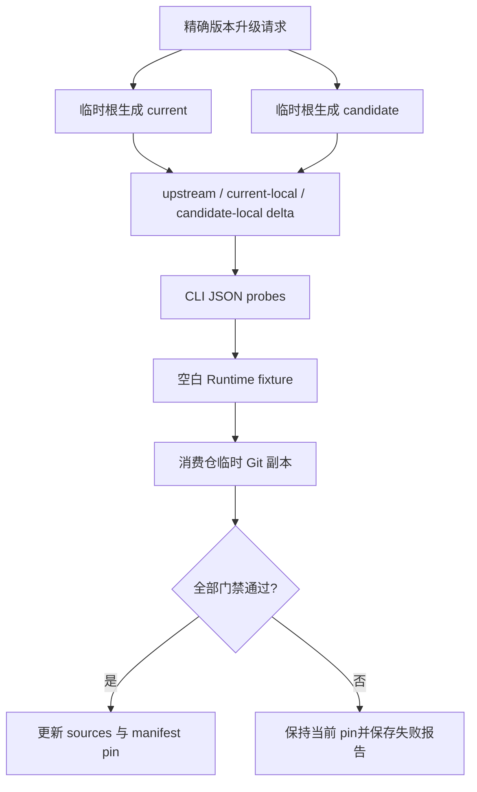

# 受控 OpenSpec 升级

本文面向评估和提升 Runtime OpenSpec 版本的维护者。消费仓不得执行本流程；实时仓的禁止边界见[架构与安全边界](architecture.md)。

## 原则

升级分为两个阶段：

1. 在 OS 临时目录分别生成 current 和 candidate，比较上游及本地差异，并执行 fixture 和消费仓隔离 smoke；
2. Runtime 维护者依据报告修改 command sources 和 `runtime-manifest.json` 精确版本 pin。

官方 OpenSpec 生成器任何时候都不得以 Runtime checkout、真实消费仓或其软链路径为 cwd。

## 前置条件

- Runtime 仓存在专门的升级 Change；
- 目标 current/candidate 都是精确 SemVer；
- 方案、测试和任务已经批准；
- `evidenceRoot` 位于当前 Change 的 `08-验收/runs/<run-id>/upgrade-evaluation/`；
- 三个消费仓路径显式提供，且真实消费仓只进行前后摘要和 Git 状态核验；
- Runtime 和消费仓工作树满足评估器的 clean 条件。

## 评估流程



## 准备请求

请求文件示例：

```json
{
  "schemaVersion": 1,
  "currentVersion": "1.10.0",
  "candidateVersion": "1.11.0",
  "runtimeRoot": "/absolute/path/to/delivery-spec-runtime",
  "evidenceRoot": "/absolute/path/to/delivery-spec-runtime/openspec/changes/<change>/08-验收/runs/<run-id>/upgrade-evaluation",
  "consumers": [
    { "name": "agent-system", "path": "/absolute/path/to/agent-system" },
    { "name": "webcoding-spec", "path": "/absolute/path/to/webcoding-spec" },
    { "name": "work-spec", "path": "/absolute/path/to/work-spec" }
  ]
}
```

字段和路径校验以 `openspec/contracts/openspec-upgrade-request.schema.json` 为准。示例只说明调用形状，不替代机器合同。

执行：

```bash
node --experimental-strip-types \
  openspec/tools/openspec-upgrade.ts evaluate --request <request.json>
```

## 评估器输出

评估器固定以 executable + argv 调用两个精确版本，并在临时目录完成：

- 九个官方 OMP Commands 的 current/candidate 生成；
- upstream、current-local、candidate-local 三类逐文件 delta 和 SHA-256；
- 声明式 CLI JSON required-fields probes；
- 空白 Runtime/gitlink/软链 fixture；
- 消费仓临时 Git 副本中的候选 Runtime 与候选 CLI smoke；
- 真实 Runtime 和消费仓前后 Git 状态、受管链接及摘要核验；
- 临时根清理和脱敏 `upgrade-report.json`。

报告只保存版本、路径类别、摘要、结构签名和退出状态，不保存消费仓 artifact 正文、环境值或凭据。报告合同以 `openspec/contracts/openspec-upgrade-report.schema.json` 为准。

## 判断和提升

只有以下门禁全部通过时，才能修改 Runtime fragments 和 manifest pin：

- renderer check；
- upstream/local 三类 delta 审阅；
- current/candidate CLI probes；
- 空白 Runtime fixture；
- Runtime 完整合同测试；
- 三个消费仓隔离 smoke；
- 真实仓零写入核验；
- 临时资源清理。

完成实现后运行 [Runtime 维护指南](maintainer-guide.md)中的最终验证，并按 [Runtime 自治理](governance.md)进入 fresh Review、Acceptance 和 Archive。

## 失败处理

任一生成、probe、fixture、smoke、零写入或清理门禁失败时：

1. 评估结果为 `FAIL`；
2. 保持当前 `runtime-manifest.json` pin；
3. 保存失败报告和可重放证据；
4. 修复升级 Change，不在真实消费仓试错；
5. 重新运行完整评估，不拼接旧 run 的局部 PASS。

上游 release note 和生成文件是待审输入，不自动成为 Runtime 权威。
