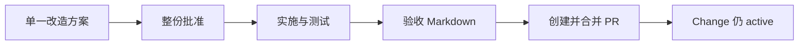

# 业务现状

## 参与者与职责

| 参与者 | 当前职责 | 当前缺口 |
|---|---|---|
| Runtime 维护者 | 批准 01-07 artifact、决定交付和合并 | 没有独立方案决策记录 |
| 实施者 | 编写方案、代码、测试和验收证据 | 可同时提出、决定、实现并自证，职责未分离 |
| 实现 Reviewer | 当前没有机器身份 | Review 结果不持久化、不绑定 commit |
| GitHub PR Reviewer | 审查最终交付 diff | PR 可能在 Change 未归档时建立并被误当作内部 Review |
| 消费仓维护者 | 选择 Runtime gitlink 版本 | 被错误纳入 Runtime 归档门禁会导致 Change 长期悬挂 |

## 当前流程问题

1. Proposal 和 Decision 合并，维护者看不到明确的选择空间。
2. Task verified 和测试 PASS 被当作实现 Review。
3. 验收不绑定被审 commit，代码变化不会自动使结果 stale。
4. 归档检查依赖文本命中，无法证明 Spec Sync 和 PR-not-started。
5. PR 被纳入 Change 内部 task，造成“验收要求任务完成、任务又要求先创建 PR”的循环依赖。

## 目标职责边界

- Proposal 作者负责完整呈现候选和 trade-off。
- 维护者批准 Decision，机器不得替代最终选择。
- Reviewer 对明确实现范围给出 findings 和 PASS/FAIL；作者可以是同一执行 Agent，但记录必须独立、完整且绑定 commit，关键变更推荐第二 Reviewer。
- Acceptance 只接受当前 Review PASS 的实现。
- Archive 证明 Change 内部生命周期完成；PR 只负责交付归档后的最终分支。
- 消费仓采用是各消费仓自己的 Change，不阻塞 Runtime Archive。

## 历史迁移

两个已合并 active Change 属于新合同建立前的历史状态。治理完成后应以 migration exception：

1. 绑定实际合并 commit 补 implementation review；
2. 同步 delta specs；
3. 生成 acceptance/archive readiness；
4. 归档并保留“原 PR 先于 Archive”的事实，不改写历史。
