# 改造方案

## 总体设计

采用已批准的候选 B，形成两条相互连接的状态链：

```mermaid
flowchart LR
    P[solution-proposal] --> D[solution-decision]
    D --> C[change-plan]
    C --> T[test-plan]
    T --> K[tasks]
    K --> R[implementation-review]
    R --> A[acceptance-state]
    A --> G[archive-readiness]
    G --> X[archive]
    X --> V[final validation]
    V --> PR[create PR]
```



## Schema v5

保留 01-09 顶层编号，在 05 内增加 artifact：

```text
05-改造方案/
├── 方案提案.md       solution-proposal
├── 方案决策.md       solution-decision
└── 改造方案.md       change-plan
```

依赖顺序：

```text
technical-current + specs
→ solution-proposal
→ solution-decision
→ change-plan
→ test-plan
→ tasks
→ acceptance
→ release
```

Proposal 和 Decision 使用独立模板、独立 digest 和独立批准。`guard apply` 要求 01-07 的九项 artifact 均批准，并额外验证 Proposal 至少包含两个候选、Trade-off、推荐和未决问题；Decision 必须包含 APPROVED、选择、决策人、时间、拒绝方案和接受后果。

## Implementation Review 合同

新增 `openspec/contracts/implementation-review.schema.json`，状态文件位于 Change 根：

```json
{
  "schemaVersion": 1,
  "baselineCommit": "<40-hex>",
  "reviewedCommit": "<40-hex>",
  "reviewedPaths": [{"path":"...","sha256":"sha256:..."}],
  "reviewedDigest": "sha256:...",
  "reviewer": "...",
  "reviewedAt": "ISO-8601",
  "findings": [{
    "id": "REV-001",
    "severity": "CRITICAL|HIGH|MEDIUM|LOW",
    "path": "...",
    "line": 1,
    "summary": "...",
    "status": "OPEN|RESOLVED|ACCEPTED",
    "resolution": null
  }],
  "result": "PASS|FAIL"
}
```

`delivery-control review write --file`：

1. 验证 baseline/reviewed commit 存在且 baseline 是 reviewed 的祖先；
2. 计算两 commit 差异中的实现路径；排除当前 Change 目录、`openspec/specs` 和归档证据；
3. 要求 `reviewedPaths` 精确覆盖差异集合，不得缺失或额外；
4. 以当前工作树对应路径重新计算 SHA 和聚合 digest；
5. 存在 OPEN CRITICAL/HIGH 或任何未处理 finding 时 result 不能 PASS；
6. 原子写入状态。

`review inspect` 重算路径摘要和 HEAD；任何变化返回 stale 并非零退出。

## Acceptance State

新增 `acceptance-state.json`：

- `reviewDigest`：当前 implementation review 文件摘要；
- `taskStateDigest`：当前 `task-state.json` 摘要，验收后任何任务状态变化都会使 Acceptance stale；
- `acceptanceDigest`：`08-验收/验收记录.md` 摘要；
- `implementationCommit`：必须等于 reviewed commit；后续 HEAD 只允许增加当前 Change、长期 specs 和生命周期证据，任何实现路径变化仍判 stale；
- `acceptedBy/acceptedAt`；
- `result=PASS|FAIL`。

`acceptance write` 只有 tasks 全 verified、Review PASS 且未 stale、验收正文严格 PASS 时可写。`guard acceptance` 只接受当前状态，不再仅解析 Markdown。

## Archive Readiness

新增 `archive-readiness.json`：

- 绑定 `acceptance-state.json` 摘要和当前 commit；
- `specSync` 逐项保存 delta spec、主 spec 相对路径和 SHA；
- `strictValidation=PASS`；
- `cleanup=PASS` 及清理证据摘要；
- `prStarted=false`、`attestedBy/attestedAt`；
- `result=READY|BLOCKED`。

`readiness write` 验证：Acceptance 当前；delta/main spec 路径存在且摘要一致；OpenSpec strict validation 的声明完整；清理证据存在；PR 尚未开始由维护者显式 attestation。`guard archive` 只接受当前 READY，不再匹配 09 任意文本。

## Archive 与最终 PR

`/opsx-archive` 顺序固定为：

1. Review 和 Acceptance 已完成；
2. 内联 `/opsx-sync`；
3. strict validate 主 specs 和 Change；
4. 写入 Archive Readiness；
5. guard archive；
6. 移动到 `openspec/changes/archive/YYYY-MM-DD-<slug>`；
7. 对归档后的仓库执行 final strict validation；
8. 此后才能创建最终 PR。

PR 不是 Change task，不把 PR URL 回写 archived Change。

## Reopen

新增 `delivery-control reopen`：

- 输入 archived Change 路径、目标 active slug、原因、操作者和时间；
- 目标不存在、工作树不干净、archive state 无效时拒绝；
- 将旧 `implementation-review.json`、`acceptance-state.json`、`archive-readiness.json` 和 08/09 快照复制到 `lifecycle-history/<timestamp>/`；
- 移回 active Change；
- 删除当前 Review/Acceptance/Readiness，写 `reopen-state.json`；
- 所有实现任务回到 `implemented_unverified`，要求重新 Review→Acceptance→Sync→Archive。

## 历史迁移

新门禁交付后，两个历史 active Change 使用显式 `migrationSource=pre-v5-merged-change`。它们补 Review、Spec Sync 和 Readiness 后归档；状态记录原 PR 已经先发生，因此不使用正常 `prStarted=false`，而使用仅限迁移的 `historicalPr` 字段和维护者批准。正常新 Change 禁止该字段。

## 公开与文档

- 更新三个 Command body 后用 renderer 生成 `.omp/commands`。
- README 明确内部生命周期与 GitHub 交付边界。
- public allowlist 增加新模板、合同和必要工具。
- 默认不新增 shell runner、服务端状态或兼容别名。
