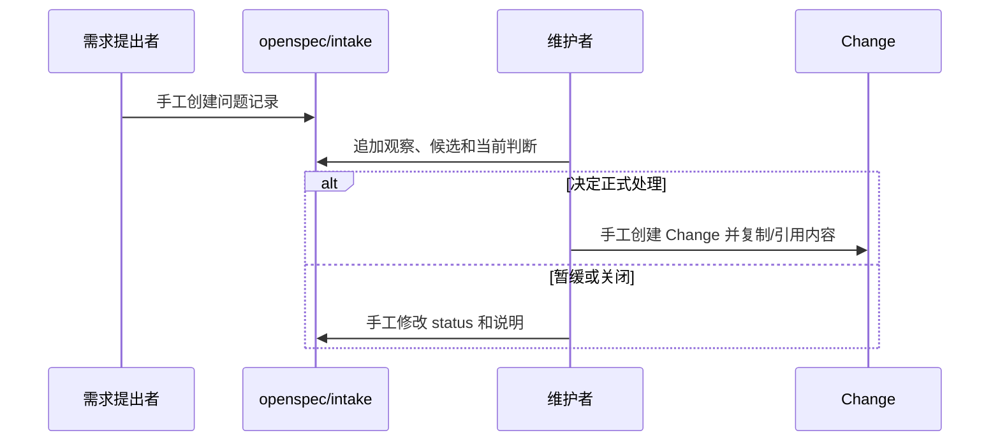

# 业务现状

## 调查口径

- 业务基线日期：2026-08-30
- 业务范围：项目仓中从外部问题到是否进入正式 Change 的前置分流
- 材料口径：当前仓 `openspec/intake/README.md`、现有 Intake 条目、`delivery-change` schema、Workflow Profile 合同；未使用真实业务事项

## 角色与责任

| 角色/系统 | 当前责任 | 输入 | 输出 |
|---|---|---|---|
| 需求提出者 | 提供问题、背景和原始判断 | 问题或想法 | 原始描述 |
| Runtime 维护者 | 判断范围、补充证据、决定是否继续 | Intake Markdown、代码和文档 | triage、候选处置和人工结论 |
| 项目仓 | 保存 Intake、Change 和长期 spec | 脱敏后的项目材料 | 可追溯的项目记录 |
| OpenSpec CLI | 提供 Change/Artifact 基础能力 | Change 和 schema | Change 状态、instruction 和 validation |
| Runtime | 当前主要提供目录约定和 Change workflow | 手写 Intake、Workflow/Change 合同 | 机器合同和交付门禁 |

## 当前业务流程

## 业务对象与状态

| 对象 | 关键字段/身份 | 状态 | 状态变化条件 |
|---|---|---|---|
| Intake asset | `id`、来源、原始问题、Markdown 文件 | `captured`、`triaged`、`promoted`、`closed` | 由维护者人工编辑；当前没有机器状态转换 |
| Change | slug、`.openspec.yaml`、Artifact DAG | active 或 archive | 由 OpenSpec 和 Runtime Change 流程管理 |
| 讨论结论 | Markdown 段落和当前处置 | 无独立状态 | 随文件人工追加或修改 |

## 异常与失败分支

| 场景 | 当前行为 | 业务影响 |
|---|---|---|
| Intake 缺字段 | 依赖人工发现 | 可能进入不完整的分析或错误分流 |
| 直接跳过分析阶段 | 没有 DAG 校验 | 无法证明为什么进入 Change |
| Promote 目标不清楚 | 依赖人工引用或复制 | 可能出现双真源和来源断裂 |
| 暂缓事项重新处理 | 没有统一恢复语义 | 历史判断和新判断容易混在一起 |
| 关闭事项重新打开 | 没有统一 reopen 合同 | 无法稳定统计恢复率和流失原因 |
| 误写 Runtime 或其他仓路径 | 依赖入口外部约束 | 可能污染公共 Runtime 或保存不应保存的业务内容 |

## 当前边界与已知问题

- 当前 Intake 是项目仓内的人工入口，不是个人 Desk 的工作区。
- 当前流程能表达基本状态，但不能机器验证阶段输入、合法转换或 Promote/Close 条件。
- 本 Change 的目标是补齐前置工作流合同；不改变正式 Change 的九层交付流程，不替主人决定事项价值，也不把真实业务数据写入公共 Runtime 仓。
