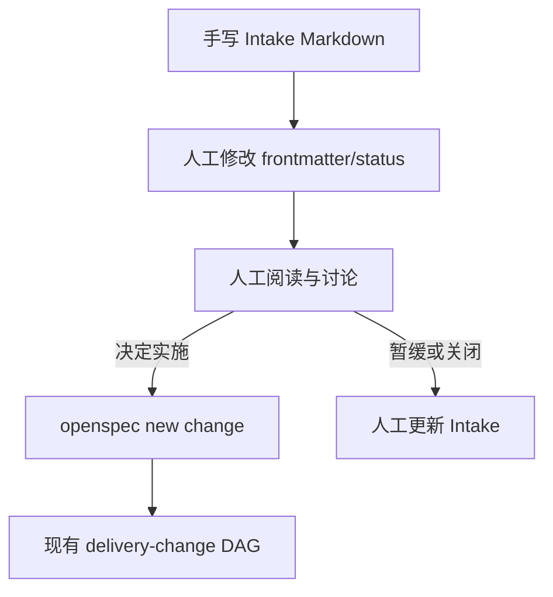

# 技术现状

## 调查基线

- 主干基线 commit：`54562ff`
- 需求分支：`profile-catalog-and-analysis-contracts`
- 运行态核验时间点：2026-08-30

| 仓库/路径 | 模块 | 证据类型 | 核验方式 |
|---|---|---|---|
| `openspec/intake/README.md` | Intake 目录规则 | 源码/文档事实 | 读取当前仓文件 |
| `openspec/intake/INT-*.md` | Intake 条目 | 源码/文档事实 | 读取现有条目 |
| `openspec/contracts/` | Runtime JSON 合同 | 源码事实 | 目录与既有合同检查 |
| `openspec/tools/workflow-core.ts` | Profile workflow 核心 | 源码事实 | 读取导出函数和状态执行路径 |
| `openspec/tools/workflow-control.ts` | Workflow CLI | 源码事实 | 读取命令分派和文件输出 |
| `openspec/tools/runtime-entry.ts` | Runtime 入口与生命周期守卫 | 源码事实 | 读取入口命令和路径边界 |
| `test/*.test.ts` | 合同与运行回归 | 历史测试事实 | 现有 Node test 套件 |

## 当前技术流程

## 接口与数据边界

| 边界 | 当前接口/模型 | 调用方 | 副作用 | 失败语义 |
|---|---|---|---|---|
| Intake 文件 | Markdown + YAML frontmatter，已有 `id/status/source/capturedAt/promotedTo` 约定 | 维护者/Agent | 直接写入 `openspec/intake/` | 没有统一 schema 校验 |
| Workflow Profile | `workflow-request` / `workflow-result` JSON | Runtime CLI 或调用层 | 写入调用方指定 request/result 文件 | `blocked`、`rejected`、`in_progress` 等合同结果 |
| Change 创建 | `openspec new change <slug> --schema delivery-change` | 维护者/Agent | 创建 Change 目录和 `.openspec.yaml` | OpenSpec CLI 非零即停止 |
| Change 合同 | `delivery-change` schema 与生命周期 JSON | Runtime 工具 | 更新 Change 内状态和证据 | 缺依赖、内容漂移和状态不一致 fail closed |
| Runtime 绑定 | `runtime-entry.ts runtime-check` | 消费仓调用方 | 只读检查 gitlink、软链、manifest 和 dirty 状态 | 环境不确定时拒绝执行 |

## 当前数据边界

- 没有 Intake 专用 JSON schema、DAG registry、状态转换工具或 Intake 合同测试。
- `workflow-core.ts` 的 Profile 状态机服务于 `requirement-analysis`、`light-change` 和 `delivery-change`，没有 Intake 阶段语义。
- 当前 `delivery-change` schema 的 Artifact DAG 从原始需求开始，不能表达“尚未承诺实施”的 Intake 生命周期。
- 当前 Runtime 通过仓内文件路径工作；公共 Runtime 不应保存消费仓真实业务正文、凭据或请求响应。
- 当前仓没有 `package.json`；本 Change 不引入 npm 分发。

## 运行态与兼容边界

- TypeScript 工具通过 `node --experimental-strip-types` 执行。
- 测试使用 Node 内置 `node:test`。
- 入口必须继续遵守 Runtime manifest、gitlink、submodule、软链和 dirty 状态检查。
- 新 Intake 工具不得绕过现有 `runtime-entry.ts` 入口，也不得直接写 Runtime submodule。
- 现有只有旧 frontmatter/status 的 Intake 条目需要可识别、可报告迁移缺口，不得被静默当成新合同下的完成状态。
