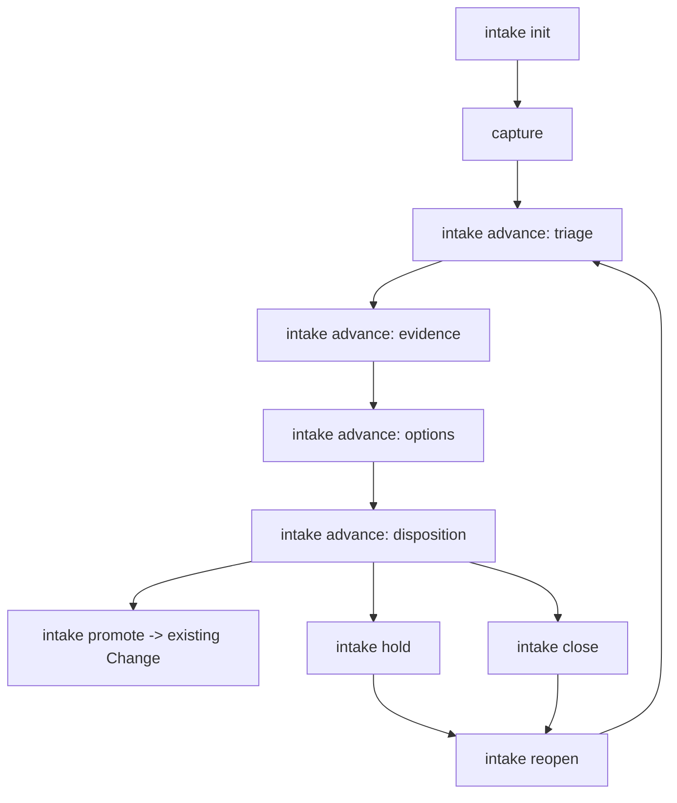

# 改造计划

## 目标与非目标

### 目标

- 增加 Runtime-owned Intake state contract、模板和阶段 DAG。
- 提供受 `runtime-entry.ts` 守卫的 `intake` 子命令，支持 init、inspect、advance、promote、hold、close 和 reopen。
- 让每次阶段推进、Promote、Hold、Close 和 Reopen 都有可验证输入、状态转换和失败语义。
- 保留旧 Intake 条目，提供 legacy inspect 和显式规范化路径。
- 更新公共资产 allowlist、README、consumer guide 和治理说明。

### 非目标

- 不改变 `delivery-change` 九层 Artifact DAG。
- 不将 Intake 注册为普通 Workflow Profile。
- 不修改 OpenSpec CLI、npm 分发、submodule 或软链接模型。
- 不自动替用户决定 Promote、Hold 或 Close。
- 不保存真实业务事项、凭据、请求响应或敏感环境值。

## 目标业务与技术流程

## 影响面

| 仓库/系统 | 模块/接口 | 变更 | 兼容约束 | 责任方 |
|---|---|---|---|---|
| Runtime contracts | `openspec/contracts/intake-state.schema.json` | 新增 Intake 状态和历史合同 | exact keys、枚举和日期格式稳定 | Runtime |
| Runtime tools | `openspec/tools/intake-control.ts` | 新增 Intake 文件操作与状态守卫 | 仅写受控项目仓路径 | Runtime |
| Runtime entry | `openspec/tools/runtime-entry.ts` | 暴露 Intake 子命令 | 继续先执行 runtime-check | Runtime |
| Intake template | `openspec/intake/template.md` | 新增统一 Markdown 模板 | 不包含真实事项 | Runtime |
| Public candidate | `public-allowlist.json` | 纳入新公共合同和工具 | candidate 检查必须覆盖新文件 | Runtime |
| Documentation | `README.md`、`docs/consumer-guide.md`、`docs/workflow-guide.md`、`docs/governance.md` | 描述 Intake→Change 边界和命令 | 不复制机器合同 | Runtime |
| Tests | `test/intake*.test.ts` | CLI、合同、迁移和负向覆盖 | Node 内置 test | Runtime |

## 实施切片与依赖

| 顺序 | 切片 | 前置 | 独立验收 | 回滚边界 |
|---:|---|---|---|---|
| 1 | Intake state schema、template、DAG 常量和 parser | solution decision | schema 合法；非法状态拒绝 | 删除新合同和模板 |
| 2 | Intake control：init/inspect/advance/hold/close/reopen | 1 | 临时仓正向和负向 CLI 行为 | 不触碰现有 Intake |
| 3 | Promote 双向引用和 legacy inspect | 2 | 目标 Change 存在性、路径和来源引用校验 | 只回滚新 Intake 状态文件 |
| 4 | runtime-entry 命令分派与路径守卫 | 2、3 | runtime-check 后命令可用；越界拒绝 | 移除命令分派，不改旧命令 |
| 5 | 合同测试、allowlist、文档和迁移说明 | 1-4 | 全部定向测试和公共候选检查 | 删除新增测试和文档变更 |

## 数据与兼容迁移

- 数据：新 Intake 保持单个 Markdown asset，machine-readable frontmatter 记录 `schemaVersion`、`id`、`state`、`phase`、`source`、`capturedAt`、`promotedTo`；状态历史追加在受控区块，不覆盖原始讨论。
- 接口：`runtime-entry.ts intake <operation>` 使用显式 `--intake-root`/`--file` 和参数；Promote 使用已存在的 `--change-root`，不隐式创建 Change。
- 灰度：新命令只服务新合同 Intake；legacy 文件 inspect-only，调用方显式规范化后再推进。
- 回滚：新命令失败不写文件；已写状态使用原子写入和历史快照；移除新入口不影响旧 `openspec` 和 `delivery-change`。

## 风险与处置

| 风险 | 影响 | 预防/缓解 | 停止条件 |
|---|---|---|---|
| Intake 变成第二套 Change | 维护和使用成本上升 | 只保留五阶段和最小输入；不实现完整 Artifact DAG | 新合同需要复制 Change Artifact |
| Promote 形成双真源 | 来源和后续修改漂移 | 要求目标 Change 已存在并建立双向引用；Promote 后 Intake 只读 | 无法稳定验证两侧引用 |
| legacy 条目被误当成新合同 | 错误统计或越过人工判断 | inspect 明确返回 legacy；禁止自动推进 | 任何 legacy 静默通过 |
| 越界写入 Runtime 或其他路径 | 污染公共仓或泄露业务数据 | safeRepoPath、runtime-check 和负向测试 | 任一越界场景写入成功 |
| 状态历史被覆盖 | 审计断裂 | 原子写入、历史数组/区块和 digest | 状态变化无历史证据 |

## 决策日志

| ID | 决策 | 依据 |
|---|---|---|
| D-001 | Intake 使用 Runtime-owned 轻量合同 | 与正式 Change 解耦，精确表达前置分流 |
| D-002 | Promote 只关联已有 Change | 避免隐藏创建和未经判断的承诺 |
| D-003 | legacy 先 inspect，不自动迁移 | 避免静默改变既有项目记录 |
