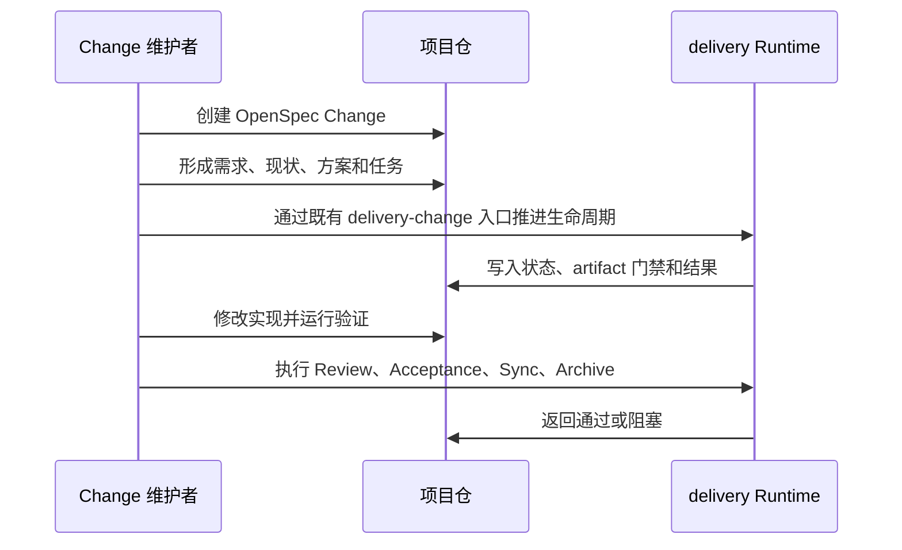

# 业务现状

## 调查口径

- 业务基线日期：2026-08-30
- 业务范围：公共 Runtime 当前如何承载 `delivery-change`，以及多 profile 架构变更前的 Change 选择、执行和交付责任。
- 材料口径：当前仓 `docs/workflow-guide.md`、`docs/architecture.md`、现有 `openspec` 合同和既有 Change；只使用公共 Runtime 事实与合成架构决策，不保存私人业务材料。

## 角色与责任

| 角色/系统 | 当前责任 | 输入 | 输出 |
|---|---|---|---|
| Change 维护者 | 提出需求、选择或批准方案、接受风险 | 需求、现状和候选方案 | Change 规划、批准和验收决定 |
| 项目仓 | 保存具体 Change、实现、测试和交付证据 | 项目需求、Runtime 调用结果 | 项目代码、artifact、长期 spec 和归档 Change |
| `delivery-spec-runtime` | 提供现有 `delivery-change` schema、Commands、合同和治理工具 | Change 根、manifest、状态和显式命令 | 生命周期状态、门禁结果和失败信息 |
| Workflow System（目标） | 尚未作为独立多 profile 系统运行 | 待定义的 profile 选择和 Change 上下文 | 待定义的 profile 执行结果 |

## 当前业务流程

当前项目 Change 默认按单一 `delivery-change` 生命周期处理，尚不存在正式的 profile 选择步骤。

当前不存在“同一 Spec 仓内列出多个 profile、Change 绑定 profile、按绑定解析不同阶段合同”的业务动作；不同事项若不适合 `delivery-change`，目前只能在流程外人工处理或另行讨论。

## 业务对象与状态

| 对象 | 关键字段/身份 | 当前状态 | 状态变化条件 |
|---|---|---|---|
| OpenSpec Change | change slug、Change 根、artifact 状态 | 规划中、实施中、验证中、可归档等 | 规划工件、任务、Review、Acceptance 和 Sync 门禁依次满足 |
| delivery workflow | 固定由 `delivery-change` schema 表达 | 单一重型交付流程 | 当前 Change 按既定 artifact 和命令推进 |
| artifact | 路径、内容、审批和依赖状态 | ready、done、blocked 等 | 依赖满足、维护者批准或工具验证通过 |
| 事项实例 | 当前无统一独立的跨 profile 身份合同 | 隐含在 Change slug / 项目上下文 | 通过 Change 和项目仓人工追踪 |
| profile 选择 | 当前不存在正式业务对象 | 未选择 | 由未来 Workflow System Change 绑定流程后产生 |

## 异常与失败分支

| 场景 | 当前行为 | 业务影响 |
|---|---|---|
| 需求仍不清楚 | 在流程外或人工分析中继续澄清，暂不应直接实施 | 事项可能停留在分析阶段 |
| 事项不适合 `delivery-change` | 当前没有正式替代 profile，通常继续人工判断 | 流程不一致，容易把轻量事项套入重型交付流程 |
| 规划工件缺失或未批准 | Runtime 按依赖和门禁阻塞 | 不得进入实施或后续生命周期 |
| 任务、测试或验收失败 | Change 保持 active，修复后重试 | 不得伪装成完成或归档 |
| Runtime gitlink、manifest 或 submodule 异常 | fail closed | 停止调用，避免消费仓使用错误 Runtime |
| 事项跨仓追踪 | 依赖 Change slug、路径和人工链接 | 缺少统一稳定事项身份，跨 profile 汇总困难 |

## 当前边界与已知问题

- 当前 Runtime 只承担项目交付流程，不是通用多 profile Workflow System。
- 项目仓保存具体实例和证据；当前没有独立的 profile registry、profile version pin 或通用 Change profile selection。
- 本 Change 的目标是补齐多 profile 的业务合同和最小执行边界，不在当前基线中假定全局扫描、跨仓同步或私有化迁移。
