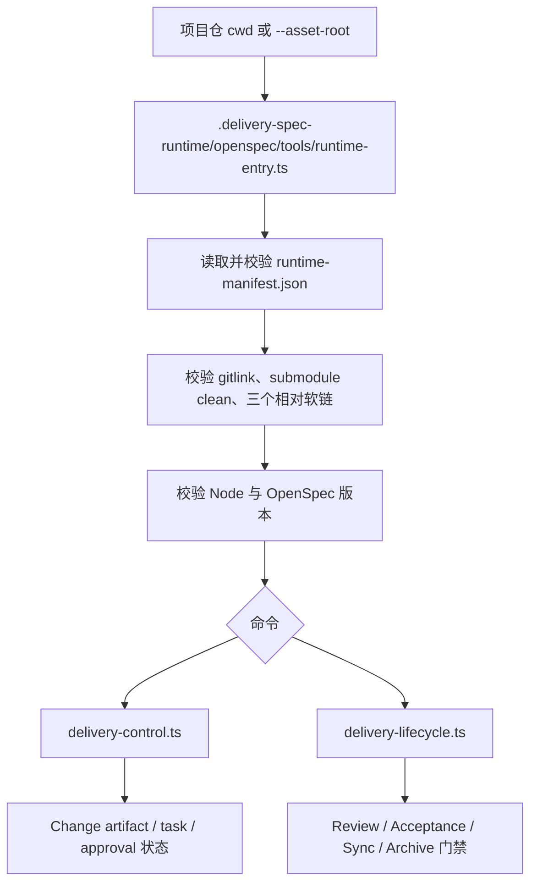

# 技术现状

## 调查基线

- 主干基线 commit：`17aba1a`（已从 `origin/main` fast-forward）
- 需求分支：`Eridanus117/intake-4`
- 调查时间点：2026-08-30

| 仓库/模块 | 证据类型（源码/历史测试/运行态/推断） | 核验方式 |
|---|---|---|
| `openspec/tools/runtime-entry.ts` | 源码 | 入口、manifest 校验、gitlink/submodule/软链校验、命令转发 |
| `openspec/tools/delivery-control.ts` | 源码 | artifact approval、task state、source、mode 和 Change 锁边界 |
| `openspec/tools/delivery-lifecycle.ts` | 源码/历史测试 | Review、Acceptance、Sync、Archive 生命周期 |
| `runtime-manifest.json` | 源码合同 | `schemaName=delivery-change`，Node/OpenSpec 版本和三个相对软链 |
| `openspec/contracts/*.schema.json` | 源码合同 | task、source、approval、acceptance 等现有机器合同 |
| `test/*.test.ts` | 历史测试 | Node 内置 `node:test`、临时 consumer、submodule dirty 和 fail-closed 断言 |

## 当前技术流程

`runtime-entry.ts` 从当前目录向上查找同时具有 `.gitmodules` 和 `.delivery-spec-runtime/runtime-manifest.json` 的资产根；随后只按 `runtime-manifest.json` 的 `schemaName=delivery-change` 绑定现有 Runtime。它在转发前校验父仓 gitlink、Runtime submodule clean、三个相对软链、Node 版本、OpenSpec 版本和 bootstrap 状态。

现有 Runtime 只有 `delivery-change` 的正式入口。`delivery-control.ts` 管理 `artifact-approvals.json`、`task-state.json`、`change-sources.json`、`change-mode.json` 和排他锁；`delivery-lifecycle.ts` 管理后续生命周期。没有通用的 profile registry、profile version pin、Change profile selection 或跨 profile result contract。

## 接口与数据边界

| 边界 | 当前接口/模型 | 调用方 | 副作用 | 失败语义 |
|---|---|---|---|---|
| 项目仓 → Runtime | `runtime-entry.ts` 转发命令和 `--asset-root` | 项目仓维护者/Commands | 可能在 Change 根写入状态和证据 | 校验失败立即非零退出 |
| Runtime → OpenSpec | `openspec` CLI 版本合同 | `runtime-entry.ts` | 依赖外部 CLI 解析 Change | 版本不匹配停止 |
| Runtime → Change 状态 | `delivery-control.ts` 的 JSON 合同和排他锁 | lifecycle Commands | 原子更新审批、任务、来源和模式 | 合同非法、锁冲突或前置缺失停止 |
| Runtime → lifecycle | `delivery-lifecycle.ts` 的阶段命令 | Review/Acceptance/Sync/Archive | 写入生命周期状态和归档资产 | fail closed，不跳过门禁 |
| 未来 Change → profile core | 当前不存在 | 目标多 profile 调用方 | 尚未定义 | 尚未定义；本 Change 需形成合同 |

当前 `runtime-manifest.json` 只声明三个相对软链：`.omp/commands`、`openspec/schemas/delivery-change` 和 `openspec/tools/runtime-entry.ts`。它没有 profile 列表或可选择的 workflow 标识；当前 Runtime 也没有全局目录解析、跨仓扫描或外部状态回写的技术路径。

## 事务、缓存、通知和兼容

- 事务：现有控制工具在 Change 根排他锁内更新机器状态；没有跨 profile 事务。
- 缓存：没有 profile registry 或执行结果缓存；现有版本和 gitlink 校验每次入口调用执行。
- 通知：命令通过 stdout/stderr 和退出码返回结果；没有面向外部上层系统的结果回传协议。
- 兼容：公共 Runtime 依赖 Windows 路径处理、gitlink/submodule clean、相对软链、OpenSpec `1.11.0` 和 Node 最低版本合同；新多 profile 能力不得放松这些约束。
- 数据归属：现有 Change 状态与证据保存在消费仓 Change 根；Runtime submodule 只提供代码、schema 和 Commands，不应保存消费仓业务数据。

## 部署与运行态

| 事实 | 环境/机器 | 证据 | 核验时间 |
|---|---|---|---|
| Runtime 通过 `.delivery-spec-runtime` git submodule 接入项目仓 | Windows 11 / Node `--experimental-strip-types` | `runtime-entry.ts`、`runtime-manifest.json` | 2026-08-30 |
| Runtime 绑定父仓 HEAD 中的 submodule gitlink | Windows git consumer fixture | `runtime-entry.ts` 的 `expectedGitlink` 与既有 submodule tests | 2026-08-30 |
| 当前 Runtime manifest 的 schema name 是 `delivery-change` | 当前仓根 | `runtime-manifest.json` | 2026-08-30 |
| 公共仓不应接收私人资产或真实业务证据 | 当前仓 AGENTS 规则 | `AGENTS.md` 与 Change 来源约束 | 2026-08-30 |

## 改造前缺口

- 没有一个仓内可发现的多 profile 定义集合。
- 没有 Change 级 `profileId` / `profileVersion` 绑定合同。
- 没有定义 profile 与 core、artifact/schema、命令、门禁之间的责任边界。
- 没有跨 profile 稳定的事项身份和机器可读执行结果合同。
- 没有 profile 级兼容测试和版本升级禁止静默切换的机制。
- `delivery-change` 的现有入口、schema 和生命周期已稳定，不能通过直接改写旧入口来隐式承担上述新职责。

本文件只记录改造前技术事实和可核验缺口；目标模块、合同和迁移顺序进入 `05-改造方案/`。
