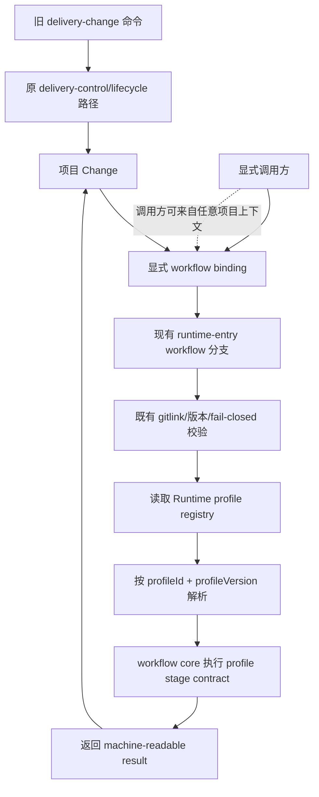

# 改造计划

## 目标与非目标

### 目标

- 在当前 `delivery-spec-runtime` 仓内增加可发现、可版本化的 workflow profile 集合。
- 增加 Change 级显式 profile binding，使每个 Change 选择一个 `profileId` 和 `profileVersion` 后再执行。
- 增加独立调用的 workflow 命令分支、通用 core 和机器可读结果，证明至少两个 profile 的选择与结果隔离。
- 将现有 `delivery-change` 保持为兼容的重型 profile 路径，不重写其 artifact、命令、锁和生命周期门禁。
- 保留现有 `runtime-manifest.json` 的三个相对软链、gitlink、submodule clean、Node/OpenSpec 版本和 fail-closed 入口合同。

### 非目标

- 不把 `delivery-change` 重写成通用 workflow，不修改其既有生命周期语义。
- 不实现全局路由、全局扫描、跨仓同步、持久化数据库或 profile 市场。
- 不创建或迁移私有 Workflow System 仓，不改变仓库可见性、remote、submodule 结构或第二套 lock/hash pin。
- 不一次性实现多个完整业务 profile；第二个 profile 只作为公共合成的轻量 profile，用于验证选择和隔离合同。
- 不允许按事项标题、目录结构或缺省规则自动猜测 profile；调用方必须显式绑定。

## 目标业务与技术流程



目标调用边界：

```text
node --experimental-strip-types openspec/tools/runtime-entry.ts workflow list-profiles --asset-root <consumer>
node --experimental-strip-types openspec/tools/runtime-entry.ts workflow run --change-root <change> --input <request.json> --asset-root <consumer>
```

`runtime-entry.ts` 继续先做既有 Runtime 绑定和版本校验，再只为 `workflow` 命令分支转发到新增 workflow tool；不传 `workflow` 的旧命令保持原分发。profile registry 位于 Runtime 仓内，Change binding 位于具体 Change 根，实例状态和结果由调用方/Change 保存；Runtime 不访问未授权的外部资产和全局目录。

## 影响面

| 仓库/系统 | 模块/接口 | 变更 | 兼容约束 | 责任方 |
|---|---|---|---|---|
| `delivery-spec-runtime` | `openspec/contracts/workflow-*.schema.json` | 新增 profile、binding、request/result 合同 | 新合同独立版本；不修改既有 delivery contracts | Runtime 维护者 |
| `delivery-spec-runtime` | `openspec/profiles/` | 新增 profile registry、版本和两个合成可执行 profile 定义 | 只含公共合成内容；profile id/version 冲突 fail closed | Runtime 维护者 |
| `delivery-spec-runtime` | `openspec/tools/workflow-core.ts` | 新增独立解析、校验、阶段转移和结果生成 | 不读写 Change 外部目录；状态从显式请求/binding 输入 | Runtime 维护者 |
| `delivery-spec-runtime` | `openspec/tools/workflow-control.ts` | 新增 `list-profiles`、`bind`、`run` workflow 命令 | 输出 JSON；错误和阻塞非零；不改变旧命令 | Runtime 维护者 |
| `delivery-spec-runtime` | `openspec/tools/runtime-entry.ts` | 只增加 `workflow` 分支转发 | 保留原 manifest、gitlink、软链、版本和旧命令分支 | Runtime 维护者 |
| 消费仓 Change | `workflow-binding.json` | 保存 Change 选择的 profile 身份和固定版本 | 不复制 profile 正文；缺失/漂移不得默认选择 | Change 维护者 |
| `delivery-change` | `delivery-control.ts`、`delivery-lifecycle.ts` | 首轮不改实现 | 原命令、状态、锁、artifact 和 fail-closed 行为不变 | Runtime 维护者 |
| 上层调用方 | 架构裁决和调用 | 不接入 Runtime 内部执行 | 调用方可选择 profile，但不得成为 Runtime 隐式依赖 | 各调用方维护者 |

## 实施切片与依赖

| 顺序 | 切片 | 前置 | 独立验收 | 回滚边界 |
|---:|---|---|---|---|
| 1 | 固化 profile、binding、request、result 合同及 registry 结构 | 已批准的总体架构和实施决策 | 两个合成 profile 可校验；重复 id/version、缺 binding、未知字段均拒绝 | 删除新增合同和 registry |
| 2 | 实现 profile registry/loader 与两个合成 profile | 切片 1 | `list-profiles` 返回稳定 id/version；同名不同内容冲突 fail closed；不存在版本不降级 | 删除 `openspec/profiles/` 和 loader |
| 3 | 实现 `workflow-core.ts` 与 profile selection | 切片 1–2 | 两个 Change 绑定不同 profile 后阶段合同、结果和下一步互不混淆；阻塞不伪装成功 | 删除 core，不改旧 delivery |
| 4 | 在 `runtime-entry.ts` 增加 workflow 分支并实现 `workflow-control.ts` | 切片 2–3 | consumer cwd 通过真实入口执行 list/bind/run；stdout 为单一 JSON；旧命令回归 | 删除新分支和 workflow tool，保留旧入口 |
| 5 | 增加 profile 版本 pin、Change binding 更新和冲突/漂移处理 | 切片 1–4 | 已开始 Change 不随 registry 新版本静默切换；绑定版本缺失时显式阻塞/拒绝 | 删除新增 binding 状态，不迁移旧 Change |
| 6 | 增加合同测试、CLI probe、consumer/submodule 边界测试 | 切片 1–5 | 覆盖成功、拒绝、阻塞、版本、独立调用和 submodule dirty 场景 | 删除新测试和合成 fixtures |
| 7 | 更新公共 Runtime 文档和 Change 交付证据 | 切片 1–6 | 文档区分 workflow profile 与旧 delivery-change，样例无私人数据 | 删除本 Change 文档变更 |

## 数据与兼容迁移

- 数据：新增 `workflow-binding.json` 作为 Change 实例的显式绑定；profile 正文仍由 Runtime registry 持有，实例只保存 `profileId`、`profileVersion` 和必要的运行引用。
- 接口：新增 `runtime-entry.ts workflow list-profiles|bind|run`；既有 `runtime-entry.ts` 的 delivery 和 lifecycle 分发不变。
- 选择规则：`bind` 必须显式指定 profile id/version；`run` 只接受已存在且内容未冲突的绑定；不按目录、标题或未声明上下文推断。
- 版本规则：registry 中同一 `profileId + profileVersion` 内容不可变；新版本并行存在；运行中的 Change 继续使用原绑定，缺失时停止而不是降级。
- delivery 兼容：已有 Change 不自动生成 binding，不要求迁移；既有 `delivery-change` 仍按原命令运行。只有新 workflow 命令显式使用 binding。
- 灰度：先在 Runtime 合成 fixture 和临时 consumer 中启用两个 profile，再选择真实 `delivery-change` adapter 接入；本 Change 不强制改造现有消费仓。
- 回滚：停止 `workflow` 命令调用，删除新增 registry/core/tool/contract；旧入口和旧 Change 不需要回滚。若外部已保存 binding，保留合同解析兼容并另立废止 Change，不删除已发布版本含义。
- 仓库边界：不增加 manifest 软链、不建立第二套 runtime lock/hash、不访问未授权的外部工作台或全局目录。

## 风险与处置

| 风险 | 影响 | 预防/缓解 | 停止条件 |
|---|---|---|---|
| core 吸收 profile 专属逻辑 | 重新形成万能 Runtime | core 只处理通用身份、选择、阶段合同和结果；差异留在 profile | 任一 profile 需要修改另一个 profile 的阶段才能运行 |
| registry 变成隐式默认路由 | Change 未明确选择却执行错误流程 | `bind` 强制 id/version；未知或缺失绑定直接拒绝 | 任一请求在无 binding 时成功执行 |
| profile 版本漂移 | 运行中的 Change 语义改变 | binding 回显并固定版本；不可解析时停止 | 新版本发布后旧 Change 结果回显新版本 |
| 新入口绕过现有 Runtime 安全校验 | consumer 使用错误或 dirty Runtime | workflow 只通过既有 `runtime-entry.ts` 分支暴露；复用 gitlink/版本校验 | workflow 命令可绕过 manifest/submodule/version 检查 |
| 旧 delivery-change 回归 | 现有项目交付中断 | 新分支 additive；全量旧合同、lifecycle 和 submodule 测试 | 任一旧测试因新 profile 代码失败 |
| profile 定义与 Change 实例混淆 | 跨仓状态和结果不可追踪 | registry 只存定义，Change 根只存 binding/实例引用 | profile 正文被复制到每个 Change 或 Runtime 写入项目业务正文 |
| 外部状态依赖悄然进入 Runtime | 破坏独立运行边界 | core/tool 不引用外部工作台路径、索引或环境；使用无外部状态 consumer smoke | 无外部状态环境无法 list/bind/run |
| 公共仓混入私有材料 | 泄露或审查失败 | 只使用合成 fixtures 和公共架构决策；审查新增路径 | fixture 出现真实业务、凭据、账号或私人路径 |

## 决策日志

| ID | 决定 | 来源 | 状态 |
|---|---|---|---|
| PLAN-001 | 总体架构采用单仓多 profile，Change 绑定 profile 身份与版本 | 总体架构裁决 | 已批准 |
| PLAN-002 | 实施采用当前 Runtime 内增量 profile 层，保留旧 delivery 路径 | `05-改造方案/方案决策.md` | 已批准 |
| PLAN-003 | profile registry、Change binding、core 和 workflow dispatch 作为新增边界；不改 manifest 软链和旧 lifecycle | 本 Change 实施决策 | 已批准 |
| PLAN-004 | V0.1 用两个合成 profile 验证识别、选择、版本和结果隔离，不实现多个完整业务 profile | 本 Change 范围 | 已批准 |
| PLAN-005 | 状态实例由 Change/调用方保存，Runtime 不访问未授权的外部资产、不建设跨仓数据库 | 当前架构约束 | 计划采用 |
