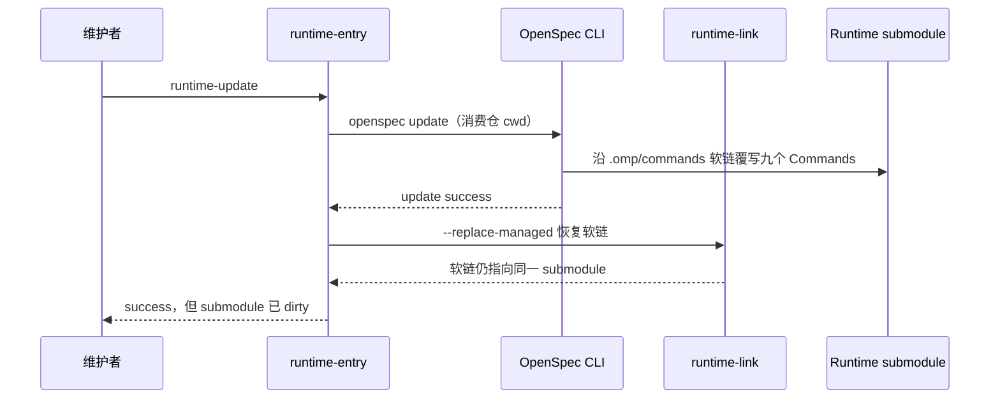

# 业务现状

## 调查口径

- 业务基线日期：2026-08-30
- 业务范围：Runtime 维护者触发 OpenSpec 客户端命令更新，以及项目仓/资产仓对锁定 Runtime 的消费
- 材料口径：当前 `delivery-spec-runtime`、三个消费仓的 submodule/软链拓扑、OpenSpec 1.10.0 实际行为探针；材料完整

## 角色与责任

| 角色/系统 | 当前责任 | 输入 | 输出 |
|---|---|---|---|
| Runtime 维护者 | 维护 schema、Commands、治理工具和版本合同 | 上游 OpenSpec、用户规则 | Runtime commit |
| 项目仓/资产仓 | 通过 gitlink 锁定 Runtime，并保存本仓 Change/specs/证据 | Runtime commit | 可执行生命周期入口 |
| `runtime-entry.ts` | 校验 gitlink、dirty、manifest、软链和版本 | 消费仓根、CLI 参数 | 放行治理命令或非零失败 |
| OpenSpec CLI | 按当前安装版本生成客户端 Commands | 项目根、已安装 adapter | `.omp/commands/opsx-*.md` |
| `runtime-link.ts` | 建立或恢复三个相对软链 | Runtime manifest | 软链路径和目标 |

## 当前业务流程

## 业务对象与状态

| 对象 | 关键字段/身份 | 状态 | 状态变化条件 |
|---|---|---|---|
| Runtime 版本 | 父仓 gitlink、submodule HEAD | clean / dirty / drift | update 沿软链写入后变 dirty |
| Commands | 九个 `opsx-*.md` | 本地治理版 / 官方生成版 | OpenSpec update 重生成内容 |
| 三个托管软链 | manifest `link/source` | exact / drift | 路径或目标变化；本缺陷中始终 exact |
| 消费仓生命周期 | runtime-check 结果 | allowed / rejected | submodule dirty 后后续入口拒绝 |

## 异常与失败分支

| 场景 | 当前行为 | 业务影响 |
|---|---|---|
| OpenSpec update 成功 | 九个本地 Commands 被官方正文覆盖 | Runtime submodule dirty，治理 prompt 丢失，后续入口停止 |
| OpenSpec update 失败但已部分写入 | wrapper 再建软链，不恢复目标文件 | 可能留下部分新旧 Commands 混合 |
| 维护者直接运行 `openspec update` | 绕过 runtime wrapper 并写入软链目标 | 同样修改 Runtime submodule |
| runtime-link `--replace-managed` | 只处理链接路径与目标 | 不能回滚链接目标内容 |

## 当前边界与已知问题

- Gitlink、manifest 和软链校验本身有效；缺陷来自对目录软链写入语义的错误假设。
- 当前测试覆盖软链漂移、gitlink 漂移和 dirty fail-closed，但未覆盖 `runtime-update` 启动官方生成器后的副作用。
- 当前 `runtime-update` 不是安全升级入口，在修复前不应执行。
