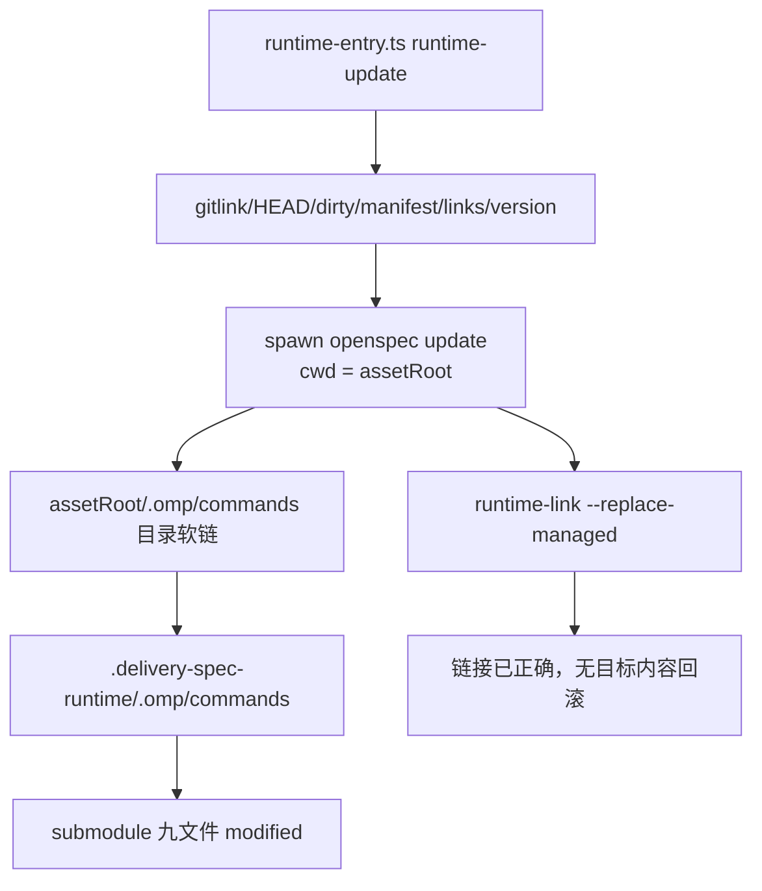

# 技术现状

## 调查基线

- 主干基线 commit：`4896699085a35713b8221a1c878d60c725a47014`
- 需求分支：`change/prevent-live-runtime-update-mutation`
- 运行态核验时间点：2026-08-30

| 仓库 | 模块 | 证据类型 | 核验方式 |
|---|---|---|---|
| delivery-spec-runtime | `openspec/tools/runtime-entry.ts` | 源码 | 读取 `runtime-update` 分支和调用顺序 |
| delivery-spec-runtime | `openspec/tools/runtime-link.ts` | 源码 | 读取 manifest 托管路径和 replace 语义 |
| delivery-spec-runtime | `.omp/commands/opsx-update.md` | 源码 | 读取当前 wrapper 指令 |
| delivery-spec-runtime | `test/submodule.test.ts` | 历史测试 | 盘点 gitlink、dirty、软链覆盖范围 |
| agent-system 临时递归 clone | `.delivery-spec-runtime` | 运行态 | 执行 `runtime-update`，比较父仓与 submodule status/diff |
| Fission-AI/OpenSpec 1.10.0 | OMP command generation | 上游源码/运行态 | 读取官方 adapter 并实际执行 update |

## 当前技术流程

## 接口与数据边界

| 边界 | 当前接口/模型 | 调用方 | 副作用 | 失败语义 |
|---|---|---|---|---|
| Runtime 版本 | `runtime-manifest.json` 要求 OpenSpec `1.10.0` | runtime-entry | 无 | 版本不等即非零 |
| 父仓锁定 | `git ls-tree HEAD -- .delivery-spec-runtime` | runtime-entry | 无 | gitlink/HEAD 不一致即非零 |
| Commands 暴露 | `.omp/commands` 相对目录软链 | OMP/OpenSpec | 写操作沿软链进入 submodule | lstat/readlink 仍显示正确，无法发现内容语义变化 |
| 官方更新 | `spawnSync("openspec", ["update"])` | runtime-entry | 重生成客户端命令 | status 非零才认为失败；成功不检查 submodule 后置状态 |
| 软链恢复 | `runtime-link.ts apply --replace-managed` | runtime-entry | 仅替换三个托管路径 | 不备份、不还原 source 内容 |
| 治理入口 | `delivery-control.ts` | runtime-entry | 修改 Change sidecar | submodule dirty 时在下一次入口前被拒绝 |

## 事务、缓存、通知和兼容

- 事务：官方 update 与 relink 不是同一事务，也没有 source 内容快照或回滚。
- 缓存：无。
- 通知：仅 stdout/stderr；没有持久升级报告。
- 兼容：Runtime 精确绑定 OpenSpec 1.10.0；命令正文是对官方生成层的大规模本地 fork。

## 部署与运行态

| 事实 | 环境 | 证据 | 核验时间 |
|---|---|---|---|
| Runtime 全量合同测试 13/13 通过 | macOS arm64、Node 26.7.0 | `node --experimental-strip-types --test test/*.test.ts` | 2026-08-30 |
| 现有测试没有调用 `runtime-update` | Runtime test tree | 文本和结构盘点 | 2026-08-30 |
| `runtime-update` 覆写九个 Commands | 临时 agent-system clone | submodule status 和 diff：九文件 modified | 2026-08-30 |
| 软链恢复后父仓仍显示 submodule modified | 同一临时 clone | `git status --porcelain -- .delivery-spec-runtime` | 2026-08-30 |

## 已知缺口与不确定性

- `[事实]` 当前 `runtime-update` 会修改 Runtime submodule，违反 gitlink 和 dirty fail-closed 设计。
- `[事实]` 现有软链恢复不能还原 source 内容。
- `[事实]` OpenSpec 1.11.0 已发布，但本 Change 不评估升级。
- `[待后续 Change]` upstream baseline、local fragments、候选生成器和 JSON 兼容矩阵尚未建立。
