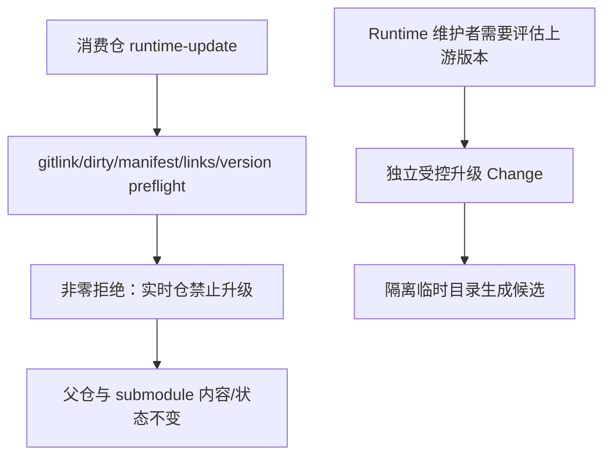

# 改造计划

## 目标与非目标

### 目标

- 将消费仓 `runtime-update` 改为确定性 fail-closed，在启动官方生成器前退出。
- 保证拒绝路径前后父仓 gitlink、Runtime submodule 内容和三个托管软链完全不变。
- 用真实 submodule fixture 建立回归合同，防止未来恢复原地 update。
- 修正文档和 `/opsx-update`，使说明与实际失败语义一致。
- 完成 Runtime 仓内 OpenSpec 自举，使本 Change 成为自身治理资产。

### 非目标

- 不实现候选版本隔离生成器；由后续 `establish-controlled-openspec-upgrades` Change 承担。
- 不评估或升级 OpenSpec 1.11.0。
- 不拆分 Commands upstream baseline/fragments；属于后续 Change。
- 不改变 submodule 路径、manifest v2 或三个软链合同。

## 目标业务与技术流程

## 影响面

| 仓库/系统 | 模块/接口 | 变更 | 兼容约束 | 责任方 |
|---|---|---|---|---|
| delivery-spec-runtime | `runtime-entry.ts` | 删除实时 `openspec update` 和 relink 调用；保留 `runtime-update` 为显式拒绝命令 | 其他 delivery-control 分派不变 | Runtime 维护者 |
| delivery-spec-runtime | `test/submodule.test.ts` | 新增真实目录软链拒绝路径测试 | fixture 不依赖业务资产 | Runtime 维护者 |
| delivery-spec-runtime | `.omp/commands/opsx-update.md` | 删除不安全 wrapper，说明升级边界 | 修订 Change 产物流程不变 | Runtime 维护者 |
| delivery-spec-runtime | `README.md`、仓内 OpenSpec | 记录自举和安全升级入口 | 公开内容不得包含私人资产 | Runtime 维护者 |
| agent-system/webcoding-spec/work-spec | Runtime 消费 | 无文件迁移；升级 gitlink 后获得拒绝行为 | 现有生命周期继续使用 1.10.0 | 各消费仓维护者 |

## 实施切片与依赖

| 顺序 | 切片 | 前置 | 独立验收 | 回滚边界 |
|---:|---|---|---|---|
| 1 | 建立 Runtime 仓内 OpenSpec 配置与安全规格 | 维护者确认 | Change status 可识别九层 DAG | 删除本 Change 与 config 即回滚自举 |
| 2 | 增加会在旧实现失败的 submodule 回归测试 | 技术现状 | 测试能证明拒绝后九命令摘要和 git status 不变 | 仅测试文件 |
| 3 | 修改 runtime-entry fail-closed | 切片 2 | 新测试通过，其他分派测试不变 | 单一入口分支 |
| 4 | 修改 Command 和 README | 切片 3 | 不再出现实时 update wrapper 或恢复承诺 | 文档文件 |
| 5 | 全量合同和消费仓 smoke | 切片 1～4 | Runtime 13+ tests、三个消费仓 runtime-check | 不合并 PR 即整体回滚 |

## 数据与兼容迁移

- 数据：无业务数据迁移；新增 Runtime 自身 Change sidecar 和规划产物。
- 接口：`runtime-update` 从“尝试更新”变为稳定非零拒绝；这是有意收紧，不提供不安全兼容路径。
- 灰度：先在 Runtime fixture 验证，再由消费仓按各自 gitlink 节奏升级。
- 回滚：PR 未合并前删除分支；合并后可回退 Runtime commit，消费仓未推进 gitlink 不受影响。

## 风险与处置

| 风险 | 影响 | 预防/缓解 | 停止条件 |
|---|---|---|---|
| 维护者误以为无法再升级 | 绕过 Runtime 直接执行官方 update | 错误信息和文档明确指向后续受控升级 Change | 文案仍提供实时写入命令 |
| 测试只断言错误文本 | 未来仍可能先写后失败 | 同时断言九文件摘要、submodule status、父仓 status 和软链目标 | 任一状态变化 |
| 改动影响其他 runtime-entry 命令 | 生命周期回归 | 全量合同测试与消费仓 runtime-check | 任一既有合同失败 |
| 自举 Change 混入完整升级框架 | 范围失控、难验收 | 第二个 Change 明确独立；当前规格禁止实现候选框架 | 出现候选版本或 renderer 实现 |

## 决策日志

| ID | 决策 | 依据 | 替代方案 | 影响 | 日期 |
|---|---|---|---|---|---|
| D-001 | 改造目标仓固定为 `delivery-spec-runtime` | Runtime 自身演进应由自身 Spec 治理 | 放在 agent-system 或外置 Spec 仓 | 建立 Runtime 仓内 OpenSpec | 2026-08-30 |
| D-002 | 拆为两个 Change | 安全缺陷与升级框架的验收、风险不同 | 一个大 Change、按 PR 拆分 | 当前先关闭风险，后续再建框架 | 2026-08-30 |
| D-003 | 当前 `runtime-update` 稳定拒绝，不尝试回滚官方 update | 目录软链使写入直接落到 source，事后恢复不可靠 | 写前备份并回滚、临时解绑软链 | 消费仓没有升级能力，但保持不可变 | 2026-08-30 |
| D-004 | 上游生成只允许在后续 Change 的隔离目录执行 | 上游是受评审输入，实时仓不是升级工作区 | 原地 update 后 diff | 后续工具必须无实时副作用 | 2026-08-30 |

## 后续 Change

- `establish-controlled-openspec-upgrades`：隔离生成 current/candidate Commands、upstream/local delta、CLI JSON 必要字段合同、多消费仓 smoke 和版本评估报告。
