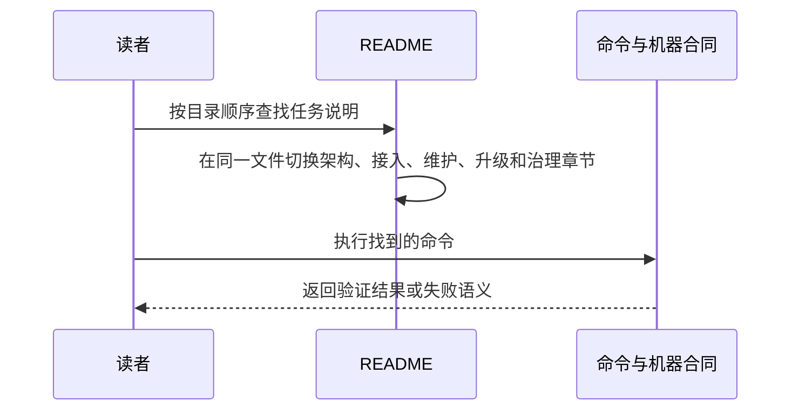

# 业务现状

## 调查口径

- 业务基线日期：2026-08-30
- 业务范围：Runtime 文档入口、消费仓采用、Runtime 维护、OpenSpec 升级和自治理说明。
- 材料口径：`README.md@42d6f1e`、三个长期 specs、机器合同和历史 Change；仓库材料完整。

## 角色与责任

| 角色/系统 | 当前责任 | 输入 | 输出 |
|---|---|---|---|
| 新采用者 | 理解 Runtime 并接入消费仓 | README | gitlink、三条受管软链、检查结果 |
| 消费仓维护者 | 更新和验证 Runtime 绑定 | README、manifest、工具 | 受评审的 gitlink 变更 |
| Runtime 维护者 | 修改 Commands、合同和版本 | README、源码、长期 specs | Runtime PR |
| Change 维护者 | 运行 Runtime 自治理 | README、delivery-change | 归档 Change 和 PR |

## 当前业务流程

## 业务对象与状态

| 对象 | 关键字段/身份 | 状态 | 状态变化条件 |
|---|---|---|---|
| README | 单一 224 行入口文件 | 同时承担六类职责 | Runtime 能力或流程变化时更新 |
| 长期 spec | capability/Requirement | 当前规范 | Change 归档前 Spec Sync |
| 机器合同 | manifest/schema/JSON | 程序权威 | 代码 Change 修改 |
| archive | 已归档 Change | 历史证据 | Runtime Change 完成后归档 |

## 异常与失败分支

| 场景 | 当前行为 | 业务影响 |
|---|---|---|
| 新采用者只需接入 | 仍需穿过维护和治理内容 | 入口认知负担高 |
| 维护者查升级步骤 | 在 README 中寻找大段专项 runbook | 难以快速定位前置、失败和验证 |
| 判断规则真源 | README、spec、机器合同和 archive 同时出现 | 容易把说明或历史证据误作权威 |

## 当前边界与已知问题

- 当前命令和安全规则有效，本次问题是信息职责混杂，不是 Runtime 行为缺陷。
- 本文件只陈述当前业务事实；目标状态进入 `05-改造方案/`。
