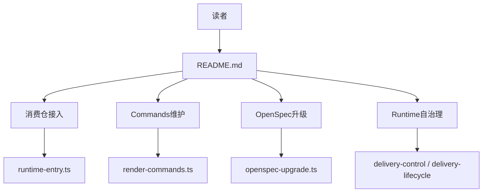

# 技术现状

## 调查基线

- 主干基线 commit：`42d6f1e93e361d6c45646526999a9f2352455d47`
- 需求分支 commit：尚未形成实现 commit
- 运行态核验时间点：2026-08-30T13:10:25Z

| 仓库 | 模块 | 证据类型 | 核验方式 |
|---|---|---|---|
| delivery-spec-runtime | `README.md` | 源码 | 完整读取 224 行及章节层级 |
| delivery-spec-runtime | `openspec/specs/` | 源码 | 检查现有 Requirements 和权威边界 |
| delivery-spec-runtime | manifest/contracts/tools | 源码与历史测试 | 检查路径职责及合同测试 |

## 当前技术流程

## 接口与数据边界

| 边界 | 当前接口/模型 | 调用方 | 副作用 | 失败语义 |
|---|---|---|---|---|
| 文档入口 | `README.md` | 所有读者 | 无 | 内容难定位但不影响工具行为 |
| Runtime 绑定 | `runtime-manifest.json`、gitlink、软链 | 消费仓 | Git 工作树变更 | fail closed |
| Commands | command sources → renderer → `.omp/commands` | Runtime 维护者 | 九个渲染文件 | 漂移非零退出 |
| 自治理 | Change artifacts、JSON 状态 | Change 维护者 | Change 和长期 spec | 状态 stale 或门禁拒绝 |

## 事务、缓存、通知和兼容

- 事务：文档无运行时事务；bootstrap 和生命周期状态由现有工具负责。
- 缓存：无。
- 通知：无。
- 兼容：所有现有命令、路径、JSON 字段和 Runtime 行为必须保持不变；仅改变说明位置和导航。

## 部署与运行态

| 事实 | 环境/机器 | 证据 | 核验时间 |
|---|---|---|---|
| README 是仓库唯一专题说明入口 | 本地 checkout | 仓库目录和 README 章节 | 2026-08-30 |
| 仓库当前不存在 `docs/` | 本地 checkout | 根目录结构 | 2026-08-30 |

## 已知缺口与不确定性

- `[事实]` 当前 README 同时覆盖六类不同读者任务。
- `[事实]` 现有长期 spec 要求 README 直接包含升级和治理细节，需要同步修改该 Requirement。
- `[推断]` 拆分后可降低定位成本；必须通过链接、命令和语义核验防止迁移遗漏。
