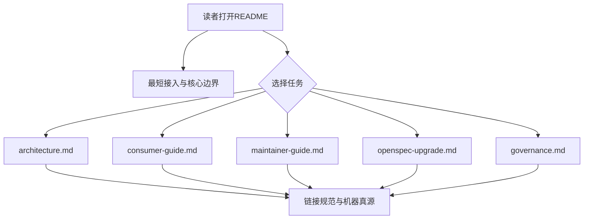

# 改造计划

## 目标与非目标

### 目标

- 将 README 收敛为可执行入口和任务导航。
- 新增五份边界稳定的专题文档。
- 迁移现有有效说明，不改变命令和安全语义。
- 明确 README、docs、长期 specs、Change、archive、机器合同和 AGENTS 的权威层次。
- 由 fresh reviewer session 独立审查完整文档 diff。

### 非目标

- 不修改 Runtime 行为、工具、Commands、schema、contracts 或 manifest。
- 不引入文档构建工具、站点或依赖。
- 不整理历史 Change 正文。

## 目标业务与技术流程

## 影响面

| 仓库/系统 | 模块/接口 | 变更 | 兼容约束 | 责任方 |
|---|---|---|---|---|
| Runtime | `README.md` | 重写为入口页 | 最短接入和验证命令保持可执行 | Runtime 维护者 |
| Runtime | `docs/*.md` | 新增五份专题说明 | 不复制机器合同 | Runtime 维护者 |
| Runtime | 长期 spec | 修改 README Requirement | 与新文档职责一致 | Change 维护者 |
| Runtime | Change lifecycle | fresh session Review | 不修改机器合同 | 主会话与 reviewer |

## 实施切片与依赖

| 顺序 | 切片 | 前置 | 独立验收 | 回滚边界 |
|---:|---|---|---|---|
| 1 | 重写 README 入口和导航 | 决策批准 | 最短接入、任务表、链接存在 | 单文件回滚 |
| 2 | 拆分五份专题文档 | README 目标结构 | 原有有效内容完成归属 | `docs/` 整体回滚 |
| 3 | 校正交叉链接和真源边界 | 前两步 | Markdown 链接、命令和路径检查 | 文档提交回滚 |
| 4 | fresh session Review | 实现 commit | 完整 diff 无 OPEN finding | 修复后重新 Review |
| 5 | 验收、同步、归档和 PR | Review PASS | strict validation 和合同测试 PASS | 受控 reopen |

## 数据与兼容迁移

- 数据：无。
- 接口：所有 CLI、JSON、路径和退出语义保持不变。
- 灰度：不适用；文档与代码同一 PR 生效。
- 回滚：回退文档提交即可，不影响 Runtime 执行状态。

## 风险与处置

| 风险 | 影响 | 预防/缓解 | 停止条件 |
|---|---|---|---|
| 迁移遗漏有效命令 | 读者无法执行任务 | 对照旧 README 逐节归属并运行命令 | 关键命令缺失或失败 |
| 链接失效 | 导航中断 | 检查全部仓库内 Markdown 链接 | 任一目标不存在 |
| 重复定义真源 | 后续规则漂移 | 权威位置表，规范和合同只链接 | 同一规范性规则出现冲突 |
| 专题边界仍重叠 | 阅读成本未降低 | reviewer 按读者任务审查 | 同一完整 runbook 在多处重复 |

## 决策日志

| ID | 决策 | 依据 | 替代方案 | 影响 | 日期 |
|---|---|---|---|---|---|
| DOC-001 | README 加五份专题文档 | 已批准方案决策 | 单 README、文档站 | 新增 `docs/` | 2026-08-30 |
| DOC-002 | Review 使用 fresh session | 维护者明确决定 | 实施会话自审 | 独立 reviewer 输出 | 2026-08-30 |
