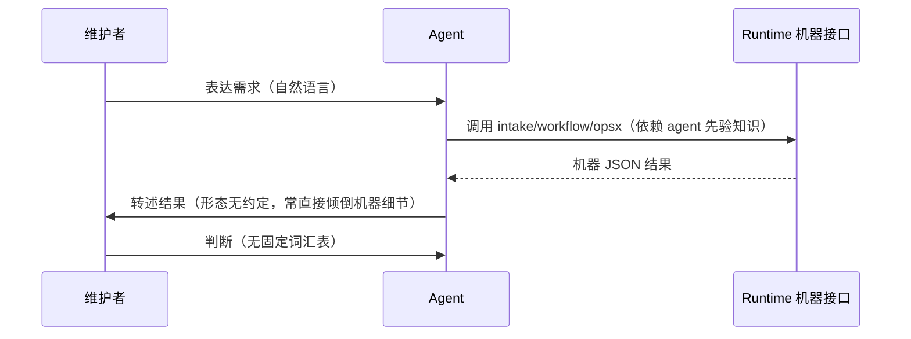

# 业务现状

## 调查口径

- 业务基线日期：2026-08-31
- 业务范围：Runtime 交付与分析流水线的人机分工——人如何发起事项、如何在门口判断、agent 如何驱动机器接口。不含流水线机器合同本身。
- 材料口径（来源、版本、完整性）：INT-20260831-007 / INT-20260831-008（完整）；2026-08-31 首次 dogfooding 会话记录（完整）；现行 README 与 docs（HEAD 版本）。

## 角色与责任

| 角色/系统 | 当前责任 | 输入 | 输出 |
|---|---|---|---|
| 维护者（人） | 发起需求、审阅材料、在判断门表态 | agent 摆出的材料 | 判断（批准/继续/拒绝） |
| Agent 会话 | 驱动 intake CLI、workflow CLI、opsx 命令 | 维护者意图、机器状态 | 各站产物、机器 JSON |
| OMP 载体 | 通过 `.omp/commands/opsx-*.md` 向 agent 提供九条命令指引 | 软链的渲染产物 | 命令指令文档 |
| Claude Code 载体 | 无任何 Runtime 指引资产（缺口） | 无 | 无；agent 仅靠会话内先验知识驱动底层 CLI |

## 当前业务流程

## 业务对象与状态

| 对象 | 关键字段/身份 | 状态 | 状态变化条件 |
|---|---|---|---|
| Intake 条目 | INT id、state、phase | captured/triaged/promoted/closed | intake CLI advance/promote/close |
| 分析事项 | matterId、binding | in_progress/blocked/waiting/completed/rejected | workflow run + 人工判断 |
| 交付 Change | slug、artifact DAG | 11 个工件的完成/阻塞 | openspec + delivery-control 门禁 |

## 异常与失败分支

| 场景 | 当前行为 | 业务影响 |
|---|---|---|
| 人不了解命令体系 | 无入口可发现；流程无法由人发起 | 采用率受限，依赖 agent 在场且知情 |
| agent 把机器 JSON 直接摆给人审 | 无约定禁止 | 审阅成本高，2026-08-31 会话中实际发生并被维护者指出 |
| 人长期未回应判断门 | 流程停靠但无提醒约定 | 在途事项可能被遗忘（烂尾） |
| 多事项并行表达 | 无约定 | 上下文混线风险，维护者已明确要求单事项在线 |

## 当前边界与已知问题

- 人的界面从未被单独设计：九条 opsx 命令与 workflow CLI 均为机器/agent 接口，却默认由人调用；维护者已确认此为设计错位。
- Claude Code 载体零部署（INT-008），OMP 载体有完整命令部署——两载体接入体验不一致。
- 本文件只陈述当前业务事实；目标状态进入 `05-改造方案/`。
