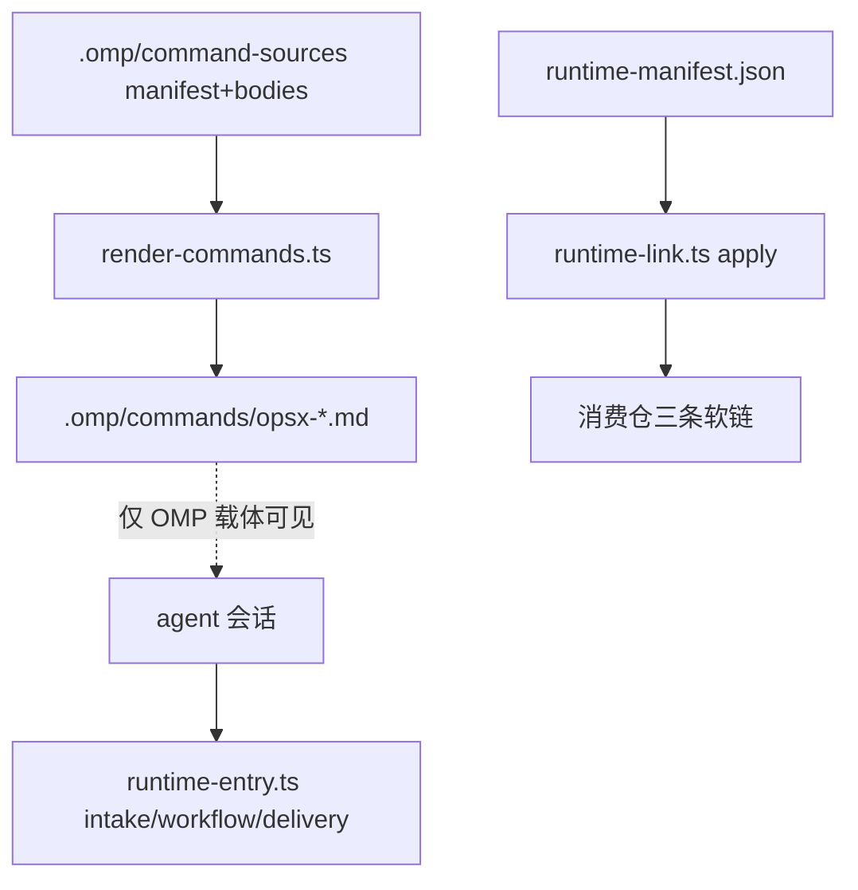

# 技术现状

## 调查基线

- 主干基线 commit：`c19b44844481b0e10d8fea082c92701746ee622c`
- 需求分支 commit：`5d4162bccadcf23763e445488f1e37ebe485c995`（Eridanus117/itk2）
- 运行态核验时间点：2026-08-31

| 仓库 | 模块 | 证据类型（源码/历史测试/运行态/推断） | 核验方式 |
|---|---|---|---|
| delivery-spec-runtime | `.omp/command-sources/` + `render-commands.ts` | 源码 + 运行态 | 阅读 manifest/bodies；render check 在测试中执行 |
| delivery-spec-runtime | `runtime-manifest.json` 受管软链 | 源码 | 三条 links：`.omp/commands`、schema、runtime-entry；无 Claude Code 目标 |
| delivery-spec-runtime | workflow/intake/delivery CLI | 运行态 | 2026-08-31 会话以纯 CLI 完成分析、intake、Change 全流程 |
| delivery-spec-runtime | 全仓 "claude" 检索 | 运行态 | grep 零命中；无 `.claude/` 目录 |

## 当前技术流程

## 接口与数据边界

| 边界 | 当前接口/模型 | 调用方 | 副作用 | 失败语义 |
|---|---|---|---|---|
| 命令渲染 | manifest.json（id/description/body 严格校验）→ `opsx-<id>.md` | render-commands.ts write/check | 写 `.omp/commands/` | 合同非法即 fail |
| 消费仓接入 | runtime-manifest links + runtime-link apply | 消费仓维护者 | 建三条相对软链 | runtime-check fail-closed |
| 底层驱动 | runtime-entry.ts 子命令（intake/workflow/delivery 等） | agent | 各自状态文件 | 机器 JSON + 非零退出码 |

## 事务、缓存、通知和兼容

- 事务：状态写入经 `atomicWriteJson` 与文件锁；无跨文件事务。
- 缓存：无。
- 通知：无任何在途提醒机制（`[事实]`）。
- 兼容：消费仓以 gitlink 锁版本；新增资产须走 manifest/links 或新渲染目标，均为追加式变更。

## 部署与运行态

| 事实 | 环境/机器 | 证据 | 核验时间 |
|---|---|---|---|
| OMP 载体有九条命令 | 仓内 `.omp/commands/` | 目录清单 | 2026-08-31 |
| Claude Code 载体零资产 | 仓内无 `.claude/`；manifest 无对应 link | grep + manifest 阅读 | 2026-08-31 |
| Claude Code 的 skill 机制可承载指引 | Claude Code 通用机制：`.claude/skills/<name>/SKILL.md`，带触发描述、按话题自动被 agent 发现 | `[事实]`（载体公开机制）；本仓尚无实例 `[事实]` | 2026-08-31 |
| 纯 CLI 驱动全流程可行 | 本会话 | bind/run/intake/change 全部经 CLI 完成，零斜杠命令 | 2026-08-31 |

## 已知缺口与不确定性

- `[事实]` render-commands.ts 渲染目标硬编码为 `.omp/commands`，新增渲染目标需扩展 manifest 合同或新增源目录。
- `[事实]` runtime-link/runtime-check 的 links 合同为固定三条，新增受管软链需同步更新合同与消费仓文档。
- `[推断]` skill 正文可复用交互设计草案（INT-007）直接撰写，无需新增运行时代码；待方案阶段确认。
- 目标实现只进入 `05-改造方案/`。
