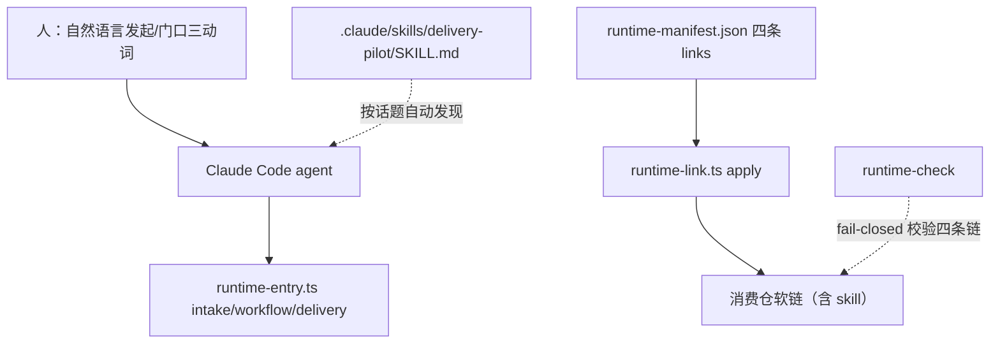

# 改造计划

## 目标与非目标

### 目标

- 在 Runtime 仓新增 Claude Code 交互指引资产 `.claude/skills/delivery-pilot/SKILL.md`，承载已批准的交互合同：发起识别、单向行进、门口一屏摆盘、三动词词汇表、沉默=缓、单事项在线、在途提醒。
- `runtime-manifest.json` links 新增第四条受管软链，使消费仓经 `runtime-link.ts apply` 获得该资产并纳入 `runtime-check` fail-closed 校验。
- 新增聚焦合同测试，锁定 skill 的存在性与五项合同要素完整性。
- 更新 README 与 docs 中的软链数量描述和消费仓升级说明。

### 非目标

- 不修改既有 workflow profile、delivery 生命周期、intake 合同、九条 opsx 命令及其渲染管线。
- 不为人新增任何斜杠命令；不实现在途提醒的机器机制（首版为 skill 行为约定）。
- 不处理流水线站位裁剪（3 事项复盘检查点另行触发）与缺陷级小刺（DEP0190、run 入口语义，留在 INT-007 候选处置中）。
- 不统一 OMP 与 Claude Code 两载体的指引形态。

## 目标业务与技术流程

skill 正文的行为合同（对 agent 的指令）：

- 发起：人以自然语言表达需求/想法/事项时，识别为流水线发起；按事项分量建议 profile 重量（requirement-analysis / delivery-change / light-change）并在首个门顺带确认。
- 行进：驱动 `runtime-entry.ts` 底层 CLI 自动走站；机器 JSON、状态文件、站位名不出现在给人的正文中。
- 停靠：仅在人工判断门停下，摆一屏以内判断导向材料；比较类决策给多方案与优劣势；等待「同意 / 纠正 / 驳回」或沉默；绝不代替人过门。
- 单事项：同一时间仅一个事项行进；人提出新事项时先声明在途事项停靠位置，确认切换/排队/放弃后行动。
- 在途提醒：会话开始或人闲聊时，若有停靠中的在途事项，低频提示一句，不主动开启新事项。

## 影响面

| 仓库/系统 | 模块/接口 | 变更 | 兼容约束 | 责任方 |
|---|---|---|---|---|
| delivery-spec-runtime | `.claude/skills/delivery-pilot/SKILL.md` | 新增静态资产 | 只含公共通用内容；中文正文、英文 slug | Runtime 维护者 |
| delivery-spec-runtime | `runtime-manifest.json` | links 三条→四条 | schemaVersion 保持 2；泛化解析无代码变更 | Runtime 维护者 |
| delivery-spec-runtime | `test/submodule.test.ts` | 硬编码链清单加第四条 | 既有断言语义不变 | Runtime 维护者 |
| delivery-spec-runtime | `test/interaction.test.ts` | 新增内容完整性合同测试 | Node `node:test`；不新增 runner | Runtime 维护者 |
| delivery-spec-runtime | `public-allowlist.json` | 视既有机制补充新资产路径 | 与 candidate 测试口径一致 | Runtime 维护者 |
| delivery-spec-runtime | README、docs/consumer-guide.md、docs/architecture.md | 软链数量与升级说明更新 | 不引入私人内容 | Runtime 维护者 |
| 既有消费仓 | gitlink pin | 无影响（旧 commit 旧 manifest） | 升级 gitlink 后必须重跑 `runtime-link.ts apply`，否则 `runtime-check` fail-closed | 各消费仓维护者 |

## 实施切片与依赖

| 顺序 | 切片 | 前置 | 独立验收 | 回滚边界 |
|---:|---|---|---|---|
| 1 | 撰写 skill 资产 | 已批准方案决策 | SKILL.md 含 frontmatter 与五项合同要素 | 删除 `.claude/` 目录 |
| 2 | manifest 加第四条链 + submodule 测试更新 | 切片 1（source 必须存在） | `runtime-link.ts apply` 在临时 consumer 建出四条链且 `runtime-check` 通过 | 还原 manifest 与测试 |
| 3 | 内容完整性合同测试 | 切片 1 | `test/interaction.test.ts` 通过；删除任一要素时测试失败 | 删除测试文件 |
| 4 | 文档与 allowlist 更新 | 切片 1–2 | 文档中软链数量、接入与升级命令与实际一致 | 还原文档 |
| 5 | 全量回归 | 切片 1–4 | 全量 tests、render check、`openspec validate --all --strict` 通过 | 不适用（验证步骤） |

## 数据与兼容迁移

- 数据：无持久化迁移；skill 为静态文本资产。
- 接口：无新 CLI；`runtime-link`/`runtime-check` 行为由 manifest 数据驱动。
- 灰度：Runtime 仓自身即第一个部署环境；消费仓在各自升级 Change 中采纳。
- 回滚：删除 `.claude/` 目录、还原 manifest 与测试、还原文档；不影响任何既有合同与消费仓 pin。
- 版本：不新增 schemaVersion；不建立第二套 lock。

## 风险与处置

| 风险 | 影响 | 预防/缓解 | 停止条件 |
|---|---|---|---|
| skill 触发描述措辞不当导致 agent 发现率低 | 交互层名存实亡 | 触发词覆盖需求/想法/立项/分析/交付/验收/流程等意图；3 事项复盘实测 | 复盘证实 agent 多次未发现 skill |
| 升级消费仓漏跑 link apply | runtime-check fail-closed 阻断 | 消费仓文档升级段落写明；fail 信息已含指引 | 兼容破坏不可接受时重议 links 策略 |
| skill 内容与 spec 合同漂移 | 校验失真 | 合同测试逐要素断言；spec Scenario 与测试同源 | 测试与 spec 不可对齐 |
| 公共仓混入个人流程内容 | 越界 | skill 只写通用合同；评审对照 AGENTS.md 禁区 | 发现私人内容即停止 |

## 决策日志

| ID | 决定 | 来源 | 状态 |
|---|---|---|---|
| PLAN-001 | 采用候选 A：静态 skill + 第四条受管软链 | `05-改造方案/方案决策.md` | 已批准 |
| PLAN-002 | 兼容语义沿用既有升级合同：新 manifest 随新 commit 分发，升级方重跑 apply，缺链 fail-closed | 方案决策·接受的后果 | 本计划定稿 |
| PLAN-003 | skill slug 定为 `delivery-pilot`；链路径 `.claude/skills/delivery-pilot` | 本计划 | 本计划定稿 |
| PLAN-004 | 在途提醒与单事项约束首版为 skill 行为约定，不加机器机制 | 方案决策·接受的后果 | 本计划定稿 |
