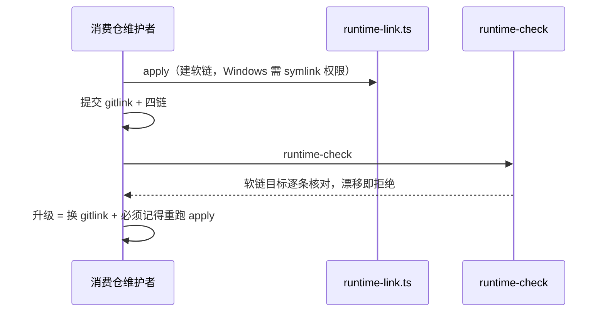

# 业务现状

## 调查口径

- 业务基线日期：2026-08-31
- 业务范围：消费仓接入、升级与日常校验中与分发机制相关的动作与体验。不含流水线内容合同。
- 材料口径（来源、版本、完整性）：INT-20260831-013（完整）；2026-08-31 会话实测记录（完整）；README/consumer-guide（HEAD 版本）。

## 角色与责任

| 角色/系统 | 当前责任 | 输入 | 输出 |
|---|---|---|---|
| 消费仓维护者 | 接入（submodule add + apply + 提交四链）、升级（gitlink + 重跑 apply） | Runtime commit | 可用的 /opsx、schema、入口与 skill |
| runtime-link.ts | 依 manifest 建立/修复四条相对软链 | runtime-manifest links | 符号链接 |
| runtime-check | 校验 gitlink、submodule clean、软链目标一致 | 父仓与 submodule 状态 | 放行或 fail-closed |
| Windows 环境 | 软链需 core.symlinks 与开发者模式/权限 | — | 常见故障源 |

## 当前业务流程

## 业务对象与状态

| 对象 | 关键字段/身份 | 状态 | 状态变化条件 |
|---|---|---|---|
| 受管软链 ×4 | manifest links（link→source） | 有效/缺失/漂移 | apply 建立；本地操作可破坏 |
| gitlink | `.delivery-spec-runtime` commit | 唯一版本锁 | 消费仓 Change 更新 |

## 异常与失败分支

| 场景 | 当前行为 | 业务影响 |
|---|---|---|
| Windows 未启用 symlink 支持 | clone/checkout 把链还原为坏目标，需重跑 apply | 接入与克隆的常见坑（consumer-guide 有专节） |
| 深层路径克隆 | 软链+长文件名触发 Filename too long | 2026-08-31 终验实测（INT-011） |
| 升级后漏跑 apply | runtime-check fail-closed | 升级路径多一步人为记忆 |
| CRLF 检出 | 与字节级校验纠缠（INT-009） | 本地校验偶发失真 |

## 当前边界与已知问题

- 维护者方向裁决（门1）：软链形态应退役；本阶段保留 submodule 为唯一锁。
- 本文件只陈述当前业务事实；目标状态进入 `05-改造方案/`。
