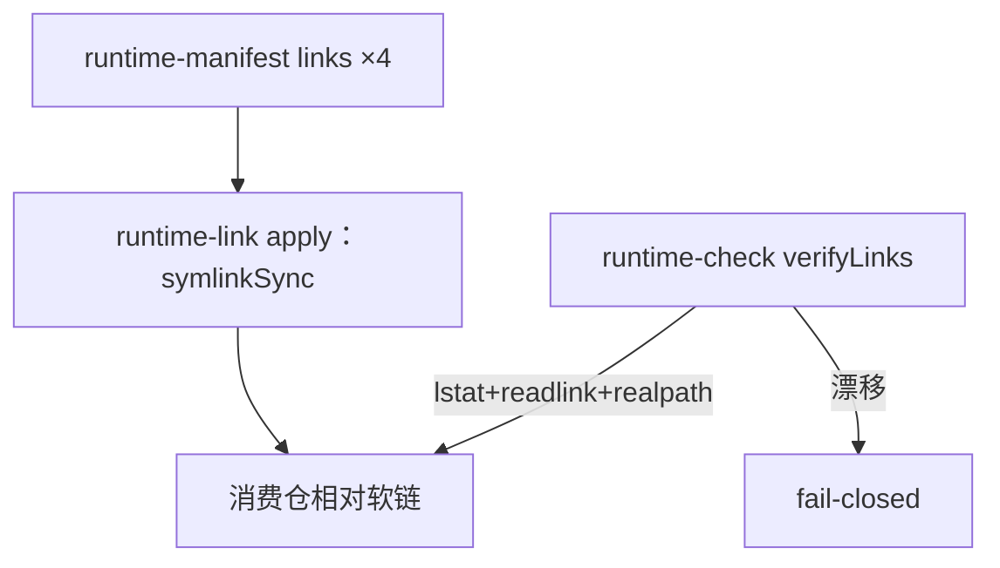

# 技术现状

## 调查基线

- 主干基线 commit：`c19b44844481b0e10d8fea082c92701746ee622c`（main，PR #15 合并前）
- 需求分支 commit：`222a621`（Eridanus117/itk2，含已合并的 human-interaction 交付）
- 运行态核验时间点：2026-08-31

| 仓库 | 模块 | 证据类型（源码/历史测试/运行态/推断） | 核验方式 |
|---|---|---|---|
| delivery-spec-runtime | runtime-link.ts | 源码 | `symlinkSync(target, staged, type)` 建链；staged+rename 原子替换；`--replace-managed` 门槛 |
| delivery-spec-runtime | runtime-entry.ts verifyLinks | 源码 | `lstat.isSymbolicLink + readlink 字符串比对 + realpath 双向核对`，全部以「是软链」为前提 |
| delivery-spec-runtime | runtime-lib.ts | 源码 | 已有 `sha256File`；hash.test.ts 覆盖 glob 摘要（POSIX 路径、去重、越界拒绝） |
| delivery-spec-runtime | openspec-upgrade.ts consumerSmoke | 源码 | 克隆消费仓→注入候选→apply→runtime-check，依赖软链语义 |
| delivery-spec-runtime | 测试 | 源码+运行态 | submodule.test.ts 断言 `isSymbolicLink/readlinkSync`；bootstrap/candidate 测试涉软链场景 |

## 当前技术流程

## 接口与数据边界

| 边界 | 当前接口/模型 | 调用方 | 副作用 | 失败语义 |
|---|---|---|---|---|
| apply | manifest 驱动，泛化处理 links；仅在符号链接语义内工作 | 消费仓维护者/agent | 建链 | source 缺失、受管路径非预期链即 fail |
| verifyLinks | 链存在性+目标字符串+realpath 一致 | runtime-check | 无 | 「运行时相对软链漂移/目标漂移」 |
| consumer smoke | 复用 apply+runtime-check | openspec-upgrade | 临时克隆内 | 同上 |

## 事务、缓存、通知和兼容

- 事务：apply 使用 staged 文件 + rename 原子替换，可平移到复制实现。
- 缓存：无。
- 通知：无。
- 兼容：verifyLinks 是唯一判定「受管路径合法形态」的函数；改为副本校验后，全部软链断言测试需同批改写；既有消费仓的旧软链需迁移语义。

## 部署与运行态

| 事实 | 环境/机器 | 证据 | 核验时间 |
|---|---|---|---|
| 哈希基础设施现成 | 仓内 | `sha256File`（runtime-lib）、hash.test.ts、review/acceptance 均用内容摘要 | 2026-08-31 |
| 复制+清单+秘密扫描现成雏形 | 仓内 | public-candidate.ts generate | 2026-08-31 |
| CI ubuntu 对软链无痛 | .github/workflows/ci.yml | 源码 | 2026-08-31 |

## 已知缺口与不确定性

- `[事实]` verifyLinks 与 apply 的软链语义是本 Change 的两处核心改写点；测试断言面 6 个文件。
- `[事实]` 目录型投影（.omp/commands、schema、skill）需要递归复制与递归哈希比对；文件型投影（runtime-entry.ts）为单文件。
- `[推断]` OMP 与 Claude Code 对普通目录/文件的读取与软链无差别（纯文件读取）；接入后以真实载体验证。
- `[推断]` 副本按字节复制自 submodule 工作树，比对同为字节级，可回避 CRLF 归一化分歧；待测试证实。
- 目标实现只进入 `05-改造方案/`。
