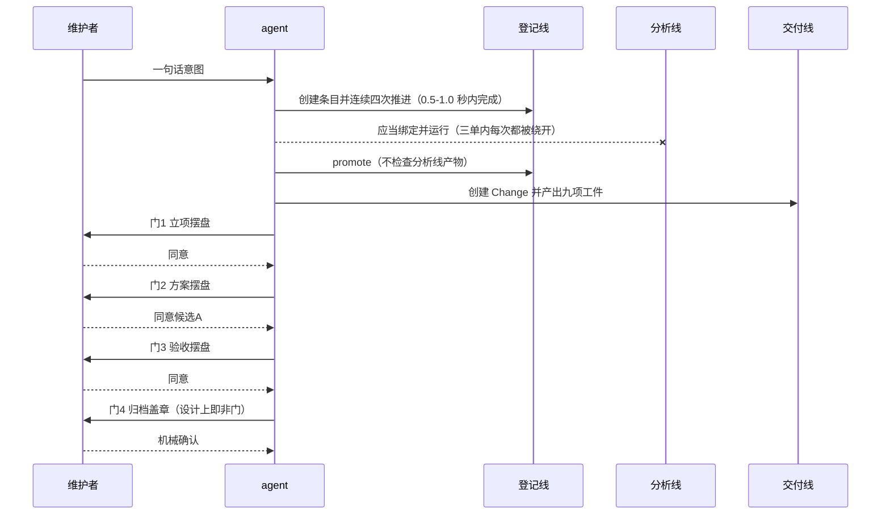

# 业务现状

## 调查口径

- 业务基线日期：2026-08-31
- 业务范围：本仓交付流水线的**治理业务**本身——登记（intake）、分析（requirement-analysis）、交付（delivery-change）三条线的职责划分、人机分工与门禁触发条件；以及三个早于归档纪律的未归档 Change 目录的处置责任。不含具体某个 Change 的业务内容。
- 材料口径（来源、版本、完整性）：`INT-20260831-019` 复盘卷宗（三单全量取证，完整）；`INT-20260831-014` 信号台账 7 条（完整）；`INT-20260830-002`（完整）；维护者 2026-08-31 主会话八条处置包（完整）。三单窗口为 `establish-human-interaction-layer`、`replace-symlinks-with-verified-copies`、`INT-20260831-015`。

## 角色与责任

| 角色/系统 | 当前责任 | 输入 | 输出 |
|---|---|---|---|
| 维护者 | 在立项、方案、验收三类门以「同意 / 纠正 / 驳回」表态；归档门另有一次名义盖章 | agent 摆出的一屏材料 | 门表态、时间戳（落入 `artifact-approvals.json` / `acceptance-state.json`） |
| agent | 驾驶全部机器接口，产出全部工件，选择走哪条线 | 维护者一句话意图、仓内既有资产 | intake 条目、Change 工件、生命周期状态文件 |
| 登记线（intake） | 承载「是否值得投入」的取证与处置 | 维护者意图 | intake 条目，promote 后成为只读来源索引 |
| 分析线（requirement-analysis） | 承载结构化澄清、能力核验、方案比较 | 分析请求与人工判断 | 绑定记录与分析结果（**三单内零产出**） |
| 交付线（delivery-change） | 承载方案、实施、审查、验收、同步、归档的可审计闭环 | 已 promote 的 intake | 九项规划工件 + 六份机器状态文件 |
| 校准期条款（AGENTS.md 末条） | 规定校准期内每站产物摆给维护者，并把不耐烦反馈当作裁剪信号 | 维护者反馈 | 信号台账条目 |

## 当前业务流程

## 业务对象与状态

| 对象 | 关键字段/身份 | 状态 | 状态变化条件 |
|---|---|---|---|
| intake 条目 | `id` / `state` / `phase` | `captured` → `triaged`（`phase` 走 capture→triage→evidence→options→disposition）→ `promoted` / `held` / `closed` | 每次 advance 需对应小节非空；`state` 在三次中间 advance 中恒为 `triaged`，只有 `phase` 在变 |
| 分析线事项 | `matterId` + profile 绑定 | 应为 capture→clarify↺→discover↺→evaluate↺→decision | 三单内从未创建任何实例 |
| Change | 目录 slug + `displayName` | 九项工件 pending → approved；生命周期 review → acceptance → readiness | 逐工件 digest 批准；工件事后改动即 stale |
| 未归档早期目录 | 目录名 | 长期 active 占位 | 三者均无批准记录、无验收、无 readiness，靠人记得才会被处置 |
| 校准期信号 | 台账条目内的编号段落 | 持续追加，复盘时一次性消费 | 维护者反馈发生即追加 |

## 异常与失败分支

| 场景 | 当前行为 | 业务影响 |
|---|---|---|
| agent 跳过分析线直接 promote | 无任何拒绝，promote 成功 | 维护者反复要求的分析线连续三单零执行；结构化分析的强制力事实上不存在 |
| agent 一次写完全文再连点四次 advance | 全部通过 | 登记线的四个状态转移不承载任何决策信息，是纯仪式 |
| 早期目录长期不归档 | `openspec validate --all --strict` 仍通过 | 不破坏门禁，但治理证据链从第一环即为空，且积累悬挂引用 |
| 维护者对摆盘不追问 | 记为「粒度可接受，或可再压缩」 | 该推断在 2026-08-31 复盘摆盘时被维护者当场否定（要求展开） |
| 维护者要求展开说明 | 现行条款无对应处理路径（条款只定义「减」的信号） | 治理条款与真实反馈方向不匹配 |
| 任务证据字符串写成自然语言而非路径 | 通过校验 | 证据「看起来被验过」，实际机器一个字节都没读 |

## 当前边界与已知问题

- 人实际出面 3 次（立项 / 方案 / 验收），第 4 次（归档）在 AGENTS 与 SKILL 中已被明写为机械确认，即设计上就不是门；但 profile 仍标记它为人工判断门。
- 三条线的职责有重叠：登记线的 Evidence / Options / Disposition 三个小节在三单中**完整承接**了分析线 discover / evaluate / decision 的职能，两套站位在做同一件事，一套写 Markdown、一套写 JSON。
- 校准期条款把维护者反馈单向解读为「减少人审面」，缺少「要求增加说明」这一方向的处理路径。
- 三个早期目录的责任归属清晰但触发条件缺失：没有任何机器检查会因为它们长期 active 而报警。
- 本文件只陈述当前业务事实；目标状态进入 `05-改造方案/`。
