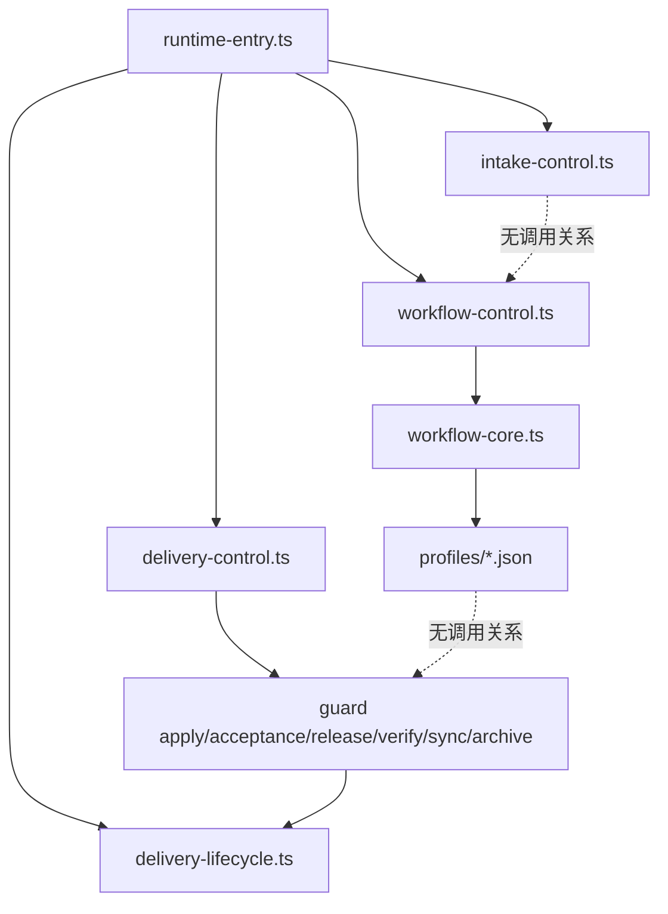

# 技术现状

## 调查基线

- 主干基线 commit：`c69bf78`（`Eridanus117/int015-closeout`，本 Change 创建时的 HEAD）
- 需求分支 commit：同上（本 Change 尚未实施，无实现提交）
- 运行态核验时间点：2026-08-31，实跑 `openspec validate --all --strict`、`node --test`、`intake list`、`runtime-check`

| 仓库 | 模块 | 证据类型（源码/历史测试/运行态/推断） | 核验方式 |
|---|---|---|---|
| `delivery-spec-runtime` | `openspec/tools/intake-control.ts` | 源码 | 逐行读取 `advance` / `promote` / `list`；确认 `state` 三元两分支字面相同 |
| `delivery-spec-runtime` | `openspec/tools/delivery-control.ts` | 源码 | 逐行读取 `parseTask` / `parseSources` / `guard` / `renderTasks` |
| `delivery-spec-runtime` | `openspec/tools/delivery-lifecycle.ts` | 源码 | 逐行读取 `reopen`（`:312-323`）与 review / acceptance / readiness 校验 |
| `delivery-spec-runtime` | `openspec/tools/workflow-core.ts` / `workflow-control.ts` / `workflow-entry.ts` | 源码 | 确认实现完整；确认与 delivery 真门禁无任何调用关系 |
| `delivery-spec-runtime` | `openspec/profiles/*.json`、`openspec/schemas/delivery-change/**` | 源码 | 逐字比对站位枚举与 `artifactPaths` |
| `delivery-spec-runtime` | `test/*.test.ts` 13 个 | 运行态 | 全量 `node --test` 通过 |
| `delivery-spec-runtime` | git 全历史 | 运行态 | `git log --all --diff-filter=A --name-only` 检索资产实例 |

## 当前技术流程

图中两条虚线是本次改造的核心技术事实：`intake promote` 不查分析线产物；`delivery-change` profile 与真实 guard 之间没有任何代码调用。

## 接口与数据边界

| 边界 | 当前接口/模型 | 调用方 | 副作用 | 失败语义 |
|---|---|---|---|---|
| 登记推进 | `intake advance --file` | agent | 改写 frontmatter `phase`，追加 History | 对应小节为空时非零；`state` 恒为 `triaged`（`intake-control.ts:130` 三元两分支字面相同） |
| 登记转出 | `intake promote --file --change --change-root` | agent | 写 `state: promoted` / `promotedTo`，向目标 `01-原始需求索引.md` 追加 `- Intake 来源：` 行（`intake-control.ts:133`） | 非 disposition 阶段或目标缺索引时非零；**不校验任何分析线产物** |
| 来源合同 | `delivery-control.ts sources write/inspect` | agent | 写 `change-sources.json` | `authority` 必须唯一且从 1 连续递增（`parseSources`，`delivery-control.ts:136-138`）——这是一条**只存在于该文件、未被 01 索引承载**的排序信息 |
| 任务证据 | `task set --evidence` → `parseTask` | agent | 写 `task-state.json` | 只校验字符串非空（`delivery-control.ts:110-115`），**从不打开路径**；`verified` 必须有 evidence、非 `verified` 不得有 evidence |
| 受控 reopen | `lifecycle reopen` | 维护者授权后 agent | 复制 review/acceptance/readiness/08/09 到 `lifecycle-history/<stamp>/`（`:317-319`），写 `reopen-state.json`（`:322`） | 两者**全仓无 reader**；`test/lifecycle.test.ts` 断言其存在 |
| Workflow 执行 | `workflow bind/run` | agent | 写 `workflow-binding.json` 等 | 实现完整；`delivery-change-v1.json` 无 `inputContracts`，`run` 只做 request 键存在性检查，全程不碰 Change 目录 |
| 交付门禁 | `guard <operation>` | agent | 无写盘，只放行/拒绝 | `requireApproved` + `artifactDigest` 重算 + `validateDecisionArtifacts` 内容正则 |

## 事务、缓存、通知和兼容

- 事务：`delivery-control.ts` 全部写盘经 `withFileLock(.delivery-control.lock)` + `atomicWriteJson`；`intake-control.ts` 用 `openSync(wx)` + `fsync` + `rename` 原子写。修剪动作必须保持这两套原子写语义。
- 缓存：无。全部状态即时从磁盘读，无内存缓存需要失效。
- 通知：无外部通知面。唯一「通知」是 agent 摆盘，由 `.claude/skills/delivery-pilot/SKILL.md` 约定。
- 兼容：
  - `openspec/changes/archive/` 下 10 个已归档 Change **各自持有一份 `change-sources.json`**，且它们的 `task-state.json` 中 `evidence` 是自然语言字符串而非路径（如「LF 克隆全量 52/52…」）。任何「evidence 必须是存在的路径」的校验若回溯适用于归档目录，会把 10 个历史 Change 全部判失效。
  - 3 个未归档早期目录的 `artifact-approvals.json` 的 `artifacts` 全为空 `{}`，`implementation-review.json` / `acceptance-state.json` / `archive-readiness.json` / `08` / `09` 全缺失。它们今天通过 `openspec validate --all --strict`（11 passed / 0 failed），修剪后必须仍然通过或被正常归档。
  - 归档目录内的 03/04 是两份独立文档；合并后的新结构不得使归档目录校验失败。
  - 本 Change 自身正处于「旧结构」下（已写 `change-sources.json`、两份现状文档），是在途 Change 兼容性的第一个样本。

## 部署与运行态

| 事实 | 环境/机器 | 证据 | 核验时间 |
|---|---|---|---|
| `change-mode.json` 全历史零实例 | 本仓 git 全历史 | `git log --all --diff-filter=A --name-only` 检索，仅命中合同 schema | 2026-08-31 |
| `.delivery-update-snapshot.json` 全历史零实例 | 同上 | 同上 | 2026-08-31 |
| `reopen-state.json` / `lifecycle-history/**` 全历史零实例 | 同上 | 同上；三单未触发 reopen | 2026-08-31 |
| `workflow-binding.json` 全历史零实例 | 同上 | 同上 | 2026-08-31 |
| 13 个测试文件全绿 | 本机 Windows 11 / Node `--experimental-strip-types` | 实跑 `node --test` | 2026-08-31 |
| `openspec validate --all --strict` 11/11 通过 | 同上 | 实跑 | 2026-08-31 |
| DEP0190 弃用警告仍复现 | 同上 | 每次 `runtime-entry.ts` 转发 `intake` 命令均出现 | 2026-08-31 |

## 改动面清单（受影响文件，按类别）

| 类别 | 文件 | 受影响的裁决项 |
|---|---|---|
| 工具 | `openspec/tools/intake-control.ts` | A2 并站；A1 promote 立项门；INT-002 路由表 |
| 工具 | `openspec/tools/delivery-control.ts` | B2 移除 `change-sources.json`；B8 evidence 校验；B3 `change-mode` / `update-snapshot`；B4 现状合并（`artifactPaths`） |
| 工具 | `openspec/tools/delivery-lifecycle.ts` | B1 移除 `reopen-state.json` 与 `lifecycle-history` |
| 工具 | `openspec/tools/workflow-control.ts` / `workflow-core.ts` | A1 分析产物需可被立项门按 `id` 定位 |
| 工具 | `openspec/tools/bootstrap.ts` | 引用 `change-sources` 与 `03-业务现状`，随之调整 |
| Schema | `openspec/schemas/delivery-change/schema.yaml` | B4 artifact 合并（03+04）；01 instruction 去掉 `change-sources.json` |
| 模板 | `templates/business-current.md` + `technical-current.md` | B4 合并为一份现状模板 |
| 模板 | `templates/release-plan.md` | B5 删「现场快速资产」「日志、指标与观察窗口」「配置开关」三节 |
| 模板 | `templates/acceptance.md` | B3 移除 `change-mode.json` 相关表述 |
| 合同 | `openspec/contracts/sources.schema.json` | B2 随 `change-sources.json` 移除 |
| 合同 | `openspec/contracts/change-mode.schema.json` | B3 核实后处置 |
| 合同 | `openspec/contracts/task-state.schema.json` | B8 evidence 语义 |
| 合同 | `openspec/contracts/intake-state.schema.json`、`openspec/intake/stages.json`、`template.md` | A2 并站 |
| Profile | `openspec/profiles/delivery-change-v1.json` | A3 archive 摘 ◆；A6 权威归属 |
| Profile | `openspec/profiles/registry.json` + `light-change-v1.json` | INT-002 路由表接入 |
| 命令 | `.omp/command-sources/bodies/opsx-archive.md`、`opsx-new.md`（及 `.omp/commands/` 渲染产物） | B1 `lifecycle-history`；B3 `change-mode` |
| 文档 | `docs/governance.md`、`docs/workflow-guide.md`、`docs/architecture.md`、`docs/maintainer-guide.md` | 全部裁决项的说明面 |
| 治理 | `AGENTS.md` 末条校准条款 | C1 / C5 摆盘深度三档 |
| Skill | `.claude/skills/delivery-pilot/SKILL.md` | C1 摆盘深度；A3 归档非门；A2 登记两站 |
| 清单 | `public-allowlist.json` | 随文件增删同步 |
| 测试 | `test/intake.test.ts`、`control.test.ts`、`lifecycle.test.ts`、`contracts.test.ts`、`bootstrap.test.ts`、`workflow.test.ts`、`interaction.test.ts`、`command-renderer.test.ts`、`helpers.ts` | 全部裁决项的断言面 |
| 早期目录 | `openspec/changes/establish-intake-inventory/`、`establish-workflow-v01-contract/` | C2 / C4 归档 |

## 已知缺口与不确定性

- `[事实]` `intake-control.ts:130` 的 `target === "triage" ? "triaged" : "triaged"` 两分支字面相同——登记线状态机不承载信息，已由源码直接证明。
- `[事实]` `change-sources.json` 的 `authority` 是一个必须从 1 连续递增的**全序排名**，`01-原始需求索引.md` 的 `- Intake 来源：` 行不携带该排序。B2 的「移除前确认索引覆盖同等信息」因此不是形式动作：索引需先补充来源权威顺序列。
- `[事实]` `parseTask` 对 `evidence` 只做字符串非空校验，归档目录中的 evidence 全部是自然语言而非路径。
- `[事实]` `delivery-change-v1.json` 无 `inputContracts` 字段，代码中不存在把 `stage.id` 映射到 lifecycle 命令的任何一行。
- `[推断]` metrics 子系统零使用的成因（接入摩擦 or 单人单仓无需度量）未做归因，故其去留挂到强制版分析线的第一单，本 Change 不预判。
- `[推断]` 并站后 `phase` 字段是否完全移除、还是保留为纯人读标签，取决于对存量 19 条 intake 的迁移策略选择，进入 `05-改造方案/`。
- 目标实现只进入 `05-改造方案/`。
