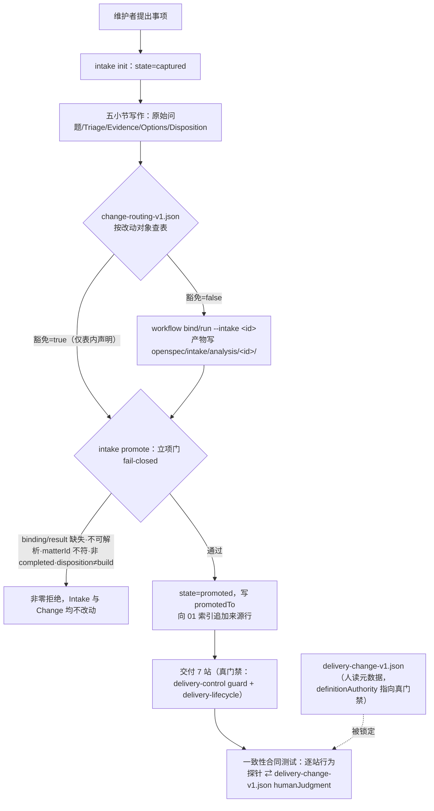

# 改造计划

> 本文件只落地 `05-改造方案/方案决策.md` 已批准的**候选 A**（单片交付，交付 7 站权威归真门禁代码）与其五项细节裁定。八条处置包的内容裁决来自 `openspec/intake/INT-20260831-019-three-item-retrospective.md` 的 Options 段，本文件不重开。

## 目标与非目标

### 目标

1. **交付 7 站只剩一份权威定义**（裁定 A6）。`openspec/tools/delivery-control.ts guard` + `openspec/tools/delivery-lifecycle.ts` 为唯一权威；`openspec/profiles/delivery-change-v1.json` 降级为人读元数据并显式声明这一从属关系；新增一致性合同测试逐站从**真门禁行为侧**取值，与 profile 的 `humanJudgment` 标记比对，任一侧单边修改即非零拒绝。
2. **`archive` 站摘除 `humanJudgment`**（裁定 A3）。归档降为机器步骤，验收的「同意」即授权；`archive-readiness.json` 的 `attestedBy` 改为从 `acceptance-state.json` 的 `acceptedBy` 派生而非再次索取，使「不索取第二次表态」在机器侧成立。readiness / release guard 的校验项一项不减。
3. **立项门 fail-closed**（裁定 A1）。`intake promote` 在写入任何状态之前，先按路由表判定该条目是否豁免分析线；不豁免时校验该条目的分析线产物（`workflow-binding.json` + `workflow-result.json`）存在、可解析、`matterId` 与条目 `id` 一致、`status` 为 `completed`、`disposition` 为 `build`；任一不满足即拒绝且不改动 Intake 与目标 Change。
4. **路由表立法**（裁定 A1 豁免规则 + `INT-20260830-002`）。新增版本化路由表 `openspec/profiles/change-routing-v1.json`，按**改动对象**分类（`governance-contract` / `tool-code` / `doc-expression` / `ledger-only`），每行声明交付档位（`delivery-change` / `light-change`）与是否必须先走分析线。路由表是立项门与档位选择的唯一真源；未匹配取最重档且不豁免；禁止为绕过门禁失败而降档；调用方自述豁免一律拒绝。
5. **登记并为两站**（裁定 A2）。机器状态只保留`已登记` / `已处置`；`state` 收敛为四元枚举 `captured` / `promoted` / `held` / `closed`，取消 `triaged`；移除 `advance` 的三次中间推进；Intake 文件的五个小节结构原样保留，其结构校验从「分站逐次校验」改为「处置时一次性全量校验并逐项返回缺失小节」。
6. **移除无机器读者的资产**（裁定 B1 / B2 / B3）。`reopen-state.json`、`lifecycle-history/<stamp>/**`、`change-sources.json` 停写并移除相关代码与合同；`change-mode.json` 与 `.delivery-update-snapshot.json` 概念移除（全历史零实例），`delivery` 作为显式默认写死在代码里，`update snapshot` / `update diagnose` 两个命令一并移除。移除 `change-sources.json` 之前，先把其唯一的独占信息——来源全序排名——以「RAW 编号顺序即权威顺序」的方式并入 `01-原始需求索引.md` 的材料索引表语义。
7. **现状文档合并并保住门禁**（裁定 B4）。`delivery-change` schema 推进到 v6：`business-current` 与 `technical-current` 合并为单一 artifact `current-state`（`03-现状/现状.md`），模板合并；合并后该 artifact 承接原两份各自参与的 digest 计算与批准门禁，`requiredBeforeAcceptance` 的门禁条目数量与语义不因合并而减少。
8. **发布模板删三节**（裁定 B5）。`templates/release-plan.md` 删除「现场快速资产」「日志、指标与观察窗口」「配置开关」三个恒空小节，保留 Spec Sync 表与门禁勾选。
9. **任务证据可校验**（裁定 B8）。`task-state.json` 的 `evidence` 项按 Change 内相对路径解析，校验存在且内容非空；绝对路径或 `..` 越界一律 fail-closed 且不写入任何状态。新校验只作用于 active Change 的写入路径，不回溯归档目录。
10. **治理文本改写**（裁定 C1 / C5 + 信号6 / 信号8）。`AGENTS.md` 末条校准条款改写为「摆盘深度与决策分量匹配」三档规则（例行站位只写盘不摆 / 两道真门一屏 / 方向级与复盘级重裁决展开说透允许超一屏），并附新的复盘触发点「强制版分析线跑满 2 单后复盘 A1 的留/修/杀」；同时把方案门摆盘必须附「落地后可感知的具体变化清单」写入条款（信号8）。`.claude/skills/delivery-pilot/SKILL.md` 的站位表同步为「登记两站、分析线为立项门前置、归档非人工门」。
11. **两个早期目录归档**（裁定 C2 / C4）。`establish-intake-inventory` 补 spec（4 条需求并入 `openspec/specs/intake-workflow/`）后正常归档；`establish-workflow-v01-contract` 标 superseded 直接归档、不补验收、保留 `openspec/tools/workflow-entry.ts`。

### 非目标

- 不动 `establish-runtime-metrics-baseline` 目录、`metrics-control.ts` 三件套与 `INT-20260830-005` 的悬挂 `promotedTo`（裁定 B6 / C3：随强制版分析线第一单的结论处置）。
- 不合并 `proposal` 与 `decision` 两站（裁定 A4：维持分站）。
- 不放宽、不重写 `implementation-review` 的自算 `reviewedPaths` / `result`，不放宽 `acceptance-state` 的四 digest 新鲜度（裁定 A5：不得削弱项）。
- 不把 `guard` 改为 profile 驱动（候选 B 已被拒绝）；`workflow run` 对 `delivery-change` 仍只做 request 键存在性检查。
- 不迁移存量：10 个已归档 Change 与本 Change 自身保持 v5 结构；19 条存量 intake 不要求补走已被移除的中间站。
- 不处置 DEP0190 警告与两个 run 入口语义不一致（裁定 C6：留在台账）。
- 不新增 shell runner，不引入第二套 lock 或哈希清单。
- 不改 `runtime-manifest.json` 的四条受管投影与 gitlink 语义；消费仓采用新 Runtime commit 由其自身 Change 负责。

## 目标业务与技术流程

登记线的机器状态只剩两节点：`captured`（已登记）与`已处置`三出口 `promoted` / `held` / `closed`；`held`、`closed` 经显式 `reopen` 回到 `captured`。分析线产物落在资产仓 `openspec/intake/analysis/<intake-id>/`（不进 Runtime submodule），目录名与 `workflow-result.json` 的 `matterId` 双向携带条目 `id`。

## 影响面

| 仓库/系统 | 模块/接口 | 变更 | 兼容约束 | 责任方 |
|---|---|---|---|---|
| delivery-spec-runtime | `openspec/tools/intake-control.ts` | 四元 `state`、移除 `advance` 中间推进、处置时一次性小节校验、`promote` 立项门读路由表与分析产物 | `list` / `inspect` 输出合同不变；19 条存量条目仍全 `current` | Runtime 维护者 |
| delivery-spec-runtime | `openspec/tools/delivery-control.ts` | 移除 `change-sources` / `change-mode` / `update snapshot`·`diagnose`；`artifactPaths` 合并 03/04；`evidence` 路径校验；导出站位行为探针所需入口 | `guard` 六个 operation 的放行/拒绝语义不变；`requireApproved` 门禁条目数不减 | Runtime 维护者 |
| delivery-spec-runtime | `openspec/tools/delivery-lifecycle.ts` | 移除 `reopen-state.json` 与 `lifecycle-history` 写盘；readiness 的 `attestedBy` 改为派生 | review 自算与 acceptance 四 digest 一字不动 | Runtime 维护者 |
| delivery-spec-runtime | `openspec/tools/workflow-core.ts` / `workflow-control.ts` | `WorkflowBinding` 增可选 `matterId`；profile 允许键增 `definitionAuthority`；`bind` / `run` 支持 `--intake-id` 与分析产物落点 | 既有 `--change-root` 用法不变；`workflow-entry.ts` standalone 行为不变 | Runtime 维护者 |
| delivery-spec-runtime | `openspec/tools/runtime-entry.ts` | 转发 `intake` 时补 `--runtime-root`（路由表在 Runtime 侧） | 入口校验顺序与 fail-closed 语义不变 | Runtime 维护者 |
| delivery-spec-runtime | `openspec/tools/bootstrap.ts` | 去掉 `change-sources.json` 写入与 `03-业务现状` 目录映射，改产 v6 结构 | bootstrap staged/rollback 语义不变 | Runtime 维护者 |
| delivery-spec-runtime | `openspec/schemas/delivery-change/schema.yaml` | version 5→6；`business-current` + `technical-current` → `current-state`；01 instruction 去掉 `change-sources.json` | 存量 Change 按 v5 解析，不迁移 | Runtime 维护者 |
| delivery-spec-runtime | `templates/{business-current,technical-current}.md` → `current-state.md`；`release-plan.md`；`acceptance.md` | 合并模板；删三节；去 `change-mode` 表述 | 归档目录内的旧模板产物不受影响 | Runtime 维护者 |
| delivery-spec-runtime | `openspec/contracts/*.json` | 删 `sources.schema.json`、`change-mode.schema.json`；改 `intake-state.schema.json`、`task-state.schema.json`、`workflow-binding.schema.json`、`workflow-profile.schema.json`；新增 `change-routing.schema.json` | `openspec/contracts/openspec-cli-probes.json` 不变 | Runtime 维护者 |
| delivery-spec-runtime | `openspec/intake/stages.json`、`openspec/intake/template.md` | 阶段枚举收敛为两状态；模板保留五小节 | 存量条目的 `phase` 字段降为只读兼容字段 | Runtime 维护者 |
| delivery-spec-runtime | `openspec/profiles/delivery-change-v1.json` | `archive` 摘 `humanJudgment`；新增 `definitionAuthority` | 站位 id 与顺序不变 | Runtime 维护者 |
| delivery-spec-runtime | `openspec/profiles/change-routing-v1.json`（新增） | 路由表首版 | 未匹配取最重档 | Runtime 维护者 |
| delivery-spec-runtime | `.omp/command-sources/bodies/{opsx-archive,opsx-new,opsx-update}.md` 及 `.omp/commands/` 渲染产物 | 去 `lifecycle-history` / `change-mode`；`opsx-update` 删 snapshot 与 diagnose 两段 | 渲染产物与源逐字节一致 | Runtime 维护者 |
| delivery-spec-runtime | `docs/{governance,workflow-guide,architecture,maintainer-guide}.md` | 说明面同步 | 无 | Runtime 维护者 |
| delivery-spec-runtime | `AGENTS.md`、`.claude/skills/delivery-pilot/SKILL.md` | 校准条款三档改写 + 复盘触发点 + 可感知变化清单；站位表同步 | 硬规则须附大白话理由（既有元规则） | Runtime 维护者 |
| delivery-spec-runtime | `public-allowlist.json` | 随文件增删同步 | 与实际文件集合一致 | Runtime 维护者 |
| delivery-spec-runtime | `test/*.test.ts` 9 份 + `helpers.ts` | 断言改写与新增场景（详见 `06-测试方案/测试方案.md`） | 既有 fail-closed 断言不得放宽 | Runtime 维护者 |
| delivery-spec-runtime | `openspec/changes/establish-intake-inventory/`、`establish-workflow-v01-contract/` | 归档 | `openspec validate --all --strict` 保持通过 | Runtime 维护者 |
| delivery-spec-runtime | `openspec/specs/intake-workflow/spec.md` | 接收 `establish-intake-inventory` 的 4 条需求 | delta 目录名≠能力名，本仓已有先例 | Runtime 维护者 |
| 消费仓 | 受管投影四条 | 不变 | 采用新 commit 由消费仓自身 Change 负责，不阻塞本 Change 归档 | 各消费仓维护者 |

## 实施切片与依赖

| 顺序 | 切片 | 前置 | 独立验收 | 回滚边界 |
|---:|---|---|---|---|
| 1 | **S1 权威归属与一致性锁**（A6 + A3）：profile 加 `definitionAuthority`、`archive` 摘 `humanJudgment`、readiness `attestedBy` 改派生、新增逐站行为探针一致性合同测试 | 方案决策批准 | 一致性测试对现状 fixture 通过；构造 profile 单边改动的 fixture → 非零并列出不一致站位；readiness/release/archive guard 既有断言全绿 | 还原 profile JSON、`delivery-lifecycle.ts` readiness 段与新测试文件 |
| 2 | **S2 立项门与路由表**（A1 + INT-002 + 分析产物可定位）：新增 `change-routing-v1.json` 与其合同、`workflow bind/run` 支持 `--intake-id` 与分析产物落点、`WorkflowBinding.matterId`、`intake promote` fail-closed 校验、`runtime-entry` 为 intake 补 `--runtime-root` | S1（避免与 profile 改动交叉） | 缺产物→拒绝、产物齐备→放行、`matterId` 不符→拒绝、调用方自述豁免→拒绝、未匹配路由行→按最重档不豁免、门禁失败后请求降档→拒绝 | 还原 `intake-control.ts` promote 段、workflow 两文件与新增 JSON |
| 3 | **S3 登记并站**（A2）：`state` 四元化、移除 `advance` 中间推进、处置时一次性小节校验并逐项报缺、`stages.json` 与 `intake-state.schema.json` 收敛、`phase` 降为只读兼容字段 | S2（`promote` 与 `advance` 同文件，顺序落地避免冲突） | 请求 advance 到 triage/evidence/options → 非零且文件内容与状态不变；缺多个小节 → 一次返回全部缺失项；`intake list` 对 19 条存量仍全 `current`、零重复 | 还原 `intake-control.ts` 与两份合同 |
| 4 | **S4 无 reader 资产移除**（B1 + B2 + B3）：01 索引材料表补「RAW 编号顺序即权威顺序」语义并先行验证覆盖度；移除 `change-sources.json`/`sources.schema.json`/`sources` 子命令；移除 `reopen-state.json` 与 `lifecycle-history`；移除 `change-mode` 概念与 `change-mode.schema.json`；移除 `update snapshot`·`diagnose` 两命令与 `.delivery-update-snapshot.json` | S3 | `sources`/`update` 子命令均返回「未知命令」非零；reopen 后目录不出现 `reopen-state.json` 与历史快照目录；`parseMode` 移除后 guard 行为等价于旧 `delivery` 分支；归档目录中的旧 `change-sources.json` 不被任何校验读取 | 还原三个工具文件与两份合同；被删资产全历史零实例（`change-sources.json` 在 10 个归档目录留有副本），无数据需恢复 |
| 5 | **S5 现状合并与证据校验**（B4 + B5 + B8）：schema v6、`current-state` artifact 与合并模板、`artifactPaths` 与 `requiredBeforeAcceptance` 调整、`release-plan.md` 删三节、`acceptance.md` 去 `change-mode` 表述、`task-state.json` 的 `evidence` 路径存在与非空校验 | S4 | 合并后门禁条目数与语义逐项比对不减；旧结构归档 Change 仍通过 strict validate；evidence 四类负向（不存在/空文件/绝对路径/`..` 越界）全部 fail-closed，正向放行；归档目录的自然语言 evidence 不被新校验触及 | 还原 schema version 与模板拆分、`delivery-control.ts` 的 `artifactPaths` 与 `parseTask` |
| 6 | **S6 治理文本与说明面**（C1 + C5 + 信号8 + docs + SKILL）：`AGENTS.md` 校准条款改写、`SKILL.md` 站位表同步、四份 docs 同步、`.omp` 两处命令源改写并重渲染九个命令 | S1–S5（文本描述已落地行为） | `command-renderer.test.ts` 渲染产物与源逐字节一致；docs 中不再出现已移除的命令与文件名；`AGENTS.md` 每条硬规则附理由 | 还原文本文件并重渲染 |
| 7 | **S7 两个早期目录归档**（C2 + C4）：`establish-intake-inventory` 的 4 条需求并入 `openspec/specs/intake-workflow/spec.md` 后归档；`establish-workflow-v01-contract` 标 superseded 归档并在处置记录写明取代关系 | S6 | `openspec validate --all --strict` 通过；`openspec/changes/` 下只余 `establish-runtime-metrics-baseline` 与本 Change；`workflow-entry.ts` 仍在 allowlist 与 `test/workflow.test.ts` 断言中 | `git mv` 反向还原目录位置与 spec 合并段 |
| 8 | **S8 清单同步与全量回归**：`public-allowlist.json` 随文件增删同步；全量 `node --test` + `openspec validate --all --strict` + `runtime-check` | S1–S7 | allowlist 与实际文件集合一致；测试与校验全绿 | 不适用 |

## 数据与兼容迁移

- **数据**：无持久化数据迁移。被移除的 `reopen-state.json`、`lifecycle-history/**`、`change-mode.json`、`.delivery-update-snapshot.json`、`workflow-binding.json`（Change 根）在全历史零实例（`git log --all --diff-filter=A --name-only` 核实，2026-08-31）；`change-sources.json` 在 10 个归档目录中留有历史副本，移除的是写入路径与读取命令，不删归档中的既有文件。
- **接口**：
  - `runtime-entry.ts` 的 `delivery sources inspect/write`、`delivery update snapshot/diagnose` 四个子命令下线，调用返回非零「未知命令」；`.omp/commands/opsx-update.md` 同批删除对应两段，避免文档指向已删命令。
  - `intake advance` 保留命令名但只接受「无中间站」的语义：请求 `triage`/`evidence`/`options` 一律非零并说明中间站已合并。
  - `workflow bind` / `workflow run` 新增 `--intake-id`，旧 `--change-root` 用法保持不变。
- **存量兼容矩阵**：

| 对象 | 处理方式 |
|---|---|
| 10 个已归档 Change（持 `change-sources.json`、两份现状文档、自然语言 evidence） | **原样冻结，不迁移**。新校验只作用于 active Change 写入路径，不回溯归档目录；`openspec validate --all --strict` 现有通过数必须保持 |
| 19 条存量 intake（`phase` 分布在 capture / disposition / promoted） | `phase` 保留为**只读兼容字段**，不再由任何命令写入；新模型只读 `state`。存量 `state: triaged` 的条目在下一次处置时直接进入四元枚举的终态，不要求补走已移除的中间站 |
| `establish-runtime-metrics-baseline` | 不动（裁定 C3） |
| 本 Change 自身 | 视为最后一个 v5 结构 Change，以旧结构走完自身闭环；v6 只对其后创建的 Change 生效 |
| 消费仓 | 受管投影四条不变；采用新 Runtime commit 由消费仓自身 Change 负责 |

- **灰度**：Runtime 仓自身与测试 fixture 先行；路由表首版只覆盖四类改动对象，上线后第一次误挡按「调表不关门」处置。
- **回滚**：全部改动在功能分支内，归档前不创建 PR，未合并前 `git reset` 即可整体回退。切片级回滚边界见「实施切片与依赖」表末列。唯一不易回退的是 schema v5→v6，但它只影响新建 Change，回退方式是把 version 改回 5 并恢复两份现状模板。

## 风险与处置

| 风险 | 影响 | 预防/缓解 | 停止条件 |
|---|---|---|---|
| 一致性合同测试写成「两侧互抄」 | A6 的权威裁定失去机器保障，结构债换个形态复发 | 断言必须从真门禁**行为侧**取值：对每站构造「仅缺该站维护者表态字段」的 fixture 跑真门禁，拒绝⇒该站索取表态；禁止从 profile 反读，也禁止在代码里另建一份站位清单供两侧比对 | 若无法从行为侧稳定判定，按方案决策「重新决策触发条件」第 1 条停止并回方案层 |
| 立项门过严，正常小改动被挡 | 维护者被迫绕开或关门 | 路由表与门同批交付并至少含一条豁免行（`doc-expression` / `ledger-only`）；上线后第一次误挡即调表 | 若误挡需要关门才能继续，说明分类维度选错，停止并回方案层 |
| `attestedBy` 派生被判为「削弱 archive 门禁」 | 与裁定 A3「机器门禁一字不动」的字面冲突 | readiness 的全部校验项（acceptance digest、releasePlan digest、specSync 双向哈希、strictValidation、cleanup PASS、`prStarted=false`、`attestedAt` 晚于 `acceptedAt`）逐项保留并补断言；改的只是 `attestedBy` 的**取值来源**（输入→派生），不是校验数量。备选降级方案：保留 `attestedBy` 输入，一致性判据改为「首次表态 vs 复述表态」的语义标注 | 若维护者判定派生也算改动门禁，改用备选降级方案，不停整片 |
| 03/04 合并丢门禁 | 批准链缺一环而无人察觉 | 合并后 artifact 必须承接原两份的全部 digest 与批准校验；补一条断言比对合并前后 `requiredBeforeAcceptance` 的门禁条目集合 | 门禁条目数或语义无法等价承接时，B4 退回「保留两份」并在方案决策追加修订 |
| evidence 校验波及归档目录 | 10 个历史 Change 被判失效 | 校验只接在 active Change 的 `task set` / `task write` / guard 路径上；补一条「归档目录不受新校验影响」的断言 | 归档目录出现任一失败即停止 |
| 单片改动面大，评审覆盖不全 | 漏审 | `implementation-review` 的 `reviewedPaths` 由代码自算、不接受手工缩小，本身即机器缓解；任务拆分按切片对齐，便于逐片评审 | Review 出现 HIGH finding 未 RESOLVED 即停止 |
| 中途某项裁决不可实施 | 整片阻塞 | 切片顺序按依赖排列，前 5 片任一失败即在该片停下并回方案层，不让后续片先行归档 | 任一切片的独立验收无法达成 |
| Windows 路径与 CRLF 既有坑复发 | 测试假绿或假红 | 沿用既有 `helpers.ts` 的临时目录与行尾归一化约定；新增 fixture 不引入长路径 | 出现平台相关的不稳定失败即停止并登记台账 |
| 分析线真跑后暴露 DEP0190 与 run 入口语义不一致 | 噪音与操作困惑 | 已登记 `INT-20260831-007`，裁定 C6 不纳入本 Change | 不适用 |

## 决策日志

| ID | 决策 | 依据 | 替代方案 | 影响 | 日期 |
|---|---|---|---|---|---|
| PLAN-001 | 交付 7 站权威归 `delivery-control.ts guard` + `delivery-lifecycle.ts`，profile 降为人读元数据并加 `definitionAuthority` 字段 | 方案决策「选择」；裁定 A6 | 权威归 profile（候选 B，已拒绝） | `workflow-core.ts` 的 profile 允许键需扩一项；`workflow-profile.schema.json` 同步 | 2026-08-31 |
| PLAN-002 | 一致性合同测试从真门禁**行为侧**取值（逐站表态字段缺失探针），不在代码中另建站位清单 | 方案提案「风险与可逆性」第 2 行；本文件风险表第 1 行 | 两侧各写一份清单再比对 | 测试需要 7 个站位的最小 fixture，成本高于互抄但这是该测试唯一有意义的写法 | 2026-08-31 |
| PLAN-003 | `archive-readiness.json` 的 `attestedBy` 由输入索取改为从 `acceptance-state.json` 的 `acceptedBy` 派生，`attestedAt` 取写入时刻 | 裁定 A3「归档不得索取第二次人工表态」在机器侧的必然推论；spec delta「归档不再索取第二次人工表态」场景 | 保留输入字段，仅在文档层声明「非人工门」 | 与裁定 A3「机器门禁一字不动」存在字面张力，故在风险表登记备选降级方案 | 2026-08-31 |
| PLAN-004 | 分析线产物落在资产仓 `openspec/intake/analysis/<intake-id>/`，目录名与 `workflow-result.json.matterId` 双向携带条目 `id`；`WorkflowBinding` 增**可选** `matterId` | spec delta「Analysis-line artifacts SHALL be discoverable by the intake gate」 | 产物落 Change 根（promote 之前尚无 Change，不可行） | `workflow-binding.schema.json` 与 `parseWorkflowBinding` 需扩字段；既有 `--change-root` 绑定不受影响 | 2026-08-31 |
| PLAN-005 | 路由表按**改动对象**四分类（`governance-contract` / `tool-code` / `doc-expression` / `ledger-only`），独立文件 + 独立合同，不塞进 `registry.json` | 方案决策未决问题 3 裁定；`registry.json` 的条目合同只允许 profile 三键 | 塞进 registry 或按预估工作量分类（已拒绝） | 新增一份合同与一份数据文件，需进 allowlist | 2026-08-31 |
| PLAN-006 | `runtime-entry.ts` 转发 `intake` 时补 `--runtime-root`（路由表在 Runtime 侧，消费仓经 `.delivery-spec-runtime` 前缀访问） | `runtime-entry.ts:172-176` 现只为 workflow 传该参数 | 把路由表放资产仓（会让每个消费仓各自维护一份，规则分叉） | `intake-control.ts` 需接受并使用该参数 | 2026-08-31 |
| PLAN-007 | `state` 收敛为四元 `captured` / `promoted` / `held` / `closed`；`phase` 降为只读兼容字段而非删除 | 方案决策未决问题 2 裁定；19 条存量零迁移 | 引入 `disposed` + 出口字段（已拒绝）；直接删 `phase`（会使存量条目解析失败） | `intake-state.schema.json` 与 `stages.json` 需同步；`inventoryEntry` 的 `phase` 输出保留 | 2026-08-31 |
| PLAN-008 | 01 索引以「材料索引表的 RAW 编号顺序即权威顺序」承载来源全序，不新增列 | 方案决策未决问题 1 裁定（补法 a） | 新增权威序列（重复表达）；直接丢弃排序（与裁定字面冲突） | 改的是 schema 的 01 instruction 与模板说明文字，零代码 | 2026-08-31 |
| PLAN-009 | schema 推进 v6，`business-current` + `technical-current` 合并为 `current-state`（`03-现状/现状.md`），存量不迁移 | 方案决策未决问题 5 裁定；裁定 B4 | 显式迁移存量（会改写历史治理证据） | 仓内长期并存两种 Change 目录形状，分界线是创建时间 | 2026-08-31 |
| PLAN-010 | 信号8（方案门摆盘须附「落地后可感知的具体变化清单」）落在 `AGENTS.md` 校准条款与 `SKILL.md` 摆盘节，**不**回头修改本 Change 已产出的 spec delta | 该规则是治理文本层约定，且本 Change 的 `specs/` 工件已定稿；重开 delta 会使已产出工件的批准链复杂化 | 向 `human-interaction` delta 追加一条 scenario | 若维护者要求 spec 级固化，需在下一轮复盘或另立 Change 补 delta | 2026-08-31 |
| PLAN-011 | 两个早期目录的归档放在最后一片（S7），在全部行为改动落地并回归通过之后执行 | 归档会改变 `openspec validate --all --strict` 的计数基线，先落行为再动目录可把两类失败分开定位 | 先归档再改代码 | 归档若失败不影响前六片的独立验收 | 2026-08-31 |

## 待决问题

- **路由表首版的行数与豁免边界**：四类改动对象已定，但每类下是否需要更细的条件（例如 `tool-code` 中「只改测试」是否豁免）留到实施时按第一版最小可用集确定，并在 S2 的独立验收中至少覆盖「一条必走分析线的行」与「一条豁免行」。该问题不改变需求、主方案与任务拆解。
- **`openspec/intake/analysis/` 是否需要进 `public-allowlist.json`**：该目录是资产仓运行时产物而非 Runtime 源文件，倾向不进 allowlist，实施时按 allowlist 现有语义确认。不改变任务拆解。
- **`docs/` 四份文档的改写深度**：本次只做「与已移除资产和已改行为对齐」的同步，不做结构重排；若发现某份文档需重写整节，登记台账另行处置，不在本 Change 内扩范围。
