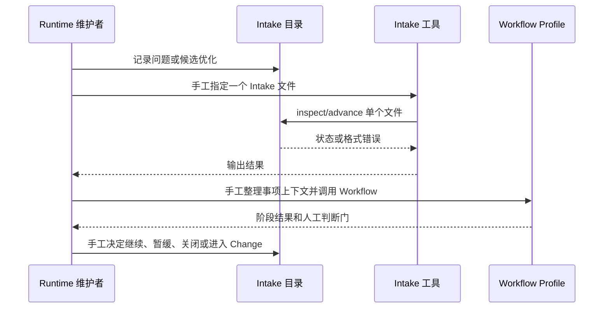

# 业务现状

## 调查口径

- 业务基线日期：2026-08-30
- 业务范围：Runtime 仓自身 `openspec/intake/` 输入池的识别和人工分流
- 材料口径：当前仓库 Intake 文件、`intake-workflow` 长期 spec、README 和维护指南；不包含 Desk 或消费仓业务资料

## 角色与责任

| 角色/系统 | 当前责任 | 输入 | 输出 |
|---|---|---|---|
| Runtime 维护者 | 判断事项是否继续、归属和是否创建 Change | Intake 内容、证据、候选 | triage/disposition 判断 |
| Intake 目录 | 保存尚未承诺实施的问题和证据 | Markdown Intake 文件 | 人工可读事项记录 |
| Intake Runtime 工具 | 创建、检查和推进单个新格式 Intake | 显式项目根和文件 | 状态转移或失败结果 |
| Workflow Profile | 在调用方提供上下文后执行阶段合同 | 事项、Profile、阶段输入 | 机器可读阶段结果 |

## 当前业务流程

当前没有一个业务步骤负责先盘点全部 Intake、检测重复身份、区分 legacy 和当前事项，也没有自动排序队列。

## 业务对象与状态

| 对象 | 关键字段/身份 | 状态 | 状态变化条件 |
|---|---|---|---|
| 新格式 Intake | `id`、`state`、`phase`、`source`、`capturedAt`、`promotedTo` | captured/triaged/held/promoted/closed | 通过阶段门禁和人工出口 |
| legacy Intake | 旧 `status`、缺失新合同字段 | legacy | 只能报告缺口，不能静默推进 |
| Intake 身份 | `id` 与文件路径 | 唯一/冲突/缺失 | 人工确认或明确迁移后恢复唯一性 |
| Runtime Change | Change slug 与来源引用 | active/archive | 维护者明确 Promote 后建立并完成生命周期 |

## 异常与失败分支

| 场景 | 当前行为 | 业务影响 |
|---|---|---|
| 多个文件使用同一 ID | 没有统一 inventory 报告 | 无法安全判断当前权威记录 |
| legacy 文件被单独 inspect | 当前工具可能因缺少新字段失败 | 无法向维护者报告迁移缺口 |
| 只推进单个文件 | 依赖维护者知道所有事项 | 容易遗漏、重复处理或扩大范围 |
| 事项缺少阶段输入 | Workflow 返回 blocked | 维护者需要补充上下文 |
| 需要人工判断 | Workflow 返回 waiting | 维护者在判断门介入 |

## 当前边界与已知问题

- 本文件只陈述改造前业务事实；目标 inventory 行为进入 `specs/intake-inventory/spec.md` 和 `05-改造方案/`。
- 重复 ID 的最终归属、legacy 迁移和是否创建 Change 仍由维护者决定。
