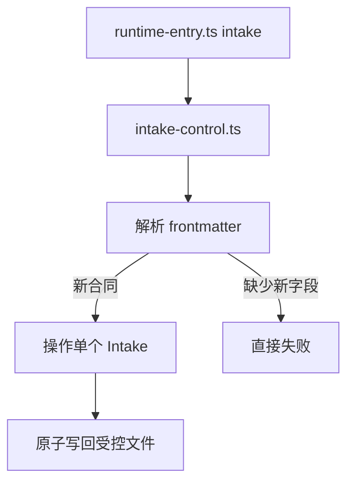

# 技术现状

## 调查基线

- 主干基线 commit：未在本 Change 中改变；当前分支为 `metrics-concurrency-intake`
- 需求分支 commit：以当前工作树为准
- 运行态核验时间点：2026-08-30

| 仓库 | 模块 | 证据类型（源码/历史测试/运行态/推断） | 核验方式 |
|---|---|---|---|
| `delivery-spec-runtime` | `openspec/tools/intake-control.ts` | 源码 | 读取 `init`、`inspect`、`advance`、`hold`、`close`、`reopen`、`promote` |
| `delivery-spec-runtime` | `openspec/contracts/intake-state.schema.json` | 源码 | 读取必填字段和状态枚举 |
| `delivery-spec-runtime` | `test/intake.test.ts` | 历史测试 | 读取现有四项 Intake 测试场景 |
| `delivery-spec-runtime` | `openspec/intake/` | 运行态工作树 | 盘点 `INT-*.md` 文件、legacy 格式和重复 ID |

## 当前技术流程

`runtime-entry.ts` 会先执行 Runtime 绑定检查，再把 `intake` 子命令分派给 `intake-control.ts`。当前控制器只接收单个显式 `--file`，没有目录清单操作。

## 接口与数据边界

| 边界 | 当前接口/模型 | 调用方 | 副作用 | 失败语义 |
|---|---|---|---|---|
| Runtime → Intake | `intake inspect --file <relative-file>` | 维护者 | 读取单个文件 | 新合同字段缺失时失败 |
| Runtime → Intake | `intake advance/hold/close/reopen/promote` | 维护者 | 原子写回 Intake 或目标 Change | 参数/路径/阶段不合法时非零退出 |
| Intake 文件 → 状态 | frontmatter `schemaVersion/id/state/phase/source/capturedAt/promotedTo` | 控制器 | 解析为内部 `State` | 当前 parser 对 legacy 没有结构化报告 |
| Intake 目录 → Inventory | 尚不存在 | 无 | 无 | 无法检测重复 ID 或统一 legacy |

`atomic()` 已执行敏感内容检查、临时文件写入、fsync 和 rename；`rootOf()` 与 `safeFile()` 限制项目根和 Runtime submodule 边界。Inventory 目标行为必须保持这些边界，并且只读。

## 事务、缓存、通知和兼容

- 事务：单文件写入采用临时文件、fsync 和 rename；inventory 不写入事务。
- 缓存：无缓存；每次操作读取磁盘当前内容。
- 通知：通过 stdout JSON 或 stderr 错误返回；没有远程通知。
- 兼容：当前 parser 只接受新格式；legacy 文件缺少 `state/phase` 时无法返回规范要求的迁移缺口。

## 部署与运行态

| 事实 | 环境/机器 | 证据 | 核验时间 |
|---|---|---|---|
| Runtime 通过 Node `--experimental-strip-types` 执行 | 本地 Runtime 仓 | `AGENTS.md`、维护指南 | 2026-08-30 |
| Intake 只能在调用方项目根受控路径读写 | 本地 Runtime/消费仓入口 | `rootOf()`、`safeFile()` 和 Intake spec | 2026-08-30 |
| 当前没有远程 telemetry、数据库或 inventory 看板 | Runtime 仓 | 当前 Intake 与维护文档 | 2026-08-30 |

## 已知缺口与不确定性

- `[事实]` 当前 Intake 控制器没有目录扫描和重复 ID 报告。
- `[事实]` 当前目录有一个旧记录文件没有合法 frontmatter，但正文含 `INT-20260830-003`；另一个 legacy 文件的 frontmatter 使用该 ID，形成身份/格式歧义而非两个可直接解析的当前 ID。
- `[事实]` 当前多个旧 Intake 使用 `status` 而非新合同 `state`，并缺少 `phase`。
- `[推断]` 自动排序策略需要后续根据维护者使用习惯再调整；本 Change 只提供确定性清单，不替维护者作业务优先级决定。
- 目标实现只进入 `05-改造方案/`。
