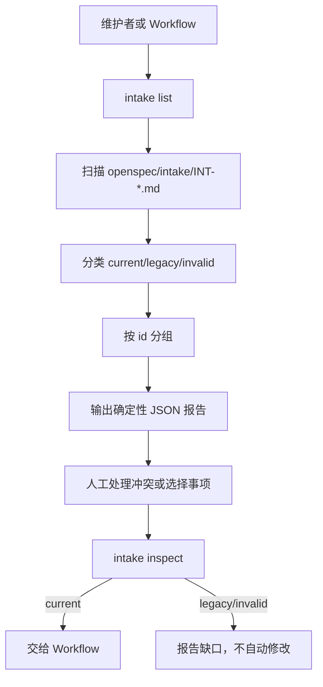

# 改造计划

## 目标与非目标

### 目标

- 新增只读 `intake list`，扫描受控 `openspec/intake/` 中的 `INT-*.md`。
- 返回确定性排序的条目摘要、当前/legacy/invalid 分类和缺失字段。
- 报告重复 Intake ID 的全部冲突文件，不自动选择权威记录。
- 让单文件 `intake inspect` 对 legacy 返回结构化迁移缺口，并保持原文件不变。
- 对当前仓已确认的 legacy/invalid 文件执行一次人工规范化，保留原始语义、历史和可追溯来源。
- 复用现有项目根、Runtime submodule、敏感内容和相对路径边界。

### 非目标

- 不自动修复、迁移、重命名、删除或合并 Intake；人工规范化必须逐文件、可审计地执行。
- 不决定业务优先级、自动创建 Change 或自动 Promote。
- 不读取 Desk、其他仓库、全局目录或远程 telemetry。
- 不引入数据库、持久化队列、Agent 调度器或并发策略。
- 不修改既有 `delivery-change` 生命周期和 Runtime submodule 接入合同。

## 目标业务与技术流程

## 影响面

| 仓库/系统 | 模块/接口 | 变更 | 兼容约束 | 责任方 |
|---|---|---|---|---|
| `delivery-spec-runtime` | `openspec/tools/intake-control.ts` | 新增 `list` 和 legacy inspect 报告 | 保留既有单文件写入命令和新格式成功路径 | Runtime 维护者 |
| `delivery-spec-runtime` | `openspec/contracts/intake-inventory.schema.json` | 新增机器可读清单合同 | 固定 `schemaVersion: 1`，不包含真实业务正文 | Runtime 维护者 |
| `delivery-spec-runtime` | `test/intake.test.ts` | 增加 current/legacy/duplicate/invalid 场景 | Node 内置 `node:test`，临时目录隔离 | Runtime 维护者 |
| `delivery-spec-runtime` | `docs/workflow-guide.md` | 说明 inventory 与人工分流边界 | 不把清单描述成自动优先级系统 | Runtime 维护者 |
| `delivery-spec-runtime` | `public-allowlist.json` | 声明新公共合同 | 只加入审查后的公共文件 | Runtime 维护者 |

## 实施切片与依赖

| 顺序 | 切片 | 前置 | 独立验收 | 回滚边界 |
|---:|---|---|---|---|
| 1 | 固化 inventory 输出合同与分类字段 | 已批准方案决策 | Schema 和合成 JSON 结构校验通过 | 删除新 schema |
| 2 | 实现受控目录扫描、确定性排序和重复分组 | 切片 1 | current/legacy/invalid/duplicate 清单正确且只读 | 删除 list 分支 |
| 3 | 实现 legacy `inspect` 结构化报告 | 切片 1 | legacy 返回缺失字段和迁移建议，原文件字节不变 | 恢复原失败语义 |
| 4 | 对现有 legacy/invalid Intake 做人工规范化 | 切片 1 | 每个文件有新合同字段，原始语义保留，ID 唯一或歧义显式记录 | 恢复单个文件的历史版本 |
| 5 | 增加合同测试、白名单和使用文档 | 切片 2–4 | 聚焦 Intake 测试、全量测试和 strict validation 通过 | 删除新增测试、文档和白名单项 |
## 数据与兼容迁移

- 数据：代码不自动迁移；人工规范化只处理已盘点文件，不删除原始语义，不生成业务事项。
- 接口：新增 `runtime-entry.ts intake list --intake-root <root>`；`inspect` 对 legacy 返回报告；既有写入命令参数不变。
- 灰度：先由维护者显式调用 list，再人工确认每个文件的 ID、状态和阶段；确认后才将单个事项交给 `requirement-analysis`。
- 回滚：代码回滚停止 list/legacy 报告分支；资产回滚使用每个文件的版本控制历史，不执行隐式批量恢复。

## 风险与处置

| 风险 | 影响 | 预防/缓解 | 停止条件 |
|---|---|---|---|
| 重复 ID 被误当成一个事项 | 错误推进或覆盖历史 | 输出全部冲突文件并保持只读 | 任一冲突被静默隐藏 |
| legacy 被伪造为当前状态 | 破坏审计和 Promote 门禁 | 返回 legacy、缺口和迁移建议 | legacy 输出 current 或 completed |
| 扫描越出受控目录 | 隐私和仓库边界破坏 | 只允许固定 `openspec/intake/` 相对范围 | 读取目录之外资产 |
| 清单顺序不稳定 | 指标和 Agent 输入不可复现 | 按 POSIX 相对路径排序 | 相同目录两次输出不同 |
| 旧调用方依赖 inspect 失败文本 | 兼容行为变化 | 仅 legacy 分支返回结构化报告，新格式路径不变 | 新格式成功 inspect 行为回归 |

## 决策日志

| ID | 决策 | 依据 | 替代方案 | 影响 | 日期 |
|---|---|---|---|---|---|
| INV-001 | 采用候选 B，list 与 legacy inspect 一体化 | 方案决策 | 仅 list | 增加只读诊断，不自动修复 | 2026-08-30 |
| INV-002 | 清单只做确定性盘点，不做优先级排序 | 避免把业务判断伪装成算法结论 | 自动排序 | 优先级仍由 Workflow/维护者决定 | 2026-08-30 |
| INV-003 | 不迁移重复或 legacy 文件 | 保留历史证据和人工归属权 | 静默合并/重命名 | 后续需要人工处理冲突 | 2026-08-30 |

## 待决问题

- 重复 `INT-20260830-003` 的业务归属和最终命名不属于本 Change。
- 是否建设优先级排序和自动队列属于后续 Change。
