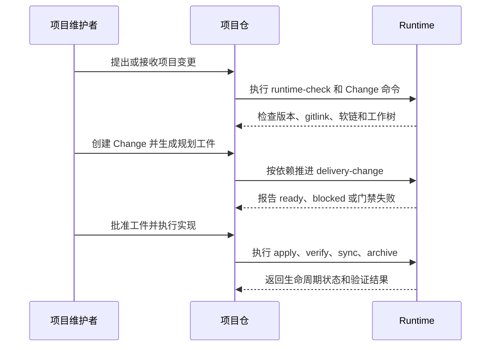

# 业务现状

## 调查口径

- 业务基线日期：2026-08-30
- 业务范围：项目仓调用共享 Runtime 执行 OpenSpec delivery-change 生命周期
- 材料口径（来源、版本、完整性）：当前仓库 `README.md`、`docs/workflow-guide.md`、`docs/consumer-guide.md`、`openspec/schemas/delivery-change/schema.yaml`；覆盖当前仓库已声明的流程，不包含未来上层工作台或 Workflow System 的目标实现。

## 角色与责任

| 角色/系统 | 当前责任 | 输入 | 输出 |
|---|---|---|---|
| 项目维护者 | 在项目仓决定是否建立 Change、批准规划和处理失败 | 项目需求、现有仓库事实、Runtime 状态 | Change 决策、实现和验收结果 |
| 项目仓 | 保存项目的 Change、长期 spec、代码和交付证据 | 需求、Runtime 命令、维护者决定 | 项目实现、Change 状态和验证证据 |
| Runtime submodule | 提供固定版本的 Commands、schema、工具和合同 | 父仓 gitlink、调用参数、Change 工件 | 状态检查、工件状态、生命周期门禁结果 |
| OpenSpec Change | 承载一次项目交付的规划和生命周期 | 原始需求、规格、方案、任务 | 规划工件、实现跟踪、Review、Acceptance 和归档状态 |

## 当前业务流程

当前流程以项目仓为边界。项目维护者直接操作项目仓中的 Change；Runtime 不负责发现项目仓、不维护跨项目目录，也不依赖外部工作台。

## 业务对象与状态

| 对象 | 关键字段/身份 | 状态 | 状态变化条件 |
|---|---|---|---|
| Runtime 绑定 | 父仓 gitlink、submodule commit、manifest | valid / invalid | 父仓 HEAD、submodule、版本或受管软链满足或不满足合同 |
| 项目 Change | Change slug、schema、mode、change-root | active / archive | CLI 创建、规划完成、验收、归档或失败重开 |
| 规划工件 | artifact id、依赖、摘要批准 | pending / ready / done / stale | 依赖完成、文件写入、批准摘要匹配或内容发生变化 |
| 实施任务 | task id、deliverables、verification、evidence | planned / implemented / verified / blocked | 实施者更新状态并提供对应证据 |
| 生命周期门禁 | operation、当前状态、相关摘要 | allowed / blocked | 前置批准、任务、Review、Acceptance 和清理条件满足或失败 |

## 异常与失败分支

| 场景 | 当前行为 | 业务影响 |
|---|---|---|
| Runtime 未初始化或 gitlink 漂移 | `runtime-check` 非零退出 | 项目不能安全执行生命周期命令 |
| Change 工件依赖缺失 | `openspec status` 报告 blocked | 下游工件不能按依赖创建 |
| 工件未批准或摘要 stale | Runtime guard 停止 | 不能继续实施或验收 |
| 任务未全部 verified | delivery 模式验收 guard 失败 | 不能形成 PASS Acceptance |
| Review 存在 OPEN finding 或已 stale | Acceptance guard 失败 | 必须修复并重新 Review |
| 项目仓不应写入 Runtime 的内容 | 当前公共 Runtime 规则禁止保存 | 个人流程和第三方材料必须留在授权仓库 |

## 当前边界与已知问题

- 本文件只陈述当前业务事实；目标状态进入 `05-改造方案/改造方案.md`。
- 当前 Runtime 以项目仓直接调用为主，没有全局入口、跨仓事项目录或按需路由层。
- 当前默认 delivery-change 强调一次项目交付的完整规划和生命周期，不提供本文首轮需求中所要求的独立工作流调用合同。
