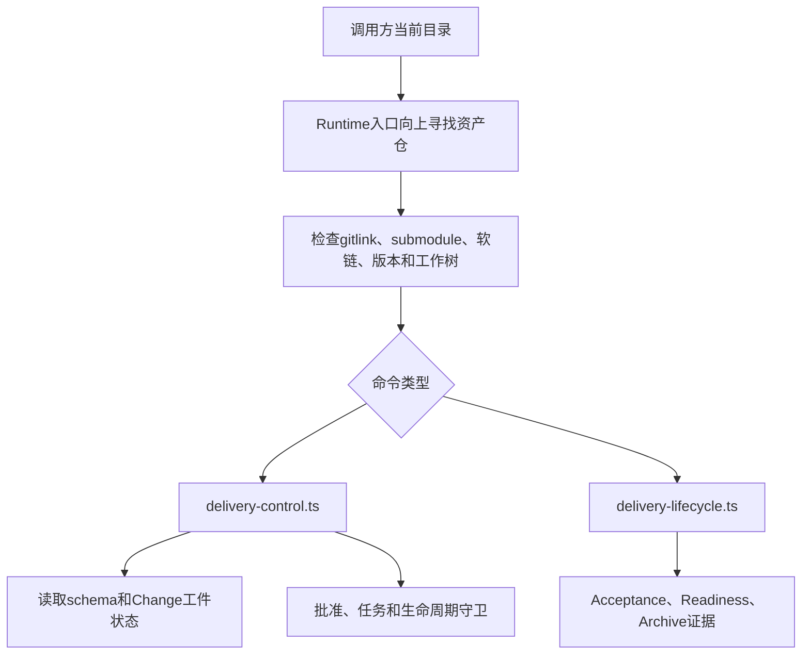

# 技术现状

## 调查基线

- 主干基线 commit：`17aba1a`（当前工作树已从 `d7dee47` fast-forward 到该提交）
- 需求分支 commit：当前 Change 建立于 `Eridanus117/intake-4` 工作树
- 运行态核验时间点：2026-08-30；OpenSpec Change 创建和首批工件写入后

| 仓库 | 模块 | 证据类型（源码/历史测试/运行态/推断） | 核验方式 |
|---|---|---|---|
| 当前 Runtime 仓 | `openspec/tools/runtime-entry.ts` | 源码 | 读取 `findAssetRoot`、`main` 和命令分发 |
| 当前 Runtime 仓 | `openspec/tools/delivery-control.ts` | 源码 | 读取工件状态、批准、任务和 guard 实现 |
| 当前 Runtime 仓 | `runtime-manifest.json` | 源码/配置 | 读取 manifest 的 schema、版本和软链合同 |
| 当前 Runtime 仓 | `openspec/schemas/delivery-change/schema.yaml` | 源码/配置 | 读取 artifact 依赖图和 apply 要求 |
| 当前 Change | `openspec/changes/establish-workflow-v01-contract/` | 运行态 | `openspec status --change establish-workflow-v01-contract --json` |

## 当前技术流程

`runtime-entry.ts` 的 `findAssetRoot` 从当前目录向上寻找同时存在 `.gitmodules` 和 `.delivery-spec-runtime/runtime-manifest.json` 的资产仓；`main` 随后校验 submodule gitlink、submodule clean 状态、父仓状态、受管软链、Node/OpenSpec 版本，再将命令转发给 `delivery-control.ts` 或 `delivery-lifecycle.ts`。

当前 `runtime-manifest.json` 的 schemaName 是 `delivery-change`，并锁定 Node、OpenSpec、submodule 路径和三条受管软链。当前入口没有全局目录解析、全局仓库扫描或外部状态回写的技术路径。

## 接口与数据边界

| 边界 | 当前接口/模型 | 调用方 | 副作用 | 失败语义 |
|---|---|---|---|---|
| 资产仓 → Runtime | `runtime-entry.ts runtime-check` | 消费项目仓 | 只读检查 | 任一合同失败即非零退出 |
| Change → Schema | `openspec status --change <slug> --json` | 项目维护者/命令 | 只读状态计算 | 依赖缺失时报告 blocked |
| Change → 控制工具 | `delivery-control.ts` 的 `init`、`approval`、`task`、`guard` 等命令 | 项目维护者/生命周期命令 | 写入 Change 机器状态或渲染任务视图 | 参数、状态或合同不合法时停止 |
| Change → 生命周期工具 | `delivery-lifecycle.ts` | 项目维护者 | 写入 Review、Acceptance、Readiness 和历史 | 前置证据或状态不满足时停止 |
| Runtime → 外部系统 | 当前没有接口 | 无 | 无 | 不适用；Runtime 不知道外部工作台 |
| 调用方 → 工作流 | 当前主要通过 Change slug 和 OpenSpec 命令进入 | 项目维护者 | 在 Change 根写入工件和状态 | 未定义通用事项身份、profile 选择或独立阶段结果合同 |

## 事务、缓存、通知和兼容

- 事务：机器状态通过 Change 根的排他锁原子写入；`task-state.json` 是任务状态真源。
- 缓存：当前没有全局仓库或事项缓存；工件状态按 Change 目录和 schema 依赖实时读取。
- 通知：命令通过 stdout/stderr 返回文本或 JSON；当前没有面向外部系统的结果回传协议。
- 兼容：`runtime-manifest.json` 精确锁定 Node/OpenSpec 版本和 Runtime gitlink；入口拒绝版本、链接或 git 状态漂移。

## 部署与运行态

| 事实 | 环境/机器 | 证据 | 核验时间 |
|---|---|---|---|
| Runtime 以 submodule 接入消费仓 | 项目仓 | `docs/consumer-guide.md`、`runtime-entry.ts` | 2026-08-30 |
| Runtime 版本由父仓 HEAD 的 gitlink 决定 | 项目仓 / Git | `runtime-entry.ts` 的 gitlink 比较 | 2026-08-30 |
| 当前 Windows 路径和命令执行修复已合入 `17aba1a` | Windows 工作树 | 当前分支 fast-forward 输出和提交信息 | 2026-08-30 |
| 当前 Change 使用 `delivery-change`，已完成 raw-requirements、specs、business-current | 当前工作树 | `openspec status --change establish-workflow-v01-contract --json` | 2026-08-30 |

## 当前技术边界与缺口

- 当前 Runtime 是围绕 `delivery-change` 的项目交付执行器，不是多 workflow profile 的通用调度器。
- 当前命令以 Change 根和 artifact id 为核心，没有稳定的通用事项身份合同。
- 当前工作流结果主要分散在工件、任务状态和生命周期 JSON 中，没有独立的阶段结果接口。
- 当前 Runtime 的独立性是已有事实；本 Change 的目标是补充显式的调用和结果合同，不让它依赖外部工作台。
- 全局归档、索引和按需路由属于 Runtime 外部能力，不应在本 Runtime 内实现。
