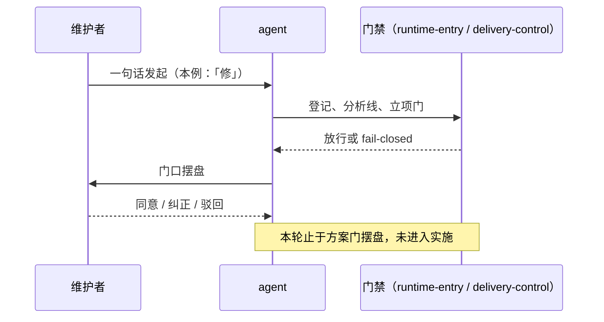
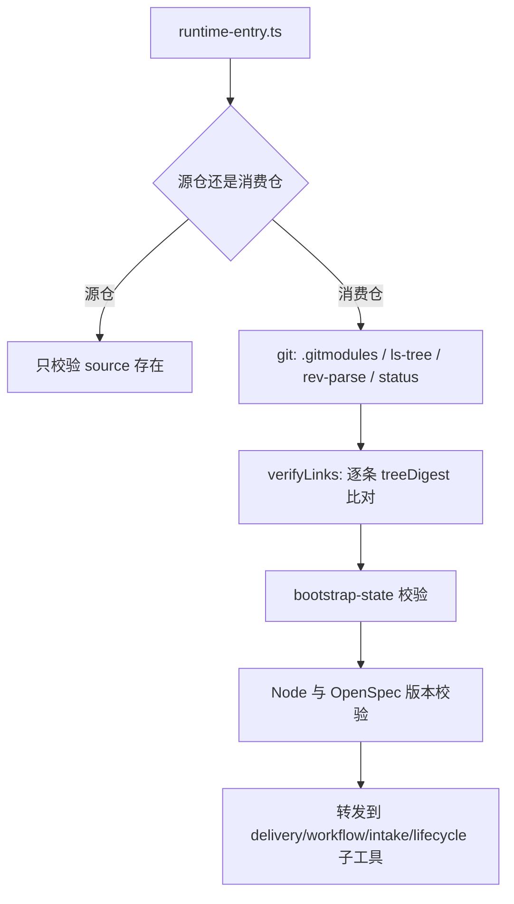

# 现状

> 本文件是改造前的单一现状记录，业务与技术两面合并在此。只陈述当前事实；目标状态一律进入 `05-改造方案/`。

## 调查口径

- 业务基线日期：2026-09-01
- 业务范围：Runtime 自身的交付门禁与受管投影分发链；不含消费仓自身治理。
- 主干基线 commit：`cd6d2f0`（origin/main，含 enforce-analysis-line-and-prune-pipeline）
- 需求分支 commit：`Eridanus117/thorn-batch`，从上述基线新建
- 运行态核验时间点：2026-09-01，维护者本机（Windows 11、Node v25.2.1、OpenSpec 1.11.0、`core.autocrlf=true`、`core.longpaths` 未设置）
- 材料口径（来源、版本、完整性）：见下表；所有「事实」条目均由本轮受控探针或源码直读取得，未取证者一律标 `[推断]`。

| 仓库 | 模块 | 证据类型（源码/历史测试/运行态/推断） | 核验方式 |
|---|---|---|---|
| delivery-spec-runtime | `openspec/tools/runtime-entry.ts` | 源码 + 运行态 | 直读；孤立副本调用探针 |
| delivery-spec-runtime | `openspec/tools/openspec-upgrade.ts` | 源码 + 运行态 | 直读；升级冒烟三次连跑 |
| delivery-spec-runtime | `openspec/tools/runtime-lib.ts` 等六个工具文件 | 源码 | 导入标识符与导出函数的全文回扫 |
| delivery-spec-runtime | `test/*.test.ts` | 运行态 | 全量合同测试一次通过（79/79） |
| delivery-spec-runtime | `.gitattributes`、`.github/workflows/ci.yml` | 源码 | 直读 |
| delivery-spec-runtime | `openspec/profiles/change-routing-v1.json` | 源码 | 直读，逐前缀比对本批次的候选改动面 |
| （外部对照）agent-system | 工作树状态、分支保护 | 运行态 | `git status`、`gh api` |

## 角色与责任

| 角色/系统 | 当前责任 | 输入 | 输出 |
|---|---|---|---|
| 维护者 | 在三道门表态；本地跑全量测试作为完成判据 | 摆盘材料 | 同意 / 纠正 / 驳回 |
| `runtime-entry.ts` | 消费仓与源仓的统一入口；执行 gitlink、submodule 洁净度、受管投影摘要四类校验 | 资产仓根 | 放行或 fail-closed |
| `runtime-link.ts` | 把 Runtime 侧四条受管资产复制进消费仓 | pinned submodule | 消费仓工作树中的普通文件副本 |
| `openspec-upgrade.ts` | 在隔离临时根评估 OpenSpec 升级，含消费仓冒烟 | 升级请求 | upgrade-report.json |
| GitHub Actions CI | 在 ubuntu 上跑 runtime-check、命令渲染检查、合同测试、strict validate | PR / push | 通过或失败 |

## 当前业务流程

## 业务对象与状态

| 对象 | 关键字段/身份 | 状态 | 状态变化条件 |
|---|---|---|---|
| 批次条目 `INT-20260901-022-thorn-batch` | `changeObject: tool-code` | `promoted` | 分析线产物 `status=completed` 且 `disposition=build`，立项门放行 |
| 分析线产物 | `matterId` 三处一致 | `completed` | 五阶段依次推完，每站人工判断齐备 |
| Change `fix-thorn-batch` | `deliverySchemaVersion: 6` | 规划中（仅 01、03、05 提案三件） | 方案门维护者表态后才产出 `方案决策.md` |
| 九类刺 | 各自 intake 条目 | `captured`（全部未处置） | 由本 Change 实施后逐条 close |

## 当前技术流程

## 接口与数据边界

| 边界 | 当前接口/模型 | 调用方 | 副作用 | 失败语义 |
|---|---|---|---|---|
| 受管投影校验 | `verifyLinks()` → `treeDigest()`（含行尾归一化） | 每次 `runtime-entry.ts` 调用 | 无 | 摘要不等即 fail-closed |
| submodule 洁净度 | `git status --porcelain`（**未加 longpaths**） | 同上 | 无 | 非空即 fail-closed |
| 升级冒烟内部 git | `git()`（win32 上**已加** `-c core.longpaths=true`） | `openspec-upgrade.ts` | 写临时根 | 抛错即整轮失败 |
| 版本探测 | `execFileSync("openspec.cmd", …, { shell: true })` | 每次入口调用 | 打印 DEP0190 告警到 stderr | 版本不符即 fail-closed |
| 档位交叉校验 | `verifyDeclaredScope()` 按 `change-routing-v1.json` 的路径前缀归类实际 diff | `guard --operation verify` | 无 | 实际档位高于声明即 fail-closed |

## 事务、缓存、通知和兼容

- 事务：intake 与工件写盘一律 `atomic()` / `atomicWriteJson()`（临时文件加 rename）；立项门在写入任何状态前完成全部判定，失败时两侧文件逐字节不变。
- 缓存：无应用级缓存。Windows 上 git 自身的 fscache 可能影响 `git status` 的表现，见「异常与失败分支」。
- 通知：无。失败只以非零退出码与 stderr 文案呈现。
- 兼容：`deliverySchemaVersion` 缺省即 v5，存量与归档 Change 不迁移；intake 的 `phase` 与 `state: triaged` 为只读兼容字段。

## 部署与运行态

| 事实 | 环境/机器 | 证据 | 核验时间 |
|---|---|---|---|
| 全量合同测试 79/79 通过 | 维护者本机 Windows | 一次全量运行 | 2026-09-01 |
| 升级冒烟三次连跑 2 过 1 败 | 同上 | `runtimeStatus` 序列 `[0,1,0]`，失败侧恒为 `webcoding-spec` | 2026-09-01 |
| `git status --porcelain` 在全路径 ≥ 260 时把未改动文件报为 `M` | 同上 | 250 / 255 / 258 / 259 / 260 / 261 / 265 / 270 八档受控探针 | 2026-09-01 |
| 同一路径加 `-c core.longpaths=true` 后恒报干净 | 同上 | 同上探针的对照组 | 2026-09-01 |
| 受管投影副本作入口稳定失败 | 同上 | 孤立副本调用报「Runtime 源仓缺少 runtime-manifest.json」 | 2026-09-01 |
| CI 只在 ubuntu 上跑 | GitHub Actions | `.github/workflows/ci.yml` 的 `runs-on: ubuntu-latest` | 2026-09-01 |

## 异常与失败分支

| 场景 | 当前行为 | 业务影响 |
|---|---|---|
| 归档证据路径 + 临时根前缀 ≥ 260 | 冒烟里的 `runtime-check` 把未改动的 submodule 判为 dirty，整轮 FAIL | 「全量测试绿」不可稳定达成；`[事实]` |
| 上述失败发生时 | upgrade report 只记 `runtimeStatus: 1`，`runtimeCheck.stderr` 被丢弃 | 失败不可归因，该刺被长期误当噪音；`[事实]` |
| 消费仓 `.gitignore` 或本机 `.git/info/exclude` 命中受管投影路径 | 本机 `runtime-check` 照常 PASS，投影进不了提交 | 坏账要等他人 clone 后才 fail-closed；`[事实]`（源自 RAW-008 的消费仓实测） |
| Windows `core.symlinks=false` 下 git 沿用旧 `120000` 模式入库 | `runtime-check` 只查工作树摘要，模式坏账通过校验 | clone 出来得到指向乱码路径的废软链；`[事实]`（源自 RAW-009 的实测） |
| 在消费仓照抄 opsx 文档里的 `<planningHome.root>/openspec/tools/runtime-entry.ts` | 稳定报「Runtime 源仓缺少 runtime-manifest.json」 | 17 条命令行在消费仓不可用；`[事实]` |
| 临时目录清理撞上 Windows 文件锁 | bootstrap 测试报 EPERM，重跑即过 | 单轮偶发失败；归因为反病毒或索引器持锁 `[推断]`，本轮未取证 |
| 每次入口调用 | stderr 打出 DEP0190 告警 | 污染本应干净的 JSON 输出；本轮 `intake init`、`workflow bind`、`intake promote` 三次调用均复现 `[事实]` |

## 当前边界与已知问题

- `[事实]` **RAW-005 的归因需要更正**：升级冒烟失败不是 git racy 竞态。受控探针给出确定阈值——全路径 259 及以下干净、260 及以上被报 `M`，加 `-c core.longpaths=true` 后恒净。这是 Windows 上未开 longpaths 时的路径越限行为。原条目正文的竞态归因在本 Change 内不再作为依据；条目原文保持不动（引用不复制），更正记在此处与 `01-原始需求/原始需求索引.md` 的冲突节。
- `[事实]` **一写一读用了两套路径能力**：`openspec-upgrade.ts` 的 `git()` 在 win32 上加 longpaths（负责检出，写得进去），`runtime-entry.ts` 的 `git()` 不加（负责判 dirty，读不出来）。这是误判的直接机制。
- `[事实]` **预算余量已为零**：仓内最长的归档证据路径为 155 字符；冒烟的临时根前缀加 `consumer-webcoding-spec` 加 `.delivery-spec-runtime` 正好把它推到 260 这一阈值上。
- `[推断]` 为何是 2 过 1 败而非恒败：溢出点正落在边界值，理论上应恒败。残留猜想是 Windows 上 git 的 fscache 或索引 stat 缓存使部分跑次绕过了越限的 lstat。阈值与触发条件已实证，此项不影响修法选择。
- `[事实]` **`016` / `017` 的前置疑问不成立**：两条目都悬着「无 git 消费场景如何降级」。但消费仓形态下的 `runtime-check` 本来就有四处硬 git 调用（`.gitmodules` 读取、`ls-tree`、`rev-parse`、`status`），任一失败即 fail-closed；不存在无 git 的合法消费路径，故新增 `check-ignore` 与 index 模式断言不引入任何新依赖。
- `[事实]` **行尾归一化是分发在 Windows 上成立的前提**，不是实现细节：`.gitattributes` 仅覆盖 `*.json`，本机 `core.autocrlf=true`，submodule 工作树与消费仓 index 的字节形态必然不等；`treeDigest()` 里的一次归一化是唯一让两端可比的环节。
- `[事实]` **RAW-004 的一个候选其实已经落地了**：该条目提出「把摘要必须做行尾归一化从实现细节升格为 spec 显式要求」。核查发现这条已经完成——`openspec/specs/runtime-distribution/spec.md` 的受管投影 Requirement 正文已写明「哈希计算 SHALL 先将 CRLF 归一化为 LF」并附「行尾差异不判为漂移」场景，`test/submodule.test.ts` 亦有对应断言。因此 `009` 剩下的真实待办只有 `.gitattributes` 覆盖面这一半，条目正文尚未反映这一点。
- `[事实]` **档位交叉校验对本批次构成硬前置条件**：`change-routing-v1.json` 的路径前缀表里，`.gitattributes` 与 `.github/**` 不属于任何一行，按未匹配取最重档（档位序 99）；`.omp/**` 属治理合同（30）。本条目声明 `tool-code`（20），故一旦实际改动触及这三处，`guard --operation verify` 的 `verifyDeclaredScope()` 必然拒绝。这不是实施期才暴露的意外，而是方案门必须先裁的前置项。
- `[事实]` **交叉校验对未声明条目不生效**：`declaredRoute()` 在条目未声明 `changeObject`、或声明了表外类别时返回 `null`，此时整个核对被跳过。即「如实声明的条目被核对，沉默的条目不被核对」。这不构成降档漏洞（未声明本身就按最重档过立项门），但确实是核对面上的一个空洞，已另记入校准台账。
- `[事实]` **CI 只跑 ubuntu**：四条 Windows 刺在 CI 上永远不可见，没有第二道网可以兜底；验收判据只能来自本地实测，且必须是确定阈值而非重跑次数。
- `[事实]` **死代码清单**：`bootstrap.ts` 的 `statSync` / `basename` / `sha256Buffer`、`intake-control.ts` 的 `requiredOption`、`public-candidate.ts` 的 `readdirSync` 五个未用导入；`runtime-lib.ts` 的 `findUp` / `gitCommit` / `ensureInside` 三个全仓零调用的导出函数。后者是本仓公开面的一部分，删除前需确认无外部消费者。
- `[事实]` **`VC-039` 是一条会绊住每个新 Change 的点时快照断言**：`test/contracts.test.ts` 的 `VC-039` 用 `deepEqual` 钉死 active Change 目录的完整集合（原为单元素 `["establish-runtime-metrics-baseline"]`）。本 Change 一建立，全量测试立刻从 79/79 掉到 78/79。本轮已按最小机械改动把新 Change 登记进期望集合并加注说明，未改变断言强度；形态是否改为真正的不变量列为未决问题。
- `[事实]` **文档与代码的两处小分叉**（本轮顺带发现，不在修复范围，供方案门决定是否顺手带上）：其一，`openspec/intake/README.md` 仍写着「阶段顺序固定为 capture → triage → evidence → options → disposition」并要求「只有人工在 disposition 选择后才能 promote」，而登记线已并站为两节点；其二，同一份 README 要求「存在 Issue 时在 intake 中记录 URL」，但 `intake-control.ts` 的 `assertSafeContent()` 用 `[A-Za-z]:[\\/]` 拦绝对路径，该正则会把任何 `https://` 一并拦下，导致带 URL 的条目无法被 promote / hold / close。
- 本文件只陈述当前业务与技术事实；目标实现只进入 `05-改造方案/`。
