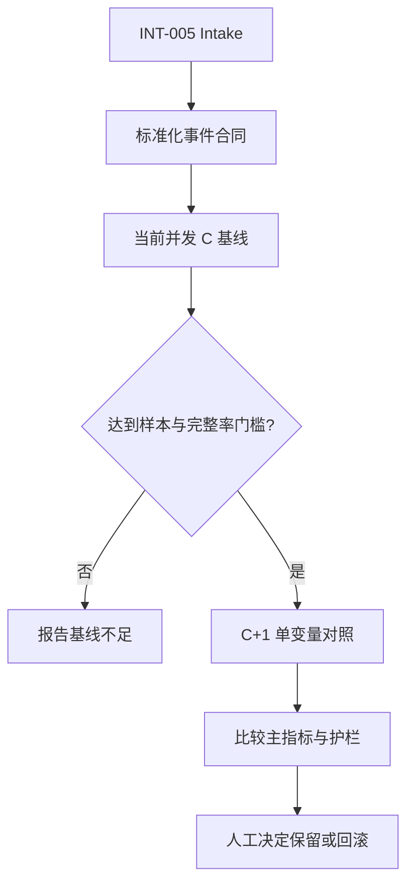

# 改造计划

> 本计划依据已批准的候选 B 编写；实施仍须通过本 Change 的任务、Review、Acceptance 和归档门禁。

## 目标与非目标

### 目标

- 建立版本化、标准化、低频、脱敏的 metrics event contract；
- 在本地私有 state 目录追加原始事件，并拒绝不安全目标、重复事件和非法数据；
- 生成当前并发 `C` 的脱敏汇总，区分配置槽位和实际 active 数；
- 为 `C+1` 提供只改变并发变量的对照报告和停止/回滚门；
- 保留 Intake 到 Change、事件到汇总、汇总到实验决定的追踪链。

### 非目标

- 不建设远程 telemetry、数据库、组织级看板或跨仓同步；
- 不自动修改 Agent 调度器配置，不自动提升长期并发；
- 不记录业务正文、请求响应、账号、凭据、绝对路径、机器标识、trace 或 release-id；
- 不把合成运行当作真实基线，不在公共仓库保存真实原始事件；
- 不把 Intake、Workflow execution 和 delivery-change 合并。

## 目标业务与技术流程

## 影响面

| 仓库/系统 | 模块/接口 | 变更 | 兼容约束 | 责任方 |
|---|---|---|---|---|
| Runtime | 新 metrics contract/tool | 标准化事件、私有写入和汇总 | 不改变既有 workflow 输入输出合同 | Runtime 维护者 |
| Agent 调度边界 | 显式 metrics 输入 | 提供 `slotCount`/`activeCount`，缺失则报告 | 不猜测实际并发 | 调用方 |
| 本地 state 目录 | `events-YYYYMMDD.jsonl` | 追加原始事件和派生汇总 | 不位于仓库、submodule 或同步目录 | 运行者 |
| 公共 Runtime 仓 | schema、合成样例、汇总结论 | 不保存真实原始事件 | 遵守白名单和敏感内容合同 | Runtime 维护者 |

## 实施切片与依赖

| 顺序 | 切片 | 前置 | 独立验收 | 回滚边界 |
|---:|---|---|---|---|
| 1 | 固化 metrics event schema、枚举和路径边界 | 方案决策批准 | 合法/非法/敏感/重复事件行为可验证 | 删除新增 contract/tool |
| 2 | 实现本地追加、去重、损坏检测和清理接口 | 切片 1 | 原始数据不出私有目录，失败 fail closed | 停止新入口 |
| 3 | 实现 `C` 汇总和缺失数据报告 | 切片 1–2 | 公式、分母、窗口和完整率稳定 | 删除汇总入口 |
| 4 | 实现 `C+1` 对照报告与停止/回滚建议 | 切片 3 | 只改变并发变量，不自动改配置 | 停止对照报告 |
| 5 | 合同测试、合成样例和审查文档 | 切片 1–4 | 聚焦测试、全量测试和 strict validation 通过 | 回滚整个 Change |

## 数据与兼容迁移

- 数据：真实原始事件仅在本地私有 state 目录；公共仓库只保存 schema、合成样例和审查汇总。
- 接口：新增 metrics 记录/汇总入口；既有 workflow request/response 不隐式增加必填字段。
- 灰度：先用合成事件验证，再接入一个真实 workflow 调用边界；先采集 C，不执行 C+1。
- 回滚：停止新 metrics 入口并删除本地原始事件；不修改既有 workflow 状态和并发配置。

## 风险与处置

| 风险 | 影响 | 预防/缓解 | 停止条件 |
|---|---|---|---|
| 事件字段不一致 | C 与 C+1 不可比较 | schema 固定字段和枚举 | 任何非法事件被接受 |
| 原始数据进入公共仓 | 隐私和审计风险 | 私有 state 边界、敏感内容拒绝 | 发现业务正文或可逆标识 |
| 只看吞吐 | 并发增加但返工增加 | 冲突、返工、质量门禁作为护栏 | 任一护栏越过阈值 |
| 样本不足 | 误判实验结果 | 输出“无法判断” | 试图以不足样本作结论 |
| 调度器不提供实际 active 数 | 并发结论失真 | 显式报告缺失，不用 slotCount 替代 | 调用方伪造 active 数 |

## 决策日志

| ID | 决策 | 依据 | 替代方案 | 影响 | 日期 |
|---|---|---|---|---|---|
| MET-001 | 标准化优先于采集 | 保证 C/C+1 可比较 | 直接采集或直接加并发 | 增加前置设计 | 2026-08-30 |
| MET-002 | 原始事件只存本地私有 state | 隐私和公共仓边界 | 远程 telemetry | 不提供组织级实时看板 | 2026-08-30 |
| MET-003 | C+1 只作为单变量对照 | 避免混淆变量 | 同时改 Profile/WIP | 实验速度较慢但可解释 | 2026-08-30 |

## 执行前置

- 所有可观测 workflow 均采集，但按 Profile 分别汇总；
- 每个 Profile 采集 10 个满足资格的事项，最长 5 个工作日，至少 8 个可计算完成事项；
- 先记录当前并发 `C`，再依据汇总结果决定是否执行 `C+1`。
