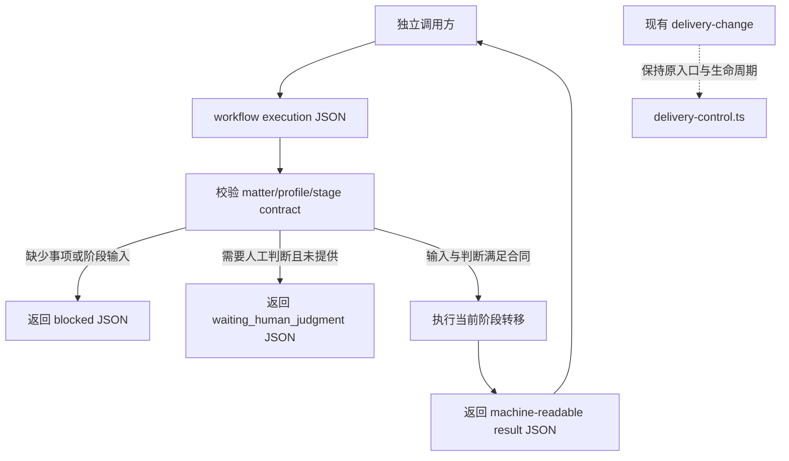

# 改造计划

## 目标与非目标

### 目标

- 在现有 Runtime 中增加与 `delivery-control.ts` 平行的最小 `workflow core`，不改变既有 `delivery-change` 生命周期。
- 定义可独立消费的事项身份、profile、stage contract、执行请求和机器可读结果合同。
- 提供不依赖外部工作台的直接入口：调用方显式提交一个事项、一个 profile 和当前阶段状态，得到确定的 JSON 结果。
- 实现最小的阶段状态转移：校验必需输入；处理人工判断；完成当前阶段并返回下一阶段；对失败和阻塞返回显式状态。
- 通过合同测试锁定字段、边界、失败语义和独立调用约束。

### 非目标

- 不修改 `delivery-control.ts`、现有 `delivery-change` schema、九个 OMP Commands 或其状态迁移语义。
- 不把 `delivery-change` 改造成通用 workflow，也不在本 Change 中把它接入新 core。
- 不实现全局扫描、全局索引、自动路由、双向同步、持久化数据库或跨仓写入。
- 不创建或迁移私有 `Workflow System` 仓，不改变当前仓库可见性、submodule、remote 或消费方式。
- 不实现多个完整 workflow profile；首轮只支持声明式 profile 合同和一个最小可执行阶段转移样例。

## 目标业务与技术流程

调用方可以来自任意项目仓；core 只处理请求中的显式数据，不读取上层目录或全局资产。



目标入口暂定为：

```text
node --experimental-strip-types openspec/tools/workflow-entry.ts run --input <request.json>
```

`workflow-entry.ts` 只负责参数、文件输入、标准输出和进程退出码；`workflow-core.ts` 负责无副作用的合同校验与转移。失败或阻塞也必须输出符合结果合同的 JSON；参数层无法读取请求文件时，使用明确的非零退出码和 stderr 错误。

执行请求至少包含：

- `schemaVersion`：固定为 `1`。
- `matter`：稳定 `id`，以及供人阅读的 `title`。
- `profile`：稳定 `id`、版本和有序 `stages`。
- `currentStageId`：当前阶段；首次执行由调用方显式指定。
- `inputs`：当前阶段可见的结构化输入。
- `humanJudgment`：阶段要求时的明确判断及理由。
- `artifacts`：当前调用已知的产物引用，不在 core 内解析或写入。

结果至少包含：

- `schemaVersion`、`matterId`、`profileId`、`stageId`。
- `status`：`completed`、`blocked`、`waiting_human_judgment` 或 `rejected`。
- `nextStageId`：可继续时为下一阶段 id，否则为 `null`。
- `artifacts`：稳定的产物引用入口数组。
- `reason`：阻塞、拒绝或等待时的机器可读原因；成功时为 `null`。
- `humanJudgment`：已消费的判断摘要；不伪造未提供的判断。

## 影响面

| 仓库/系统 | 模块/接口 | 变更 | 兼容约束 | 责任方 |
|---|---|---|---|---|
| `delivery-spec-runtime` | `openspec/contracts/` | 新增 workflow 请求、profile、结果 JSON Schema | 只新增 `schemaVersion: 1` 合同；不修改现有 `delivery-change/*` 合同 | Runtime 维护者 |
| `delivery-spec-runtime` | `openspec/tools/workflow-core.ts` | 新增纯核心：事项身份、阶段合同校验和转移 | 不导入外部工作台、Git 扫描、`delivery-control.ts` 状态文件或外部写入 | Runtime 维护者 |
| `delivery-spec-runtime` | `openspec/tools/workflow-entry.ts` | 新增 standalone `run` CLI | 输入来自显式 `--input`；stdout 为单个机器可读 JSON；现有入口不改 | Runtime 维护者 |
| `delivery-spec-runtime` | `test/` 或现有合同测试位置 | 新增 core/CLI 行为合同测试 | 使用 Node 内置 `node:test`；不得新增 shell runner | Runtime 维护者 |
| `delivery-change` consumers | `delivery-control.ts`、现有 Change | 无业务改造 | 原命令、锁、artifact 依赖、fail-closed 行为保持不变 | Runtime 维护者 |
| 上层调用方 | 调用关系 | 本 Change 只保留显式 JSON 调用边界 | 不新增反向依赖，不读取或写入未授权外部资产 | 各调用方维护者 |

## 实施切片与依赖

| 顺序 | 切片 | 前置 | 独立验收 | 回滚边界 |
|---:|---|---|---|---|
| 1 | 固化 workflow execution、profile、matter、result 四类合同与示例 | 已批准方案决策 | 合法请求、缺字段、额外字段、阶段顺序和结果枚举均按 Schema 判定 | 删除新增合同与示例，不触及旧合同 |
| 2 | 实现 `workflow-core.ts` 的声明式阶段校验与状态转移 | 切片 1 | 必需输入缺失、人工判断缺失、成功推进、末阶段完成、非法阶段和非法 profile 均返回确定结果 | 删除 core 文件；旧 `delivery-control.ts` 不受影响 |
| 3 | 实现 `workflow-entry.ts run` standalone CLI | 切片 2 | 从显式 JSON 文件读取并在 stdout 返回单个结果；阻塞/拒绝使用非成功状态而非成功伪装 | 删除新入口；调用方继续使用原 delivery 入口 |
| 4 | 增加 Node 合同测试与最小合成调用样例 | 切片 1–3 | 直接调用 core、CLI 子进程、旧 `delivery-control` 回归探针分别通过 | 删除测试/样例，不改变运行时代码边界 |
| 5 | 更新 Runtime 使用说明与 Change 交付证据 | 切片 1–4 | 文档只描述公共、合成、可复现接口；不包含私人内容或真实业务证据 | 回滚文档与本 Change 证据 |

切片 4 的“最小 profile”是测试中的声明式 `manual-stage` 合成 profile：它验证通用阶段合同和一次真实状态转移，不引入生产 profile 注册表，也不构造无行为的 placeholder 命令。

## 数据与兼容迁移

- 数据：无持久化迁移。每次调用携带完整的当前事项、profile、阶段输入和已知产物引用；core 返回下一次调用所需的 `nextStageId` 与结果。
- 接口：新增 `workflow-entry.ts run --input <path>` 和可导入的 `executeWorkflow(request)`；`delivery-control.ts` 继续使用既有参数和文件合同。
- 灰度：不替换任何现有调用方。先以直接 CLI/core 合成调用验证，再由未来独立 Change 选择性接入一个真实 profile。
- 回滚：先停止新入口调用并删除 workflow 新增文件；不得删除或重写现有 `delivery-change` 状态和产物。若合同已被外部采用，回滚只能停止实现发布并保留已发布的 `schemaVersion: 1` 解析兼容，另行作废决策。
- 版本：新合同固定 `schemaVersion: 1`；不建立第二套 lock/hash pin，不改 `runtime-manifest.json` 的三个软链声明。

## 风险与处置

| 风险 | 影响 | 预防/缓解 | 停止条件 |
|---|---|---|---|
| core 过早抽象，无法表达真实阶段 | 后续 profile 继续绕过 core | 只实现声明式阶段合同和单次转移；把真实 profile 接入留给独立 Change | 合成用例无法同时表达输入、产出、退出和人工判断 |
| 新旧入口职责重叠 | 调用方误把 `delivery-control.ts` 当通用入口 | 文档和命令名明确隔离；本 Change 不改旧入口 | 无法用输入边界说明两者责任差异 |
| 结果状态把阻塞伪装为成功 | 上层错误推进事项 | 结果合同枚举区分 `completed`、`blocked`、`waiting_human_judgment`、`rejected`，测试覆盖退出码 | 任一阻塞场景产生 `completed` |
| 事项身份不稳定或被 profile 覆盖 | 追踪和汇总失真 | `matter.id` 由调用方提供并原样返回；禁止 core 自动生成替代 id | 同一请求无法稳定回显 `matterId` |
| CLI 偷读外部工作台或仓库上下文 | 破坏独立运行和隐私边界 | core 无目录发现；入口只读取 `--input` 指定文件；测试在无外部状态环境运行 | 运行必须依赖工作区外隐式文件 |
| 公共仓库混入私人样例 | 泄露或审查失败 | 只提交合成 fixtures；审查路径、请求、结果和 trace 字段 | 样例含真实业务、凭据或私人路径 |

## 决策日志

| ID | 决定 | 来源 | 状态 |
|---|---|---|---|
| PLAN-001 | 采用候选 B：独立 workflow core，保留 `delivery-change` 为现有重型 profile | `05-改造方案/方案决策.md` | 已批准 |
| PLAN-002 | 首轮采用无持久化、声明式 profile；不建设 profile 注册表或自动路由 | 首轮 V0.1 范围与候选 B 的最小化约束 | 本计划定稿 |
| 外部上层系统只作为未来按需调用方；本 Change 不实现上层系统接入 | 方案决策与 Workflow System 边界 | 本计划定稿 |
| PLAN-004 | 私有化、新仓迁移和仓库可见性另立决策 | 方案决策中拒绝候选 C | 本计划定稿 |
