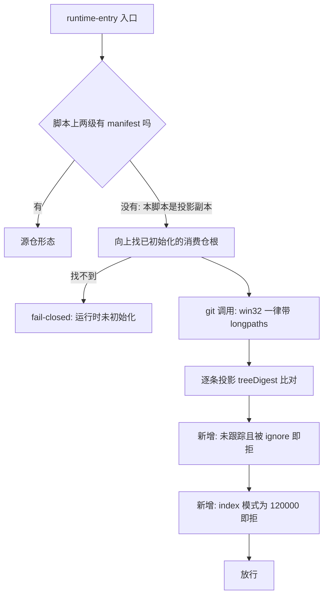

# 改造计划

## 目标与非目标

### 目标

- 让 Windows 本地全量合同测试稳定绿，判据是**连跑三次全绿**，且绿的原因可解释（确定阈值），不是重试掩盖。
- 把受管投影分发的三处静默盲区变成机器 fail-closed：ignore 吞投影、index 软链模式坏账、投影副本不可作入口。
- 升级冒烟失败时报告里留下可归因的原因文本，不再只有一个退出码。
- 给仓内路径长度设一个被自动校验守住的预算，挡住继续恶化。
- 清掉五个未用导入与三个零调用导出，消除 DEP0190 告警噪音。

### 非目标

- 不扩 `.gitattributes`，不缩名任何既有归档证据，不改写任何归档目录。
- 不修路由表缺前缀、不修交叉校验对未声明条目跳过、不改 `VC-039` 断言形态、不修 intake README 与代码的分叉——四条已在台账记录在案，随工作流重设计处置。
- 不改 `.omp/commands/**` 任何一个字（裁定 #1 选「投影副本算入口」，17 处命令行因此无需改动）。
- 不动消费仓 `profiles/`，不动两仓分支保护规则。
- 本计划不含 08 验收与 09 发布动作。

## 目标业务与技术流程

## 影响面

| 仓库/系统 | 模块/接口 | 变更 | 兼容约束 | 责任方 |
|---|---|---|---|---|
| delivery-spec-runtime | `openspec/tools/runtime-entry.ts` | git 调用补 longpaths；新增投影 index 两条断言；入口定位加回落；版本探测去 shell | 该文件是四条受管投影之一，行为变更随 gitlink 升级进入消费仓 | Runtime 维护者 |
| delivery-spec-runtime | `openspec/tools/openspec-upgrade.ts` | `consumerSmoke` 保留失败原因并写进报告 | 报告新增字段，须同步机器合同 | 同上 |
| delivery-spec-runtime | `openspec/contracts/openspec-upgrade-report.schema.json` | consumer 条目新增 `failureReason` | 与上一行必须同批改，否则合同与实现分叉 | 同上 |
| delivery-spec-runtime | `openspec/tools/bootstrap.ts`、`intake-control.ts`、`public-candidate.ts`、`runtime-lib.ts` | 删除未用导入与零调用导出 | `runtime-lib.ts` 的公开面收窄 | 同上 |
| delivery-spec-runtime | `test/*.test.ts` | 新增五组断言；临时目录清理加有限退避 | 不削弱任何既有断言 | 同上 |
| 消费仓（agent-system 等） | `.delivery-spec-runtime` gitlink | 升级后获得新断言，可能暴露既有坏账 | 由各消费仓独立 Change 管理，不阻塞本 Change | 各消费仓 |

## 实施切片与依赖

| 顺序 | 切片 | 前置 | 独立验收 | 回滚边界 |
|---:|---|---|---|---|
| 1 | 路径预算：常量与断言 | 无 | 新增超长路径被拒并点名 | 单独 commit，删测试即回滚 |
| 2 | 读侧路径能力：runtime-entry git 补 longpaths | 无 | 升级冒烟连跑三次全绿 | 单独 commit |
| 3 | 冒烟失败可归因：stderr 进报告 + 合同同步 | 无 | 失败样本的报告含原因文本 | 单独 commit |
| 4 | 投影 index 两条断言 | 无 | 正负向各一组断言 | 单独 commit |
| 5 | 入口回落 + 未初始化边界 | 无 | 投影副本可调用；未初始化仍被拒 | 单独 commit |
| 6 | 噪音与死代码：DEP0190、未用导入、零调用导出 | 无 | 输出无告警；全量测试不变 | 单独 commit |
| 7 | 临时目录清理有限退避 | 无 | bootstrap 测试连跑不再 EPERM | 单独 commit |

切片之间无依赖，可任意顺序落地；实际按上表顺序提交，便于按刺分组审查。

## 数据与兼容迁移

- 数据：无持久化数据结构变更。`upgrade-report.json` 新增一个 `failureReason` 字段（PASS 时为 `null`），既有报告文件不回溯改写——它们是归档证据。
- 接口：`runtime-lib.ts` 删除三个导出，属公开面收窄；本仓与 `test/` 内无任何调用点，外部消费者需自行从 git 历史取回（裁定 #5 明确接受）。
- 灰度：无。消费仓通过各自的 gitlink 升级 Change 获得新行为。
- 回滚：七个切片各自独立 commit，任一可单独 revert。

## 风险与处置

| 风险 | 影响 | 预防/缓解 | 停止条件 |
|---|---|---|---|
| 入口回落掩盖真正的「未初始化」错误 | 用户拿到误导性错误信息 | `findConsumerRoot()` 的原有 fail-closed 文案保持不变，并加一条专门断言钉死该边界 | 断言无法区分两种场景时停止，回到候选 C |
| 补 longpaths 后冒烟仍不稳定 | 归因不完整 | 验收判据定为连跑三次全绿；不足则回 discover 站重新取证 | 三次里出现任一次失败即停止并重新取证 |
| `check-ignore` 断言误伤已跟踪文件 | 干净消费仓被错误拒绝 | 断言只作用于**未跟踪**的投影文件：已在 index 中的文件不受 ignore 规则影响，先用 `git ls-files` 排除 | 出现任一误伤即停止 |
| 报告新增字段破坏既有合同校验 | 升级评估整体失败 | TS 侧 `validateReport` 与 JSON 合同同批修改，测试覆盖 PASS 与 FAIL 两种形态 | 合同校验拒绝自身产出的报告即停止 |
| 路径预算断言把既有归档判红 | 测试永久失败 | 预算取当前实测最大值 155 作为冻结上限，不缩名存量 | 断言在未改动仓库上不通过即停止 |
| 死代码删除误伤外部消费者 | 公开面破坏 | 已在 `openspec/tools/` 与 `test/` 两处全文检索确认零引用；裁定 #5 明确接受 git 历史即存档 | 无（已裁定） |

## 决策日志

| ID | 决策 | 依据 | 替代方案 | 影响 | 日期 |
|---|---|---|---|---|---|
| D-01 | 采用候选 A 最小止血包 | `05-改造方案/方案决策.md` | 候选 B / C | 不扩 `.gitattributes`，不缩名归档 | 2026-09-01 |
| D-02 | 投影副本算可执行入口 | 裁定 #1 | 收缩合同并改 17 处文档 | `.omp/**` 一字不改 | 2026-09-01 |
| D-03 | 路径预算取冻结值 155（当前实测最大） | 裁定 #3；受控探针得出 260 阈值，冒烟临时根前缀约 104 字符 | 压到 120 并缩名存量 | 只挡恶化不恢复余量 | 2026-09-01 |
| D-04 | `check-ignore` 断言只作用于未跟踪文件 | 已跟踪文件不受 ignore 规则影响，全量断言会误伤 | 对全部投影文件断言 | 精确命中 `INT-016` 场景，无误伤 | 2026-09-01 |
| D-05 | **改动面越出原声明，条目 `changeObject` 由 `tool-code` 升为 `governance-contract`** | 报告新增字段必须同步 `openspec/contracts/openspec-upgrade-report.schema.json`，该路径按路由表属治理合同档（序 30），高于原声明 `tool-code`（序 20）。路由表规定的处置是「修正条目的 changeObject 声明」，明文禁止「缩小改动面以迁就声明」。两档要求的分析 profile 同为 `requirement-analysis`，已完成的分析线对新档位同样满足，立项门结论不变。 | ① 只改 TS 不改 JSON 合同 → 合同与实现分叉；② 放弃「stderr 进报告」→ 违背裁定 #3 | 声明与事实重新一致；`guard verify` 的交叉校验可通过 | 2026-09-01 |

## 待决问题

- 无。裁定 #4 / #6 / #7 / #8 已明确「本批不修」，并已在 `openspec/intake/INT-20260831-014-calibration-signals.md` 与 `openspec/intake/INT-20260901-023-repo-suited-workflow.md` 记录在案，不构成本 Change 的待决项。
