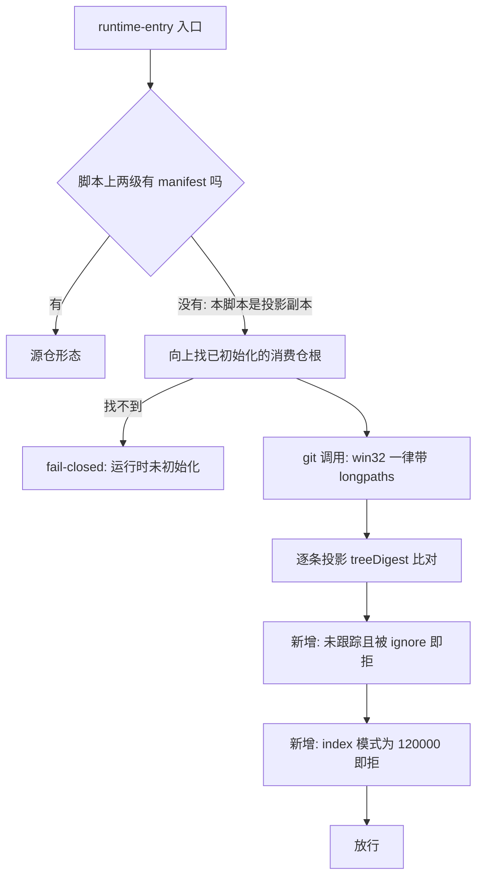

# 改造计划

## 目标与非目标

### 目标

- 让 Windows 本地全量合同测试稳定绿，判据是**连跑三次全绿**，且绿的原因可解释（确定阈值），不是重试掩盖。
- 把受管投影分发的三处静默盲区变成机器 fail-closed：ignore 吞投影、index 软链模式坏账、投影副本不可作入口。
- 升级冒烟失败时报告里留下可归因的原因文本，不再只有一个退出码。
- 给仓内路径长度设一个被自动校验守住的预算，挡住继续恶化。
- 清掉五个未用导入与三个零调用导出，消除 DEP0190 告警噪音。
- 消除治理链与 CI 检查上已知的「静默哑炮」：`delivery-lifecycle.ts` 与 `render-commands.ts` 在软链路径下必须与真实路径同行为（见 D-09）。

### 非目标

- 不扩 `.gitattributes`，不缩名任何既有归档证据，不改写任何归档目录。
- 不修路由表缺前缀、不修交叉校验对未声明条目跳过、不改 `VC-039` 断言形态、不修 intake README 与代码的分叉——四条已在台账记录在案，随工作流重设计处置。
- 不改 `.omp/commands/**` 任何一个字（裁定 #1 选「投影副本算入口」，17 处命令行因此无需改动）。
- 不动消费仓 `profiles/`，不动两仓分支保护规则。
- 本计划不含 08 验收与 09 发布动作。

## 目标业务与技术流程

## 影响面

| 仓库/系统 | 模块/接口 | 变更 | 兼容约束 | 责任方 |
|---|---|---|---|---|
| delivery-spec-runtime | `openspec/tools/runtime-entry.ts` | git 调用补 longpaths；新增投影 index 两条断言；入口定位加回落；版本探测去 shell | 该文件是四条受管投影之一，行为变更随 gitlink 升级进入消费仓 | Runtime 维护者 |
| delivery-spec-runtime | `openspec/tools/openspec-upgrade.ts` | `consumerSmoke` 保留失败原因并写进报告 | 报告新增字段，须同步机器合同 | 同上 |
| delivery-spec-runtime | `openspec/tools/delivery-lifecycle.ts`、`render-commands.ts` | 模块入口守卫的判据由字符串比较改为 `samePath()`（见 D-09） | 守卫不能删（两者的导出被别的模块 import）；行为必须与真实路径逐项一致 | 同上 |
| delivery-spec-runtime | `openspec/contracts/openspec-upgrade-report.schema.json` | consumer 条目新增 `failureReason`（**可选键**，出现时取值约束为硬） | 与上一行必须同批改，否则合同与实现分叉；同时必须继续接受无该键的存量归档证据（见 D-06） | 同上 |
| delivery-spec-runtime | `openspec/tools/bootstrap.ts`、`intake-control.ts`、`public-candidate.ts`、`runtime-lib.ts` | 删除未用导入与零调用导出；`runtime-lib.ts` 另新增 `samePath`、`abnormalExit`、`checkIgnoreIncomplete` 三个纯判据的权威定义（见 D-08、D-09） | `runtime-lib.ts` 的公开面先收窄后新增三个导出 | 同上 |
| delivery-spec-runtime | `test/*.test.ts` | 新增十一组断言（基线 79 项 → 90 项；六组首轮实现，两组 REV-002 / REV-004 返工补充，两组 REV-008 收口补充，一组 INT-024 两处提前修复的回归）；临时目录清理加有限退避 | 不削弱任何既有断言 | 同上 |
| 消费仓（agent-system 等） | `.delivery-spec-runtime` gitlink | 升级后获得新断言，可能暴露既有坏账 | 由各消费仓独立 Change 管理，不阻塞本 Change | 各消费仓 |

## 实施切片与依赖

| 顺序 | 切片 | 前置 | 独立验收 | 回滚边界 |
|---:|---|---|---|---|
| 1 | 路径预算：常量与断言 | 无 | 新增超长路径被拒并点名 | 单独 commit，删测试即回滚 |
| 2 | 读侧路径能力：runtime-entry git 补 longpaths | 无 | 升级冒烟连跑三次全绿 | 单独 commit |
| 3 | 冒烟失败可归因：stderr 进报告 + 合同同步 | 无 | 失败样本的报告含原因文本 | 单独 commit |
| 4 | 投影 index 两条断言 | 无 | 正负向各一组断言 | 单独 commit |
| 5 | 入口回落 + 未初始化边界 | 无 | 投影副本可调用；未初始化仍被拒 | 单独 commit |
| 6 | 噪音与死代码：DEP0190、未用导入、零调用导出 | 无 | 输出无告警；全量测试不变 | 单独 commit |
| 7 | 临时目录清理有限退避 | 无 | bootstrap 测试连跑不再 EPERM | 单独 commit |
| 8 | 治理链与 CI 工具的入口守卫改用 `samePath()` | 无 | 经软链调用与真实路径逐项同结果 | 单独 commit |

切片之间无依赖，可任意顺序落地；实际按上表顺序提交，便于按刺分组审查。

## 数据与兼容迁移

- 数据：无持久化数据结构变更。`upgrade-report.json` 新增一个 `failureReason` 字段（PASS 时为 `null`），既有报告文件不回溯改写——它们是归档证据。
- 接口：`runtime-lib.ts` 删除三个零调用导出（公开面收窄，裁定 #5 明确接受 git 历史即存档），另新增 `samePath` / `abnormalExit` / `checkIgnoreIncomplete` 三个纯判据导出（供断言与两处入口守卫消费，见 D-08、D-09）。
- 灰度：无。消费仓通过各自的 gitlink 升级 Change 获得新行为。
- 回滚：七个切片各自独立 commit，任一可单独 revert。

## 风险与处置

| 风险 | 影响 | 预防/缓解 | 停止条件 |
|---|---|---|---|
| 入口回落掩盖真正的「未初始化」错误 | 用户拿到误导性错误信息 | `findConsumerRoot()` 的原有 fail-closed 文案保持不变，并加一条专门断言钉死该边界 | 断言无法区分两种场景时停止，回到候选 C |
| 补 longpaths 后冒烟仍不稳定 | 归因不完整 | 验收判据定为连跑三次全绿；不足则回 discover 站重新取证 | 三次里出现任一次失败即停止并重新取证 |
| `check-ignore` 断言误伤已跟踪文件 | 干净消费仓被错误拒绝 | 断言只作用于**未跟踪**的投影文件：已在 index 中的文件不受 ignore 规则影响，先用 `git ls-files` 排除 | 出现任一误伤即停止 |
| 报告新增字段破坏既有合同校验 | 升级评估整体失败 | TS 侧 `validateReport` 与 JSON 合同同批修改，测试覆盖 PASS 与 FAIL 两种形态 | 合同校验拒绝自身产出的报告即停止 |
| 路径预算断言把既有归档判红 | 测试永久失败 | 预算取当前实测最大值 155 作为冻结上限，不缩名存量 | 断言在未改动仓库上不通过即停止 |
| 死代码删除误伤外部消费者 | 公开面破坏 | 已在 `openspec/tools/` 与 `test/` 两处全文检索确认零引用；裁定 #5 明确接受 git 历史即存档 | 无（已裁定） |
| 入口因「是否执行」被系在路径写法上而静默跳过 | 全体消费仓唯一的 fail-closed 闸门失效，坏账被放行且无任何输出 | 入口 `main()` 无条件执行、不导出任何符号；`VC-042` 禁止再出现路径比较守卫；`REV-008` 回归用例经 junction 调用验证坏账仍被拒 | 入口出现任何形式的条件执行即停止 |
| 有 import 方的工具无法删守卫，判据仍系在路径上 | 治理链与 CI 检查在软链路径下静默跳过 | 判据统一为 `samePath()`（resolve → realpath → 小写）；`T-GUARD-3` 逐项比对软链与真实路径的退出码与输出，并禁止「退出码 0 且零输出」这一失配特征形状 | 两条路径给出不同结果即停止 |

## 决策日志

| ID | 决策 | 依据 | 替代方案 | 影响 | 日期 |
|---|---|---|---|---|---|
| D-01 | 采用候选 A 最小止血包 | `05-改造方案/方案决策.md` | 候选 B / C | 不扩 `.gitattributes`，不缩名归档 | 2026-09-01 |
| D-02 | 投影副本算可执行入口 | 裁定 #1 | 收缩合同并改 17 处文档 | `.omp/**` 一字不改 | 2026-09-01 |
| D-03 | 路径预算取冻结值 155（当前实测最大） | 裁定 #3；受控探针得出 260 阈值，冒烟临时根前缀约 104 字符 | 压到 120 并缩名存量 | 只挡恶化不恢复余量 | 2026-09-01 |
| D-04 | `check-ignore` 断言只作用于未跟踪文件 | 已跟踪文件不受 ignore 规则影响，全量断言会误伤 | 对全部投影文件断言 | 精确命中 `INT-016` 场景，无误伤 | 2026-09-01 |
| D-06 | `failureReason` 不进合同的 `required`：新旧两种消费仓条目形状同时合法 | 独立评审 REV-002（MEDIUM）。本仓已归档的 `upgrade-report.json` 同为 `schemaVersion: 1` 且三个 consumer 条目均无该键，而本计划明写归档报告不回溯改写——把它设为必填，等于让本仓公开分发的机器合同拒绝本仓自己的归档证据。沿用上一单同形态问题（artifact-approvals 合同同时容纳 v5/v6 两种工件集）的收口范式：合同容纳两种形状，取值约束在键出现时依旧是硬的，「新报告必带该键」由产出侧保证并有断言守住。 | ① 升 `schemaVersion` 到 2 并做版本分支（改动面远大于收益，且会让所有既有消费者一起改）；② 维持必填（合同拒绝自家归档证据） | 合同与 TS 校验同批放宽 `required`；新增断言把真实归档报告喂进唯一的校验实现 | 2026-09-01 |
| D-07 | `gitResult` 如实透出 `status: number \| null`，判据由调用方按语义决定 | 独立评审 REV-004（LOW）。原实现把 `status` 为 null（进程被信号终止）归一成 1；对 `ls-files` 无害（非 0 即拒），但对 `check-ignore` 恰好相反——1 正是「没有任何路径被忽略」这一正常答案，归一等于把「校验没跑完」读成「校验通过」，是本单唯一一处 fail-open。 | 在 `gitResult` 内部直接抛错（会让 `check-ignore` 的正常 1 也被当成故障） | 判据抽成可断言的纯函数 `checkIgnoreIncomplete`，null 与 128 一律拒绝并报明原因 | 2026-09-01 |
| D-08 | **入口的 `main()` 无条件执行；纯判据的权威定义移进 `runtime-lib.ts`，入口保留一份受机器校验的逐字副本** | 收口复审 REV-008（CRITICAL）。为让断言能 import 判据而给入口加的「仅直接执行时才跑 main」守卫，判据是 `process.argv[1]` 与 `import.meta.filename` 的路径比较；Node 的 ESM 加载器对主模块解析软链与 junction，后者是 realpath 而前者保留调用写法，路径上有任意一段软链时守卫必为假——全体消费仓唯一的 fail-closed 闸门以退出码 0、零输出静默跳过。**闸门「永远会跑」不得依赖任何路径比较。** 判据的权威定义放 `runtime-lib.ts` 供断言直接 import。 | ① 让入口 `import` `runtime-lib.ts`（**不可行**：消费仓的 `openspec/tools/` 下只有 `runtime-entry.ts` 一个文件被投影，一 import 投影副本即加载失败，裁定 #1 当场作废）；② 把守卫判据改成先 realpath 再比较（形态不变，仍把闸门是否执行系在路径写法上）；③ 放弃 REV-004 的负向覆盖 | 入口恢复无条件执行且不再导出任何符号；两份判据由 `VC-042` 逐字比对兜底（本仓对副本的一贯立场：允许复制，禁止无校验的复制）；junction 场景固化为 `REV-008` 回归用例 | 2026-09-01 |
| D-09 | **`delivery-lifecycle.ts` 与 `render-commands.ts` 的入口守卫提前到本批修，判据改用 `samePath()`；`openspec-upgrade.ts` 维持登记不修** | 维护者采纳 `INT-20260901-024` 登记时实测得出的爆炸半径订正后变更裁定：前两处不是「内部工具」——`delivery-lifecycle.ts` 在消费仓治理链上（入口的 `lifecycle` 子命令以未经 realpath 的 `runtimeRoot` 拼路径 spawn 它，消费仓路径含软链时 review / acceptance / readiness 全族静默跳过），`render-commands.ts` 是 CI 的「Check rendered Commands」步骤（会静默通过而不做任何比对）。消费仓治理链与 CI 检查不容许已知的静默哑炮。**守卫不能删**：两者的导出分别被 `delivery-control.ts`、`openspec-upgrade.ts` 与 `test/command-renderer.test.ts` import，无条件执行 `main()` 会在每次 import 时跑一遍命令解析——这与 `runtime-entry.ts`（无任何 import 方）不同，故那里走无条件执行、这里走 `samePath`。 | ① 无条件执行 `main()`（**不可行**，见左列的 import 方）；② 维持三处全部不修（已被爆炸半径订正推翻）；③ 三处一起修（`openspec-upgrade.ts` 确属内部工具，本批不扩范围） | 两处判据统一为 `samePath()`；`delivery-lifecycle.ts` 顺带甩掉「把 argv[1] 拼进 file 协议 URL」的旧写法及其未编码脆弱性；`samePath` 的权威定义落在 `runtime-lib.ts` 并纳入 `VC-042` 的逐字比对；回归由 `T-GUARD-3` 守住 | 2026-09-01 |
| D-05 | **改动面越出原声明，条目 `changeObject` 由 `tool-code` 升为 `governance-contract`** | 报告新增字段必须同步 `openspec/contracts/openspec-upgrade-report.schema.json`，该路径按路由表属治理合同档（序 30），高于原声明 `tool-code`（序 20）。路由表规定的处置是「修正条目的 changeObject 声明」，明文禁止「缩小改动面以迁就声明」。两档要求的分析 profile 同为 `requirement-analysis`，已完成的分析线对新档位同样满足，立项门结论不变。 | ① 只改 TS 不改 JSON 合同 → 合同与实现分叉；② 放弃「stderr 进报告」→ 违背裁定 #3 | 声明与事实重新一致；`guard verify` 的交叉校验可通过 | 2026-09-01 |

## 待决问题

- 无。裁定 #4 / #6 / #7 / #8 已明确「本批不修」，并已在 `openspec/intake/INT-20260831-014-calibration-signals.md` 与 `openspec/intake/INT-20260901-023-repo-suited-workflow.md` 记录在案，不构成本 Change 的待决项。
- 收口复审 REV-008 的处置过程中查到：`openspec-upgrade.ts`、`render-commands.ts`、`delivery-lifecycle.ts` 三处于基线即存在同形态的入口守卫，已登记 `openspec/intake/INT-20260901-024-entry-guard-symlink-fragility.md`。登记时实跑得出的爆炸半径订正被维护者采纳后**裁定变更**：前两处提前到本批修（见 D-09，已完成并有 `T-GUARD-3` 守住），`openspec-upgrade.ts` 一处维持登记不修——它是三处里唯一确属维护者侧内部工具的。该条目保持 `captured`，剩余一处随重设计或后续批次消费；不构成本 Change 的待决项。
