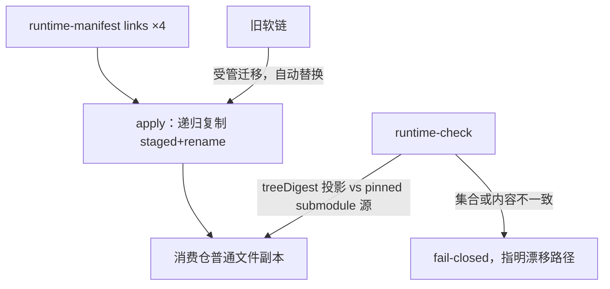

# 改造计划

## 目标与非目标

### 目标

- `runtime-link.ts apply`：受管路径由建软链改为**复制**（目录递归、staged+rename 原子替换）；旧软链视作受管迁移自动替换；非软链且内容不一致仍需 `--replace-managed`；内容一致则视为合规。
- `runtime-entry.ts`：verifyLinks 改为受管投影校验——逐条计算投影与 pinned submodule 源的递归内容摘要并比对，缺失/多余/内容漂移即 fail-closed；投影仍为旧软链时给出「重跑 apply」指引。
- `openspec-upgrade.ts` fingerprint：受管路径由 readlink 采样改为内容摘要采样。
- preamble 与 opsx-update 命令体的「软链」措辞改为「受管投影」，重渲染九个命令。
- AGENTS.md 第 5 条改写为带理由表述（允许可校验副本；禁止无校验副本与第二套 lock），并新增元规则：硬规则须随附一句大白话理由。
- docs（README、consumer-guide、architecture）措辞与操作说明一致化；consumer-guide 的 Windows 软链修复专节改写。
- 测试同批改写：投影形态、漂移拒绝、迁移、`--replace-managed` 边界、升级采样。

### 非目标

- 不动 gitlink/submodule 机制本身（第二阶段另立 Change）。
- 不改 manifest links 数据形状、schema、profiles、intake/workflow/delivery 合同。
- 不为副本引入任何固化哈希清单或锁文件。

## 目标业务与技术流程

内容摘要（treeDigest）：文件=字节 sha256；目录=按名排序后对「相对名+类型+子摘要」求 sha256；投影中出现符号链接即判为旧形态，提示重跑 apply。摘要实时计算、不落盘。

## 影响面

| 仓库/系统 | 模块/接口 | 变更 | 兼容约束 | 责任方 |
|---|---|---|---|---|
| delivery-spec-runtime | runtime-link.ts | 复制实现 + 迁移语义 | CLI 参数不变；输出仍为机器 JSON | Runtime 维护者 |
| delivery-spec-runtime | runtime-entry.ts | verifyLinks→投影摘要比对 | 入口校验顺序与 fail-closed 语义不变 | Runtime 维护者 |
| delivery-spec-runtime | openspec-upgrade.ts | fingerprint 采样方式 | 报告合同字段不变 | Runtime 维护者 |
| delivery-spec-runtime | .omp/command-sources + 渲染物 | 「软链」→「受管投影」措辞 | render check 逐字节一致 | Runtime 维护者 |
| delivery-spec-runtime | AGENTS.md | 第 5 条改写 + 元规则 | 唯一锁原则不变 | Runtime 维护者 |
| delivery-spec-runtime | test/（submodule、contracts、bootstrap、candidate 等涉软链断言） | 断言改写 + 新场景 | 不放宽既有语义 | Runtime 维护者 |
| 既有消费仓 | 升级路径 | gitlink 升级后重跑 apply，软链自动迁移为副本 | 迁移前 pinned 旧版不受影响 | 各消费仓维护者 |

## 实施切片与依赖

| 顺序 | 切片 | 前置 | 独立验收 | 回滚边界 |
|---:|---|---|---|---|
| 1 | runtime-link.ts 复制与迁移 | 方案批准 | 空仓 apply 出普通副本；旧软链被替换；不一致非链内容按 `--replace-managed` 门槛 | 还原文件 |
| 2 | runtime-entry.ts 投影校验 | 切片 1 | 副本一致通过；改/删/增文件被拒；旧软链得到迁移指引 | 还原文件 |
| 3 | openspec-upgrade fingerprint 适配 | 切片 2 | 升级测试消费仓 smoke 全通过 | 还原文件 |
| 4 | 措辞与规则：preamble/命令体/AGENTS/docs | 切片 2 | render check 通过；文档与行为一致 | 还原文件 |
| 5 | 测试改写与新增场景 | 切片 1–4 | 全量测试通过；漂移/迁移/门槛场景逐一断言 | 还原测试 |
| 6 | 全量回归（LF 克隆） | 切片 1–5 | 52+ 测试、render check、strict validate 全过 | 不适用 |

## 数据与兼容迁移

- 数据：无持久化迁移；副本由 apply 幂等重建。
- 迁移矩阵：受管路径为旧软链→自动替换；为一致内容→保留通过；为**已提交且干净**的不一致内容（典型为升级后的旧版投影）→自动刷新（git 历史可恢复）；为**含未提交改动**的不一致内容→`--replace-managed` 显式替换（覆盖即不可恢复）；缺失→直接建立。（实施期发现的升级场景缺口，2026-08-31 补定）
- 灰度：Runtime 仓自身与测试 fixture 先行；消费仓在各自升级 Change 中迁移。
- 回滚：恢复 symlinkSync 分支与旧断言即可，manifest 无变化。

## 风险与处置

| 风险 | 影响 | 预防/缓解 | 停止条件 |
|---|---|---|---|
| 递归摘要遗漏「多余文件」 | 漂移漏检 | 目录摘要覆盖文件集合（名+类型+子摘要） | 任一新增文件场景未被拒 |
| Windows 原子替换边界（占用/长路径） | apply 失败 | 沿用 staged+rename 既有模式；staged 清理兜底 | 无法原子化时停止交付 |
| 措辞改写撕裂渲染一致性 | render check 失败 | 源与渲染物同批更新并以 check 验证 | check 无法归零 |
| 采样改写破坏升级评估合同 | 升级测试回归 | fingerprint 只换采样、不动报告字段 | 报告合同字段变化 |

## 决策日志

| ID | 决定 | 来源 | 状态 |
|---|---|---|---|
| PLAN-001 | 采用候选 A：副本 + 实时哈希对照 pinned submodule | 方案决策 | 已批准 |
| PLAN-002 | 目录摘要以源文件集合为基准，投影多余文件即漂移 | 方案提案未决问题 1 | 本计划定稿 |
| PLAN-003 | 迁移矩阵与 `--replace-managed` 边界如上表 | 方案提案未决问题 3 | 本计划定稿 |
| PLAN-004 | AGENTS.md 元规则：硬规则随附理由；本 Change 先改第 5 条，其余条目复盘时补理由 | 门2 附带确认 | 本计划定稿 |
