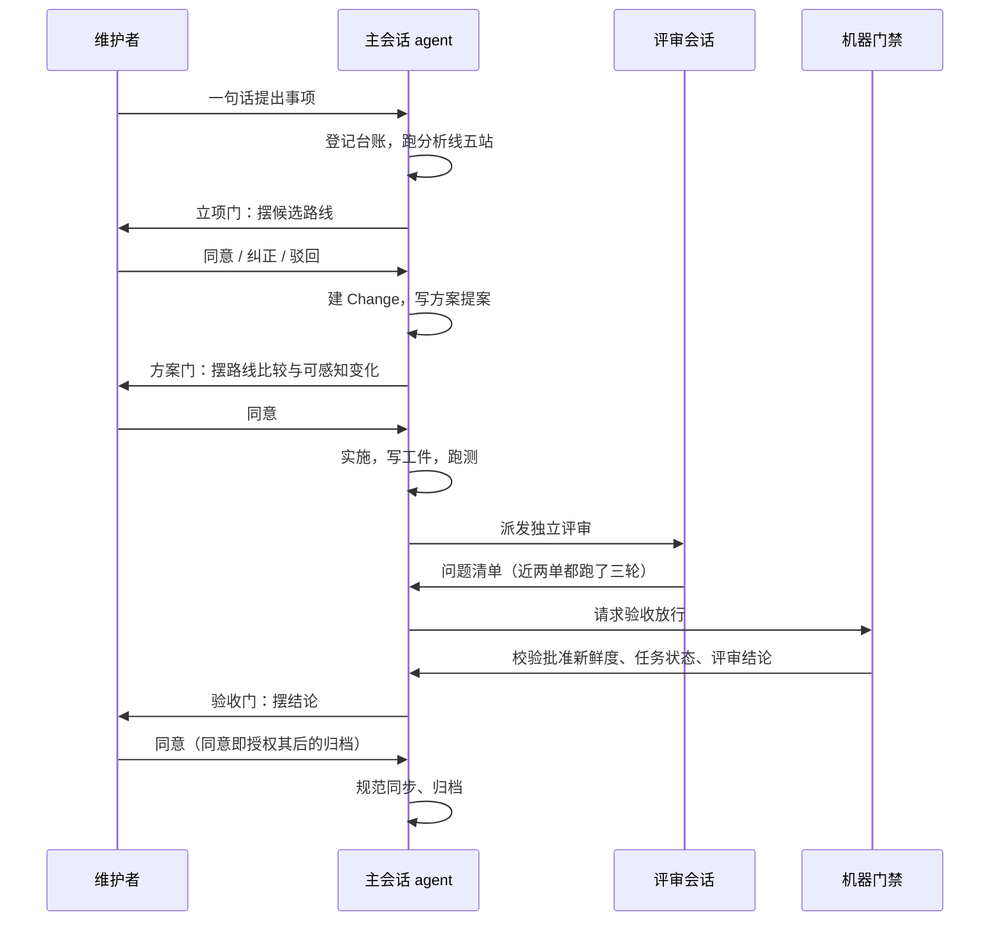
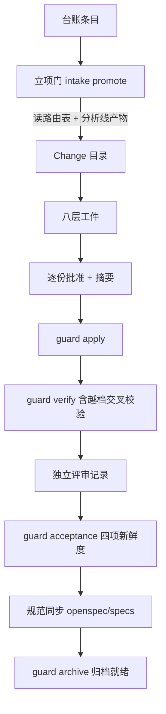

# 现状

> 本文件是改造前的单一现状记录，业务与技术两面合并在此。只陈述当前事实；目标状态一律进入 `05-改造方案/`。
>
> **本文的「业务」就是本仓自己的交付流水线**：角色是维护者与 agent，业务对象是一个个 Change 与台账条目，
> 业务流程就是从「维护者说一句话」到「东西归档」的那条链路。本仓没有对外业务系统，所以模板里
> 「部署与运行态」「缓存与通知」这类小节在本单里恒为空——**这件事本身就是本 Change 的证据之一**，
> 不是填写疏漏，见文末「当前边界与已知问题」。

## 读这份文件需要先知道的几个词

> 沿用台账 `INT-20260901-023` 开头那张词表，此处只摘本文用到的。完整版见该台账。

| 词 | 意思 |
|---|---|
| **本 Runtime / 本仓** | 就是本仓库 `delivery-spec-runtime`。它是一套公开共享的交付工作流，别的仓库可以作为 Git 子模块接进去用。 |
| **消费仓** | 接入了这套工作流的下游仓库。目前只有一个，叫 `agent-system`。 |
| **工件** | 走一遍交付流程会产出的那批文件（方案文档、测试方案、验收记录、各种状态 JSON）的统称。 |
| **站 / 站位** | 流程里的一个节点。本仓有两条流水线：**交付线七站**（方案提案 → 方案决策 → 实施任务 → 实现审查 → 验收 → 规范同步 → 归档），**分析线五站**（捕获 → 澄清 → 核验 → 评估 → 决定）。 |
| **门** | 必须由人表态才能过的节点。人的视角只有三道：立项门、方案门、验收门。 |
| **档 / 档位** | 按「改动对象」给事项定的流程等级。**降档**＝声明成比实际更轻的档；**越档**＝实际改动超出了自己声明的档。 |
| **路由表** | 定义档位以及每档对应哪些文件路径的那份配置，`openspec/profiles/change-routing-v1.json`。 |
| **台账** | `openspec/intake/` 下的一份份 Markdown 记录，每份记一件事的来龙去脉。**挂账**＝已登记但还没处理。 |
| **摘要 / 新鲜度** | 工件被批准时把内容算一个哈希存下来；以后内容一变、哈希对不上，这条批准自动失效，流程被拦住。 |
| **陌生读者关** | 把一段耐久文字交给一个没有本仓上下文的会话读一遍，请它只圈看不懂的地方。 |

## 调查口径

- 业务基线日期：2026-09-01
- 业务范围：本仓自己的交付流水线（交付线、分析线、快车道三套），以及给维护者摆材料的规则
- 主干基线 commit：`fe18b84`（本 Change 建立前的分支头）
- 需求分支 commit：`Eridanus117/itk2` 分支，本 Change 的提交序列
- 运行态核验时间点：2026-09-01，全量合同测试实跑
- 材料口径：台账 `INT-20260901-023` 的实测盘点为主（该台账已过一次陌生读者关并按意见订正），本文只复用其结论、不重复取证

| 仓库 | 模块 | 证据类型 | 核验方式 |
|---|---|---|---|
| delivery-spec-runtime | `openspec/tools/**` | 源码 | 逐文件读，确认哪些工件真的被代码打开 |
| delivery-spec-runtime | `openspec/changes/**` | 源码 + 历史 | 全量盘点 15 个 Change 目录的文件数与类型分布 |
| delivery-spec-runtime | `test/**` | 历史测试 | 全量实跑，本轮基线 91 项通过 |
| delivery-spec-runtime | `openspec/intake/**` | 源码 | 逐条提取维护者表态原文并计数 |
| agent-system（消费仓） | 接入面 | 推断 | 本仓无法直接观察消费仓内部，只能从两次升级的台账记录推断 |

## 角色与责任

| 角色/系统 | 当前责任 | 输入 | 输出 |
|---|---|---|---|
| 维护者 | 在三道门口表态；检查台账整不整洁；要求文字说人话 | agent 摆到门口的材料 | 「同意 / 纠正 / 驳回」，或沉默（＝缓） |
| 主会话 agent | 驱动全部命令，写全部工件，在门口停靠 | 维护者的一句话；仓内既有资产 | Change 工件、台账、代码与测试改动 |
| 评审会话 agent | 独立复查实现改动，出结构化问题清单 | 仓库规则、已批准工件、实现 diff | 评审记录（含逐路径指纹与结论） |
| 陌生读者会话 | 只圈看不懂的地方，不评价内容 | 一段待发出的耐久文字 | 意见清单 |
| 机器门禁 | 拒绝执行不合规的下一步 | 各种状态 JSON 与工件摘要 | 放行或带理由的拒绝 |

## 当前业务流程

## 业务对象与状态

| 对象 | 关键字段/身份 | 状态 | 状态变化条件 |
|---|---|---|---|
| 台账条目 | `openspec/intake/INT-<日期>-<序号>-<名>.md` | 已登记 / 已处置（立项、挂起、关闭） | 立项须先过立项门；纯台账档不可立项 |
| Change | `openspec/changes/<slug>/` | 在途 / 已归档 | 归档须先过验收，且验收状态为通过 |
| 工件批准 | `artifact-approvals.json` 里一条记录 | 已批准 / 已失效 | 工件内容变化即失效 |
| 评审记录 | `implementation-review.json` | 通过 / 不通过 | 由评审会话写入，被审路径由代码自算 |
| 验收状态 | `acceptance-state.json` | 通过 / 过期 | 四项来源任一变化即过期 |

## 当前技术流程

## 接口与数据边界

| 边界 | 当前接口/模型 | 调用方 | 副作用 | 失败语义 |
|---|---|---|---|---|
| 立项门 | `intake-control.ts promote` | agent | 改条目状态、给 Change 追加来源行 | 拒绝时非零退出；**但本轮实测发现拒绝仍会留下半截写入**，见已知问题 |
| 交付门禁 | `delivery-control.ts guard`（六种拒绝检查） | agent | 无 | 拒绝时非零退出并点名原因 |
| 生命周期 | `delivery-lifecycle.ts`（三个前置要求） | agent | 写验收状态、归档就绪 | fail-closed |
| 流程引擎 | `workflow-control.ts` / `workflow-core.ts` | agent | 写分析线三份产物 | 缺输入返回 blocked、缺人表态返回等待 |
| 总闸门 | `runtime-entry.ts` | 消费仓 | 无 | 状态不确定时直接拒绝执行 |

## 事务、缓存、通知和兼容

- 事务：Change 根内的任务状态更新在排他锁内原子写；其余为单文件原子替换。
- 缓存：无。
- 通知：无。
- 兼容：归档目录存量不迁移，代码里为此维护两套解析（两张工件路径表、两套期望键集）。**再改一次工件形状就是第三套**，这是本轮方案要面对的主要迁移约束。

## 部署与运行态

本仓没有部署，也没有运行态可核验。模板要求的这一小节在本仓的每一单里都填「无」。

| 事实 | 环境/机器 | 证据 | 核验时间 |
|---|---|---|---|
| 自动验证只在 ubuntu 上跑 | GitHub Actions | `.github/workflows/ci.yml` | 2026-09-01 |
| Windows 侧只能靠维护者本机实测 | 维护者本机 | 台账 `INT-20260901-022` 的路径长度实测 | 2026-09-01 |

## 异常与失败分支

| 场景 | 当前行为 | 业务影响 |
|---|---|---|
| 工件内容在批准后被改 | 该条批准失效，下游门禁停 | 正常保护，两次拦住 agent 自己 |
| 声明档位低于实际触碰路径 | 验证门拒绝并点名路径 | 正常保护，拦住过一次越档声明 |
| 流水线自己的收尾动作触碰未定档路径 | 按未匹配取最重档，一律拒绝 | **误挡**；已在本 Change 第一个动作里修掉 |
| 台账里写了网址 | 敏感内容检查判为本机绝对路径并拒绝 | 误挡；说明文档要求写网址，机器不让写 |
| 立项门任一校验不通过 | 非零退出，但目标 Change 已被追加来源行 | 半截写入，重试从说不清的中间状态开始 |

## 当前边界与已知问题

**产出体量（`[事实]`）**：15 个 Change 目录共 427 个文件、约 1.2 MB，平均一单 28.5 个文件。最近一单
为了改 219 行工具代码，写了 2013 行治理文档，约九比一。

**谁在读这些文件（`[事实]`，以代码为准）**：

- 有代码打开并据以放行或拒绝的：评审记录、验收状态、批准记录、任务状态、归档就绪记录、方案提案
  （查候选数与四个必备小节）、方案决策（查六项）、验收记录（查结论行）。
- 只算摘要、机器一个字都没读过的：现状文档（就是本文件）、改造方案、测试方案。其中测试方案有真实
  人类读者——它的编号被任务表与验收覆盖表逐条回引；另两份没有。
- 完全零消费的一整块：指标子系统（315 行代码、一份契约、118 行测试、四处文档说明），统一入口里零
  转发，消费仓根本拿不到。

**维护者实际说了多少字（`[事实]`）**：全仓能逐字引用的表态 17 条、约 210 字，三道门内合计约 53 字，
其中 6 次是「同意」二字。对照之下现行批准模型要求 8 份工件各持一条独立批准记录——**一句「同意」被
展开成 8 条**。

**哪些环节被实战证明有价值（`[事实]`）**：独立评审是全仓唯一有拦截战果的环节，12 份评审记录共 51 条
问题，其中 2 条最严重的都是 agent 自查报「零问题」之后才被评审判出来的。最近两个 Change 都跑了三轮
评审，前两轮都判不通过；其中一单第二轮查出的最严重问题，是第一轮返工时自己新引入的。

**一处结构不对称（`[事实]`）**：交付七站根本没跑流程引擎——它跑的是一个控制工具的六种拒绝检查加另一个
工具的三个前置要求；引擎只服务分析线和快车道。交付模板文件自己写着「本文件不产生约束力，权威在
代码」。**改站位要同时动两个地方，只改一处要么不生效要么分叉。**

**本文件自己就是证据（`[事实]`）**：模板要求的「部署与运行态」「缓存」「通知」三处在本仓恒为空；
本文件除摘要外没有任何机器读者。写它花掉的篇幅，正是本 Change 要处置的那类成本。**它在本单被保留，
是因为砍纸方案本身还没过方案门——不能一边提议砍、一边自己先砍。**

**六处挂账机器缺陷（`[事实]`，位置均已落实）**：批准清单与站位清单各说各话；站位一致性探针 7 站里
只有 3 站做了真负向对照；评审自算范围把长期规范目录排除在外；入口守卫还剩 `openspec-upgrade.ts`
一处；路由表四处路径空白（**已在本 Change 第一个动作里修掉**）；把某一时刻清单写死成永久判据的
断言（其中一条本轮第三次撞红）。

**本轮新发现的两处（`[事实]`）**：立项门拒绝时留半截写入；敏感内容检查把网址整类误判为本机绝对路径，
且一份记录该缺陷的台账被这条缺陷本身挡在了流水线外面。

**未取证、只能记为 `[推断]` 的三处**：

- 独立评审的战果与「写了多少份工件」之间没有已证实的因果。可能砍掉大部分工件后战果不变，也可能
  工件正是评审者能对照的基准。取证方式是可行的：挑一单已完成的，只给评审者代码与提交范围。
- 本仓至今没有发生过一次事后审计，「保护性记录留到什么程度才够」没有实测下限。
- 消费仓是否真的走过交付七站，本仓无法直接观察。从两次升级的台账看它只用到版本锁与分发校验这一层。
  **不过维护者已在立项门口回答了这个前提问题：这套东西不是对外样板，是他自己的通用工作流**，
  所以这条推断对本轮的影响已经消失。
