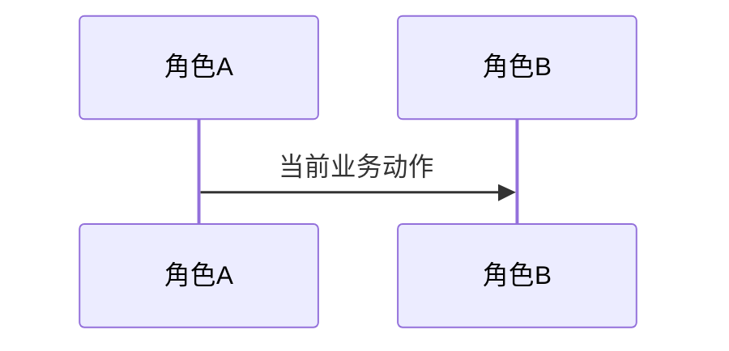

# 业务现状

## 调查口径

- 时间点：
- 业务范围：
- 来源：

## 角色与责任

| 角色/系统 | 当前责任 | 输入 | 输出 |
|---|---|---|---|

## 当前业务流程

## 业务对象与状态

| 对象 | 关键字段/身份 | 状态 | 状态变化条件 |
|---|---|---|---|

## 异常与失败分支

| 场景 | 当前行为 | 业务影响 |
|---|---|---|

## 当前边界与已知问题

- 本文件只陈述当前业务事实；目标状态进入 `05-改造方案/`。
