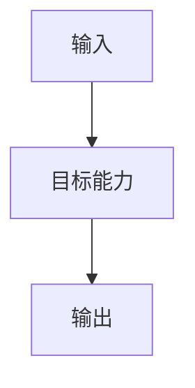

# 改造计划

## 目标与非目标

### 目标

- 

### 非目标

- 

## 目标业务与技术流程

## 影响面

| 仓库/系统 | 模块/接口 | 变更 | 兼容约束 | 责任方 |
|---|---|---|---|---|

## 实施切片与依赖

| 顺序 | 切片 | 前置 | 独立验收 | 回滚边界 |
|---:|---|---|---|---|

## 数据与兼容迁移

- 数据：
- 接口：
- 灰度：
- 回滚：

## 风险与处置

| 风险 | 影响 | 预防/缓解 | 停止条件 |
|---|---|---|---|

## 决策日志

| ID | 决策 | 依据 | 替代方案 | 影响 | 日期 |
|---|---|---|---|---|---|

## 待决问题

- 只保留不改变需求、主方案或任务拆解的可延后问题；其余问题在进入任务前解决。
