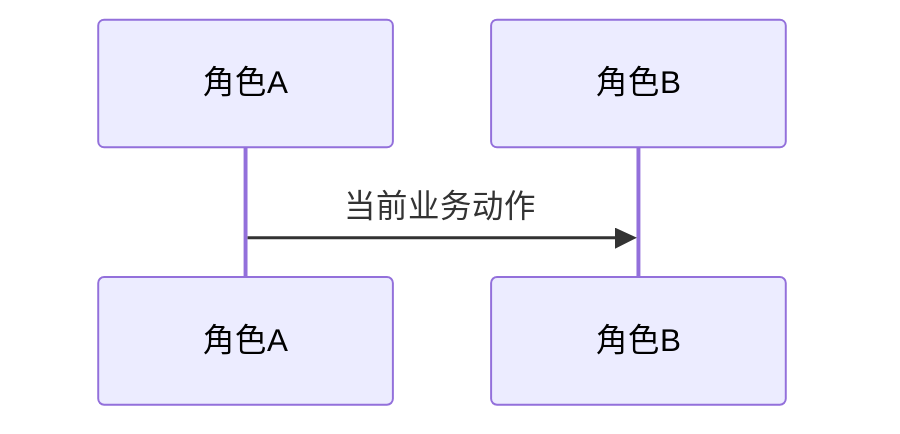
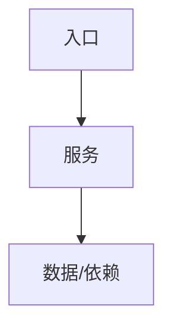

# 现状

> 本文件是改造前的单一现状记录，业务与技术两面合并在此。只陈述当前事实；目标状态一律进入 `05-改造方案/`。

## 调查口径

- 业务基线日期：
- 业务范围：
- 主干基线 commit：
- 需求分支 commit：
- 运行态核验时间点：
- 材料口径（来源、版本、完整性）：

| 仓库 | 模块 | 证据类型（源码/历史测试/运行态/推断） | 核验方式 |
|---|---|---|---|

## 角色与责任

| 角色/系统 | 当前责任 | 输入 | 输出 |
|---|---|---|---|

## 当前业务流程

## 业务对象与状态

| 对象 | 关键字段/身份 | 状态 | 状态变化条件 |
|---|---|---|---|

## 当前技术流程

## 接口与数据边界

| 边界 | 当前接口/模型 | 调用方 | 副作用 | 失败语义 |
|---|---|---|---|---|

## 事务、缓存、通知和兼容

- 事务：
- 缓存：
- 通知：
- 兼容：

## 部署与运行态

| 事实 | 环境/机器 | 证据 | 核验时间 |
|---|---|---|---|

## 异常与失败分支

| 场景 | 当前行为 | 业务影响 |
|---|---|---|

## 当前边界与已知问题

- `[事实]` 源码或运行结果直接证明。
- `[推断]` 尚需进一步核验。
- 本文件只陈述当前业务与技术事实；目标实现只进入 `05-改造方案/`。
