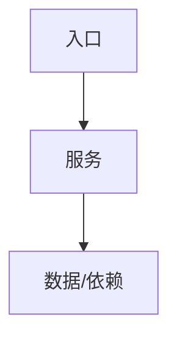

# 技术现状

## 调查基线

| 仓库 | 分支/Commit | 模块 | 核验方式 |
|---|---|---|---|

## 当前技术流程

## 接口与数据边界

| 边界 | 当前接口/模型 | 调用方 | 副作用 | 失败语义 |
|---|---|---|---|---|

## 事务、缓存、通知和兼容

- 事务：
- 缓存：
- 通知：
- 兼容：

## 部署与运行态

| 事实 | 环境/机器 | 证据 | 核验时间 |
|---|---|---|---|

## 已知缺口与不确定性

- `[事实]` 源码或运行结果直接证明。
- `[推断]` 尚需进一步核验。
- 目标实现只进入 `05-改造方案/`。
